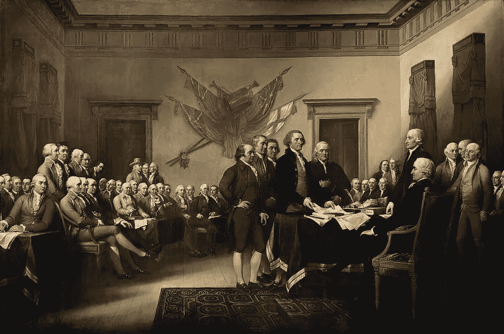

# 独立意味着艰难的决定

> 原文：<https://medium.com/swlh/being-independent-means-difficult-decisions-b9194188b4ce>

## 创业意味着摆脱“男人”，但也意味着不断进步

我刚从芝加哥回来，在那里我看了音乐剧 ***汉密尔顿*** ，讲述了一位开国元勋短暂而充实的一生。如果你听过原声音乐，你就会知道这部音乐剧有多吸引人。但是**经历**就没得比了……