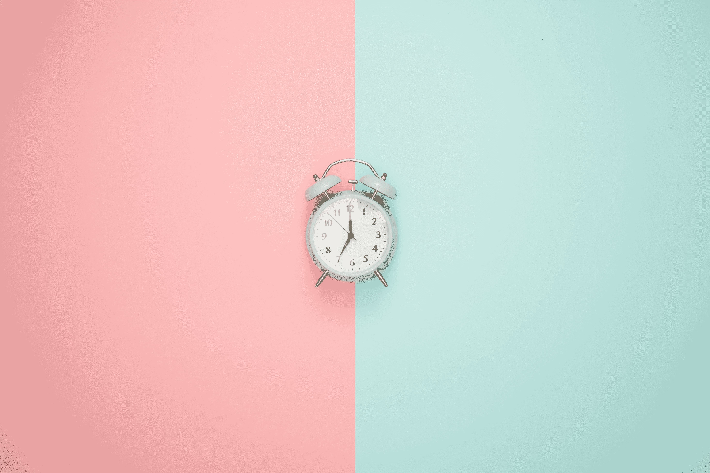

# 迟到

> 原文：<https://medium.com/swlh/being-late-8a9f24612686>

并努力改变

Photo by [Icons8 team](https://unsplash.com/@icons8?utm_source=unsplash&utm_medium=referral&utm_content=creditCopyText) on [Unsplash](https://unsplash.com/search/photos/time?utm_source=unsplash&utm_medium=referral&utm_content=creditCopyText)

如果你了解我，那么你应该知道我可能会迟到。你收到我的短信的可能性大概是，“嗨！我会晚到几分钟。太抱歉了。!"就是高。有一个迟到的习惯是很难隐藏的，因为你周围的人会成为你问题的受害者。众所周知，我很长一段时间都在纠结于时间管理。即便如此，我还是被囚禁了几年…