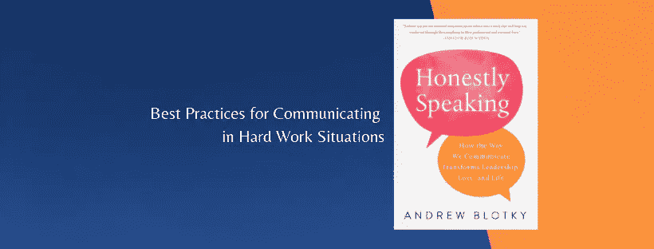

# 在艰苦工作环境中沟通的最佳实践

> 原文：<https://medium.com/swlh/best-practices-for-communicating-in-hard-work-situations-65aff0d4cc15>

我们在工作中面临的许多挑战来自于我们难以有效地交流自己的想法，也难以被我们的同事有效地倾听。

> 在危机沟通中，就像在战略评估和绩效对话中一样，你如何沟通通常和你做什么一样重要。