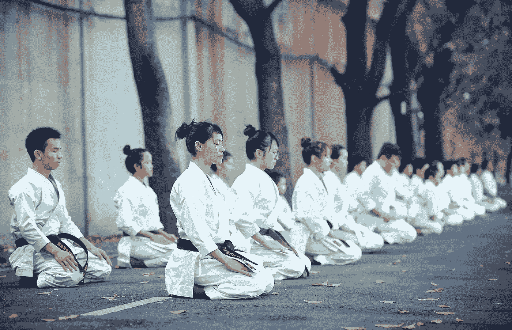
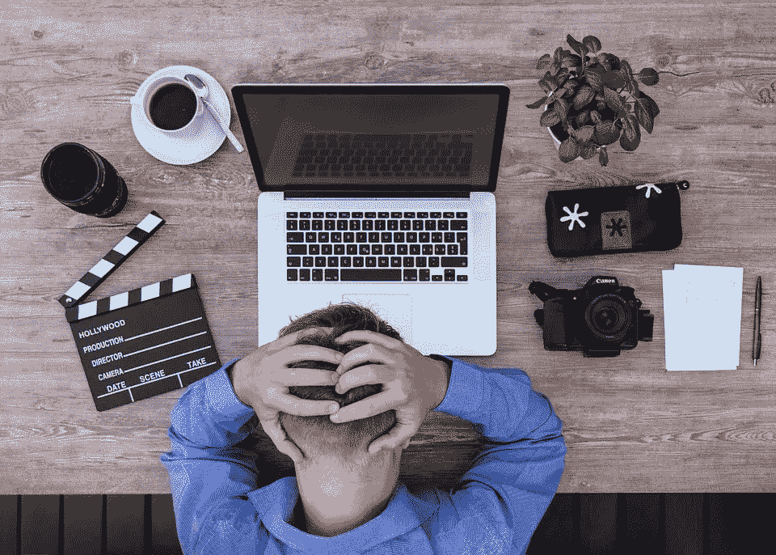
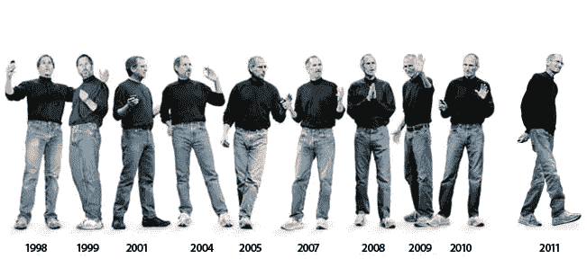
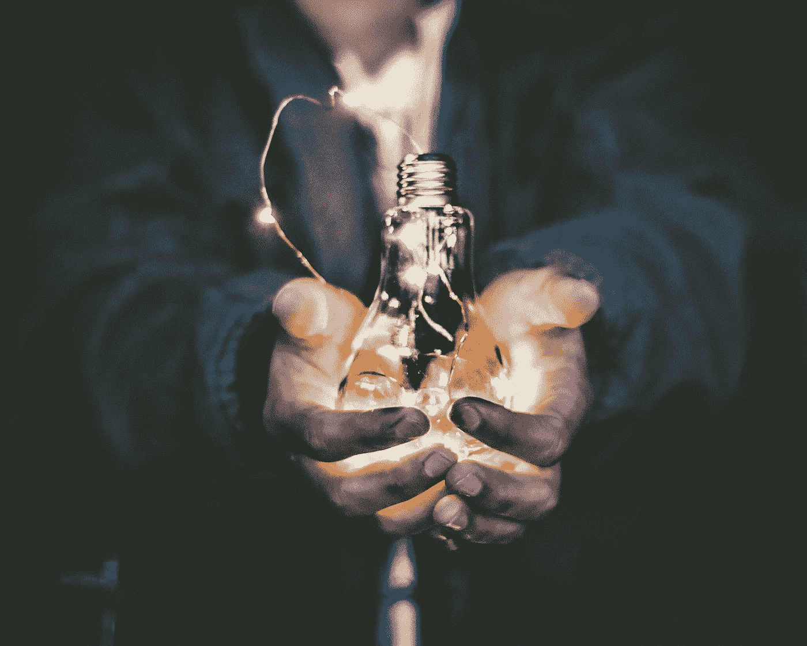
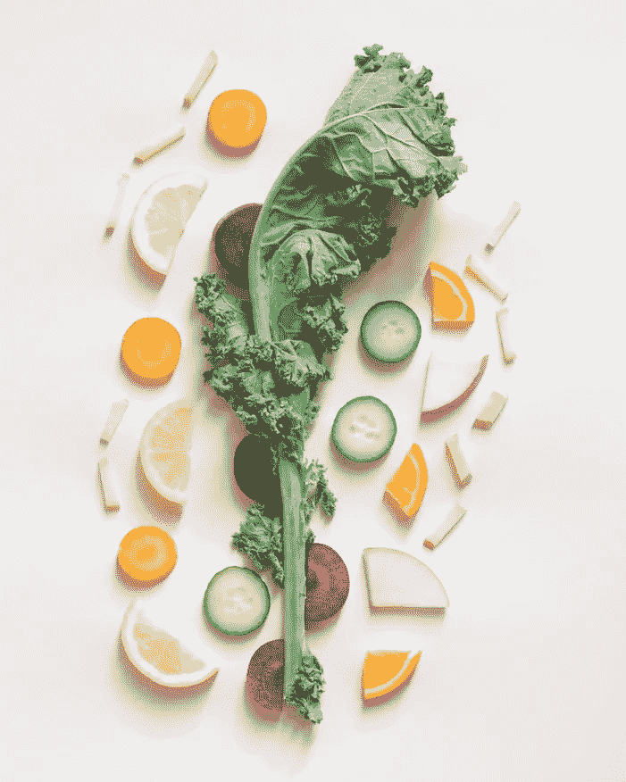
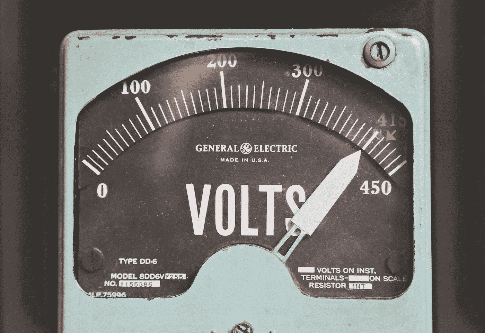
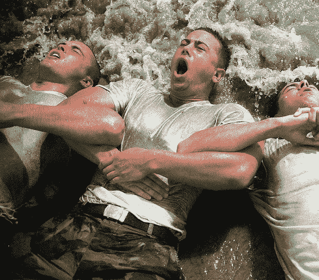
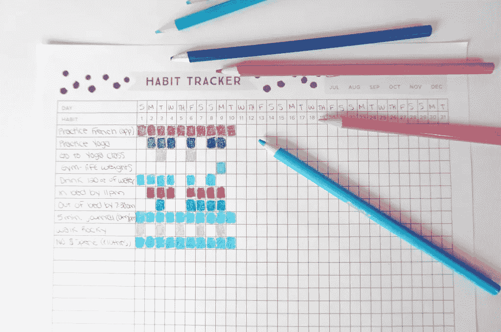

# 增强意志力的最佳策略——有科学依据

> 原文：<https://medium.com/swlh/best-strategies-to-increase-willpower-f7cee8ec1fe8>

Photo Credit: [**Thao Le Hoang**](https://unsplash.com/@h4x0r3)

> 聪明人想要自我控制；孩子们想要糖果。—鲁米

我开始注意到，**拥有超级成功人士的共同特征，他在正确的时间做正确的事情，不管什么样的情绪(无聊、焦虑等等)。)他们有**。

他们似乎锻造了一种超能力，帮助他们轻松培养有价值的习惯。我现在相信，这种超能力就是意志力和纪律。

拥有强大的意志力是相当自由的，因为它能把你从情绪的束缚中解放出来。正如海豹突击队海军司令乔科·威林克所说:

> 纪律等于自由。—乔科·威林克

我研究和试验[增强意志力的方法](https://livelikepros.com/definite-guide-to-increasing-willpower-and-discipline/)已经有 *5 年*了，我可以总结出以下三个增强意志力的核心策略:

把你的意志力想象成油箱里的燃料。要增强你的意志力，你可以采取以下一种或全部方法:

1.  当你没有意志力的时候加油。——通过食用我将解释的特定食物。
2.  加大油箱，这样你会有更多的意志力储备——通过针对你的额叶前部皮层(意志力的所在地)进行特定的脑力锻炼
3.  利用心理学原理，优化燃料消耗，让你在同样的活动中消耗更少的意志力。
4.  最后，你可以通过采取完全绕过意志力的策略来学习超越意志力。

但是在我告诉你如何增强你的意志力之前，你最好知道一天中什么会耗尽你的意志力。

# 一.意志力的杀手

> 有时，当我们试探自己力量的脆弱时，我们对自己是魔鬼，因为我们认为它们的力量是多变的。——特洛伊罗斯，在莎士比亚的《特洛伊罗斯和克瑞西达》中

如果你要有意志力和自制力，你需要有实现它们的精神能量。唉，许多活动——不仅仅是自我控制的行为——都来自同一个能量源。

我们先来了解一下这些吸血鬼。

## 1.抵制诱惑

如果你决定戒烟或节食，这意味着你必须经常抵制诱惑和冲动。[正如科学发现的那样](https://livelikepros.com/definite-guide-to-increasing-willpower-and-discipline/)，抵制诱惑是你的大脑进行的新陈代谢最昂贵的活动之一。

换句话说，抵制诱惑会消耗你大量的意志力。

## 2.日常斗争

资深婚姻治疗师唐·鲍康姆会给争执中的夫妇提出一个奇怪的建议:早点下班回家！

他认为人们在工作中耗尽了他们所有的意志力，后来在家里，他们会为琐事争吵，如果他们有稍微多一点的意志力储备，这些问题是可以很容易避免的。

Daily Struggles Drain Willpower — [lukasbieri](https://pixabay.com/en/users/lukasbieri-4664461/) at Pixabay

你可能会认为你有一个工作自我控制库，一个节食库，一个锻炼库，一个友善库，等等。

但是，你消耗相同的意志力来处理完全不同的事情:令人沮丧的交通、诱人的食物、令人讨厌的同事、苛刻的老板，所有这些都导致油箱变空，使你容易受到诱惑和情绪波动。

## 3.决策疲劳

决策，尤其是当结果非常重要的时候，会给意志力储备带来沉重的负担。

你因做决定而耗尽所有意志力的状态(比如购物回来时)被称为 [***决策疲劳。***](https://livelikepros.com/decision-fatigue/)

这就是为什么像史蒂夫·乔布斯或马克·扎克伯格这样的人总是穿同样的衣服，所有的标志性人物都有一个特定的早晨惯例: ***以尽量减少不重要的决策。***

Minimizing Decision Making By Wearing the Same Outfit — Steve Jobs

## 4.经前周期(PMS)和慢性疼痛

在被称为黄体期的月经前阶段(PMS ),女性身体开始将其大量能量输送到卵巢和相关活动。这些区域的能量越多，意味着身体其他部分的能量越少。

这就是为什么在这个阶段，身体渴望食物、巧克力和其他甜食，因为它们能提供瞬间的能量。

> 我有严重的经前综合症，所以我有点疯狂。——女演员梅兰尼·格里菲斯，解释了她为什么提出离婚却立即撤回

同样，睡眠不足、焦虑和慢性疼痛是意志力的主要杀手。因此，通过检查以上内容，你在游戏中领先一步。

迄今为止的经验教训是:

1.  你的意志力是有限的，当你使用它的时候就会耗尽。
2.  你用同样的意志力完成各种任务。

因此，正如《意志力:发现人类最大潜力》的作者罗伊·鲍梅斯特所说:

> 一次专注于一个项目或一个习惯。

如果你试图戒烟，如果你还努力节食并开始学习西班牙语，那将会非常困难。

如果你总是无法实现你的五项新年计划，问题不在于你，而在于你的清单。

以上所有这些，如果走得太远，会导致一种叫做 ***的自我耗尽的情况。在这种情况下，你已经耗尽了你所有的意志力，因此，你缺乏调节他们的思想、感情和行为的能力。***

准备好让你的意志力更上一层楼吗？

# 二。意志力的燃料是什么？

我一直在谈论的意志力燃料是*葡萄糖、*由各种食物在体内制造的简单糖，不仅仅是甜的。

由消化提供的葡萄糖流经血液，除了意志力和自我控制之外，它还被肌肉、心脏、肝脏和免疫系统使用。

当身体生病时，免疫系统会消耗大量的葡萄糖，这就是为什么你在生病时会感到疲倦并想睡觉。你的身体正在调动所有的能量来对抗疾病。

现在我们知道了所有意志力的猎人，问题是我们应该做些什么？

Photo Credit: [Riccardo Annandale](https://unsplash.com/@pavement_special)

# 三。如何给意志力加油

> 在任何重要的事情上，永远不要相信缺糖的大脑。

现在，你知道你一天中的意志力越强，你的自制力、分析力、情绪控制力等就越强。你会有的。

因此，明智的做法是以满满一箱油开始你的一天。怎么会？带早餐。

我们不想早餐吃麦穗和碾碎的食谱。理想的早餐是在一天中逐渐将葡萄糖释放到你的血液中。

***甜食。从提供意志力燃料的角度来看，甜食是最糟糕的，因为它们提供快速的刺激，然后立即崩溃，这会让你想吃更多的甜食。***

***但是*** *，y* 你可以机智地使用它:例如，如果你正试图戒烟，并且你渴望点燃一支，你可以喝一小口可乐，它的刺激将帮助你抵制它的诱惑。

所以如果你有一个测试，一个重要的项目，和老板开会，没有足够的葡萄糖就不要服用。

Food With Low Glycemic Index Provide Steady Fuel for Willpower

## 通过慢烧食物获得稳定的意志力

身体将各种食物转化为葡萄糖，但速度不同。

为了保持稳定的自控力，你最好吃低血糖指数的食物，以更慢更稳定的速度转化为葡萄糖的食物，如大多数蔬菜，坚果(如花生和腰果)，许多生水果，如苹果，蓝莓和梨。此外，奶酪、鱼、肉、橄榄油和其他有益脂肪都是大脑的超级燃料。现在，是时候用一种更有利可图的方式来增强意志力了。

# 四。扩大燃油箱

> 身体越痛苦，精神越旺盛。—大卫·布赖恩

这部分的练习，集中在放大 ***油箱*** 的意志力上。

## 1.意志力锻炼

在一次幸运的实验中，鲍梅斯特和他的同事发现了令人讨厌的*建议——“坐直！”——最大程度地提高了参与者的意志力，因为 ***要求他们克服懒散的习惯。****

*他们发现:*

> *扩大意志力的关键是定期参加那些负担沉重或需要克服简单习惯的活动。*

*以下是一些想法:*

*   *开始用你的非惯用手做日常工作。我是右撇子，从三年前开始刷牙，拿勺子，开门等等。，用我的左手。(这也是《意志力本能》一书中的一条建议)*
*   *另一个训练策略是改变你的说话习惯，这也需要花心思去改变。例如，试着改掉用*来点缀你的话语的习惯，比如你知道的*和*。**

**

***Photo Credit:** [**Thomas Kelley**](https://unsplash.com/@thkelley)*

## *2.从强大到更强大*

*在实验室实验中，主要的改进是在抵抗损耗的影响方面。即当你耗尽所有意志力储备时，最后的自制力行为。*

*你去健身房练过举重吗？如果是这样，你可能知道当你的肌肉燃烧时，最后的重复是引起最大变化的。*

*当我下班回家，筋疲力尽时，我不想叠每一件衣服。但是，我知道如果我做了，那就像是在健身房做了额外的引体向上。*

*根据经验，如果我不想做，我知道那是我应该做的；从长远来看，发生的事情是你变得舒服不舒服，这是最终的自由。*

> *我有欲望，我杀了它们，现在我是主人。*

*这还不是全部，你可以更进一步，首先使用帮助你燃烧更少意志力燃料的心理战术。*

# *七。增强意志力——优化油耗*

*心理战术可以帮助你更有效地消耗宝贵的意志力燃料，或者完全绕过燃料消耗。这些策略通过防止你耗尽自我，极大地帮助你的决心的可持续性。*

## *1.预先承诺*

> *我已经庄严宣誓，只要我还有一丝生命的希望，我就要遵守这个誓言，不被诱惑去打破我已经下定的决心，任何活着的人都不能阻止我，只有死亡能阻止我，但是死亡——即使是这个也不能；我不会死，我不会死，我不能死！—斯坦利:非洲最伟大探险家的不可能生活*

*预先承诺是一种有效的策略，它可以防止你一开始就不得不依赖意志力。*

*策略的本质是把自己锁定在一条良性的道路上。*

*你预期你会面临有利可图的诱惑，使你偏离自己的道路；所以，你让离开这条路变得不可能——或者以某种方式让它变得可耻、罪恶或不可想象。*

*当你必须专注于你的项目时，你想防止自己沉迷于社交网络吗？通过阻止您访问它们来预先提交。*

*你想确定你去健身房吗？预先承诺，向一个朋友保证你会在体育馆*出现*。*

> *坚持预先承诺，你会被赋予一些有价值的东西，从不得不再次承诺或依赖意志力中解脱出来:一种习惯。*

## *2.让你的大脑自动驾驶——启动效应的力量*

*当被困在非洲的雨林中，他的胃被各种感染毁掉，他的希望变得暗淡，斯坦利——非洲最伟大的探险家——每天早上醒来用冷水刮脸。*

*为什么一个快饿死的人会坚持刮胡子？斯坦利的传记作者回答说，这是这个人井井有条的典型表现。*

*此外，Stanely 总是试图保持整洁的外表——衣服也是如此——并保持他所有的物品井井有条。 ***秩序的创造是对他周围大自然破坏力的一种解毒剂。****

> *从长远来看，有序的习惯实际上可以通过触发不需要太多能量的自动心理过程来增强自我控制。*

*通过每天刮胡子，斯坦利可以受益于同样的有序的潜意识效果。他会通过早晨的例行公事唤起自己的自律精神。*

## *3.超越自我控制和纪律*

> *有活下去的理由的人几乎可以忍受任何方式。——弗里德里希·尼采*

*海军海豹突击队突击队必须通过一项名为*地狱周*的测试，这是一项持续的跑步、游泳、爬行和颤抖的测试，他们必须忍受少于 5 小时的睡眠。*

**

*Navy SEAL Hell Week Training — Photo Credit: [Stephenguise](https://stephenguise.com)*

*至少 75%的人失败了，那些通过测试的人不一定是肌肉最发达的人。这是一位海军海豹突击队指挥官如何指出幸存者的共同品质的:*

> ****“他们有能力走出自己的痛苦，抛开自己的恐惧，并问:我如何才能帮助我旁边的家伙？”****

*这是遵循这种方法的关键:*

> *专注于崇高的思想。*

*当人们被要求思考 ***为什么*** 他们想做某事或者 ***他们想如何*** 做某事时，“为什么”问题将思维提升到更高层次的思考，这极大地增强了他们的自制力。*

*所以，在最激动的时候，当你甚至不想动你的手指时，你需要做的就是，绕过意志力的短缺，问自己为什么？*

*假设你对你正在做的事情有一个强烈的“为什么”,你会被它的魔力推动前进。*

## *4.自我监控*

*想办法让自我监控变得简单且不可避免，这是你保存意志力的最有效策略。*

**

*Use self-monitoring as a potent willpower tool — photo credit: [BalancingLemons](https://twitter.com/balancinglemons)*

*作为历史上最多产的小说家之一，安东尼·特罗洛普认为没有必要一天写作超过三个小时。*

*对于他的每一部小说，他都会制定一个工作时间表，通常每周计划一万字， ***，然后记日记。****

> *“在这我已经进入，每天，我写的页数，所以如果在任何时候我滑入闲置一两天，闲置的记录一直在那里，盯着我的脸，并要求我增加劳动，以便不足可能被供应。我面前有记录，一个星期过去了，不足的页数一直是我眼睛的水泡，一个月如此丢脸会是我心中的悲伤。”*

****眼睛起了水泡。你在心理学文献中找不到任何东西能如此恰当地概括自我监控的影响。****

> *那些记食物日记的人比那些不记的人减掉两倍的体重。*

## *5.公开承诺*

*你可以通过公开宣布将自我监控的效果发挥到极致。*

*公共信息比私人信息更有影响力。人们更关心别人对他们的了解，而不是他们对自己的了解。*

*如果只有你一个人知道的话，失败、失误、自制力的下降很容易被掩盖起来。你可以合理化它或者干脆忽略它。但如果其他人知道了，就更难驳回了。*

## *6.神圣的纪律*

*信教的人不太可能养成不健康的习惯，如酗酒、沉溺于危险的性行为、吸烟等。*

*他们的自制力也比正常人高得多。*

*他们自我控制的关键被麦卡洛发现了:*

> *信徒的自制力不仅来自对上帝的敬畏，还来自他们所吸收的价值体系，这给他们的个人目标蒙上了神圣的光环。*

**

*Photo Credit: [Nik](https://unsplash.com/@helloimnik)*

*你不一定要信教才能收获自我控制的果实；无论你是不可知论者还是无神论者:*

> *寻找你自己的一套被掏空的价值观。*

*这种神圣的价值观可以是帮助他人的虔诚承诺，改善他人健康或为后代保护环境的强烈愿望。*

****你的价值越是自我超越，它带给你的动力和燃料就越多。****

## *7.强大的如果-那么规则*

*我解释说，做决定消耗大量的能量，如果意志力薄弱，你可能会成为决策疲劳和自我损耗的受害者。*

*一个聪明的办法是防止这种什么心理学家都 ***实现意图*** *。**

*这个想法是为了减少你花费在控制你的思想和指导你的行为上的时间和精力。*

*你使 ***高度具体化*** 为 ***自动行为*** 在 ***某些情况下。例如，你精确地指定如果你在一次聚会上被一种令人发胖的食物所诱惑，你会怎么做。****

*该方法采用 if-then 的形式:*

> *如果 x 发生了，我会做 y。*

*所以，在你被聚会上那美味的巧克力蛋糕诱惑之前，你可以做好这样的准备:*如果他们提供巧克力蛋糕，我会全部拒绝。**

*或者:*如果有自助餐，我就只吃蔬菜和瘦肉**

*这种方法出奇的有效，并且包含在你阅读的每一本意志力书籍中(意志力本能，棉花糖测试，鲍梅斯特的意志力等等)。)*

*它之所以有效，是因为你把对诱惑的高要求和不舒服的拒绝外包给了一个自动的过程。*

## *8.永远不要说永远*

> *不做某事的承诺是世界上让一个人想去做那件事的最可靠的方法。——马克·吐温*

*我把最有趣的技巧留到了最后。*

*当你面临强大的诱惑时，比如屈服于食物或再来一支烟，对抗它最有效的方法是告诉自己 ***我可以以后再来。****

*在心里，这有点像现在就拥有它，并在很大程度上满足你的渴望。*

*拒绝一份甜点需要意志力，但根据研究，晚说*比*对大脑的压力要小。***

***所以:***

> ***说到食物，永远不要说不。当甜点车到达时，不要渴望地盯着被禁止的食物。发誓你迟早会把它们都吃掉，但不是今晚。***

# ***七。结论***

***意志力的好处显而易见。在繁荣和个人发展领域，你可以用下面这句话来总结大量的研究:***

> ***减轻生活压力的最好方法是停止搞砸。***

***即使意志力的作用至关重要，你也不应该把它作为你的主要策略。***

***关于意志力最强的人的研究发人深省。***

***自制力最强的人，比别人花 ***更少的*** 时间抵制诱惑。这让研究人员感到困惑，直到出现了解释:***

> **自制力最强的人不太需要使用意志力，因为他们较少受到诱惑和内心冲突的困扰。他们更善于安排自己的生活，以避免出现问题。**

**你将需要培养你的意志力(加大坦克)，这反过来给你巨大的可能性和行动的意愿。**

**然后你会用这个*意愿*来养成习惯，然后这些习惯会为你创造你的生活。迈出改变的第一步，你的生活就会开始改变。**

> **控制你的思想，否则它会控制你——贺拉斯**

****

***最初发表于*[T5【livelikepros.com】](https://livelikepros.com/definite-guide-to-increasing-willpower-and-discipline/)*。***