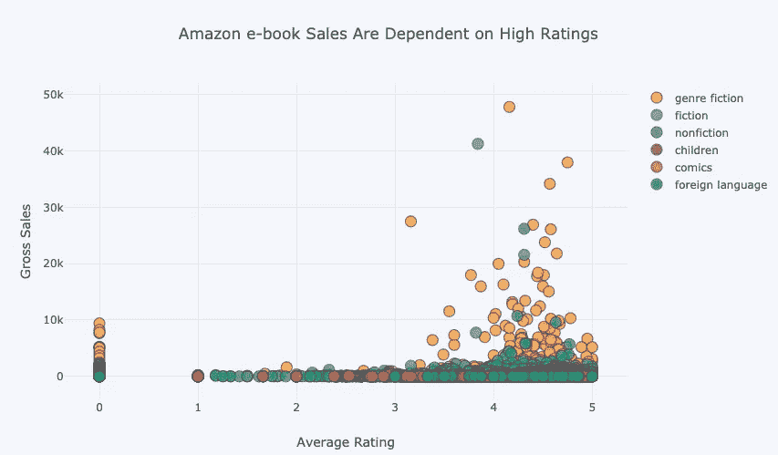

# 畅销书和便宜货:书籍统计一瞥

> 原文：<https://medium.com/swlh/bestsellers-and-bargain-bins-a-statistical-glimpse-into-books-939bc6fc53d1>

在对社交媒体和以移动为中心的生活幻灭多年后，实体书销售再次增长。虽然 Twitter APIs、脸书分析和谷歌提供了无尽的数据洪流，但图书市场也提供了对时代精神的洞察。

Source: [https://think.cs.vt.edu/corgis/csv/publishers/publishers.html](https://think.cs.vt.edu/corgis/csv/publishers/publishers.html)

根据 54，000 本亚马逊电子书的样本，一本书被评为…