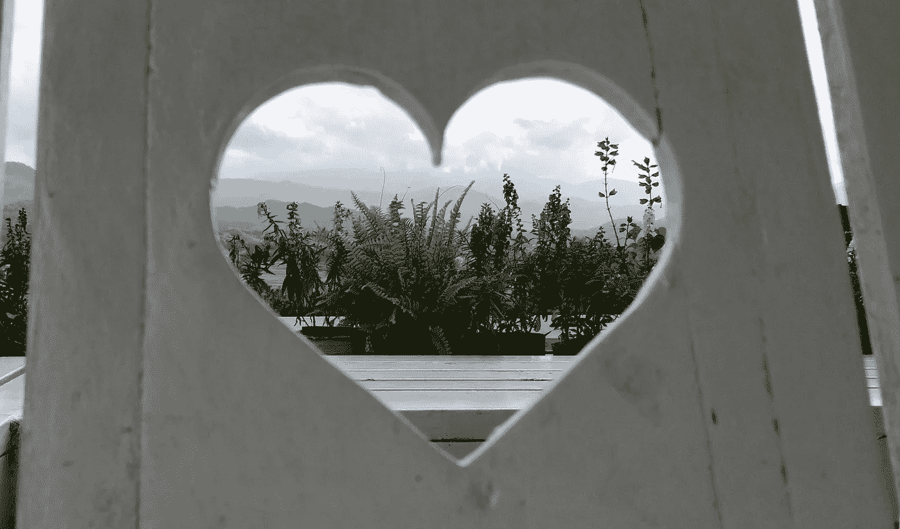

# 悲伤和成长之间

> 原文：<https://medium.com/swlh/between-grief-and-growth-8b59d65e096d>

2012 年可能是我人生中最糟糕的一年。经过 5 年的艰苦斗争，我的母亲死于癌症，我几乎完全失去了我最大的资产——我自己。在大学三年级的时候，我只是一个空壳，在 25 岁这个“成熟”的年龄，我确信处理悲伤的最好方式很简单——忽略它。

一个决定，有人会说是一个错误，越来越糟糕。