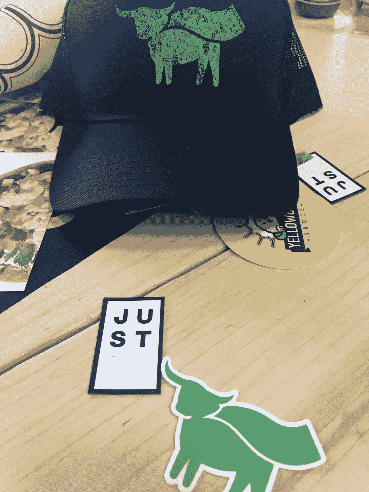

# 超越肉类——超越趋势？

> 原文：<https://medium.com/swlh/beyond-meat-beyond-a-trend-73d2bc511297>

Beyond Meat Brunch @ [SXSW](http://www.sxsw.com)

> 纯素食品风靡一时。仅仅是一种趋势吗？或者全素是通过替代食物选择来改善健康的新方式？

如果是这样，我将是一个强买强卖者。

去年春天，我去了一个我最喜欢的德克萨斯腹地城市奥斯汀，我发现了一些流行的东西。这位肉食爱好者被邀请参加素食品牌 [Just，Inc](https://www.ju.st/en-us) 主办的 SXSW 早午餐…