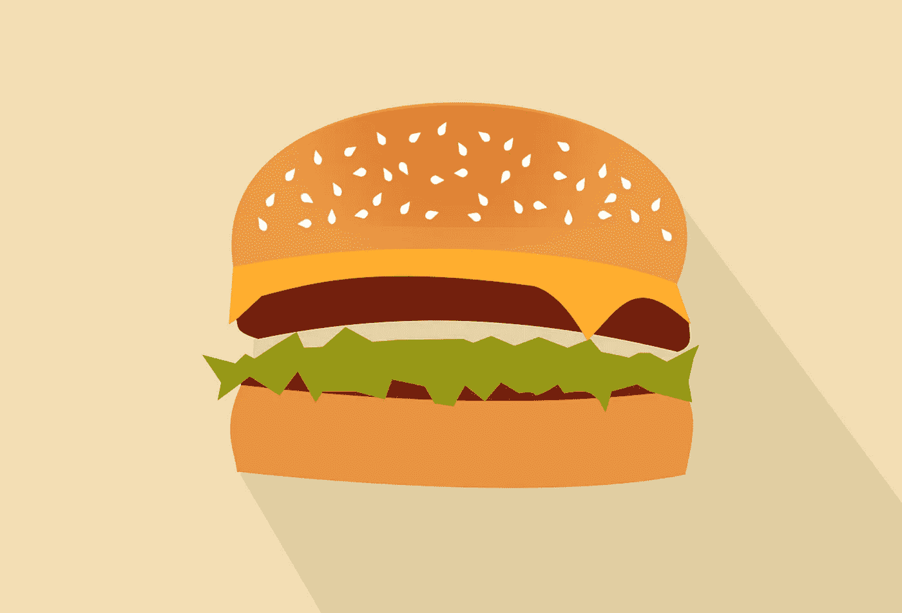

# 超越肉类、燕麦和可持续发展

> 原文：<https://medium.com/swlh/beyond-meat-oatly-and-scaling-sustainability-2ce63f1fd530>

## 随着人们对动物福利、环境和个人健康的日益关注，基于植物的食物替代品正在激增——这在很大程度上是最好的

在美国，[超过 95%的农场动物](https://www.aspca.org/animal-cruelty/farm-animal-welfare)(鸡、猪、牛、火鸡)都是在工厂化农场——大型工业化农场……