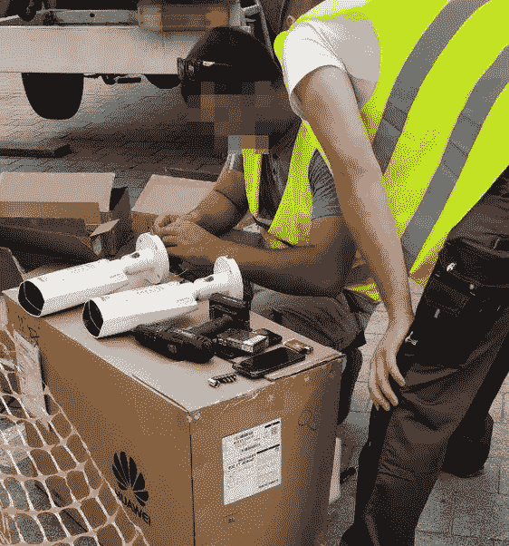

# 老大哥来到贝尔格莱德

> 原文：<https://medium.com/swlh/big-brother-comes-to-belgrade-4eb7dca7dc5b>

Photo/Share Foundation

2014 年，一名年轻人在塞尔维亚首都贝尔格莱德的一场肇事逃逸车祸中丧生。尽管警察在追踪，罪犯最终还是逃脱了。接下来的一个月，塞尔维亚警方发现[嫌疑人已经逃到了](https://www.telegraf.rs/vesti/1824689-danas-presuda-u-slucaju-kantrimen-tuzilastvo-trazi-deset-godina-zatvora-za-marka-miliceva)中国的一个城市，他们向中国当局提供了他的照片。

仅仅过了三天，中国警方在…的协助下逮捕了这名男子