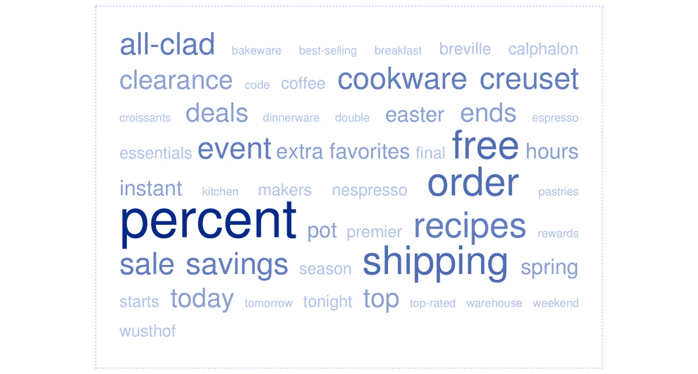

# 大数据承诺更少(更好)的营销。事情并没有那样发展。

> 原文：<https://medium.com/swlh/big-data-promised-less-and-better-marketing-it-hasnt-worked-out-that-way-12359ba0f23a>

59 days. 175 emails. Zero relevancy from Williams-Sonoma.

消费者:*那么，再提醒我一次，为什么我需要放弃大量我的私人数据？*

营销:*嗯，你不仅可以免费(或者以低于实际成本的价格)使用我们的产品，而且我们还会利用这些数据来停止无关广告的轰炸。这对我们更好，因为我们可以更有效率* …