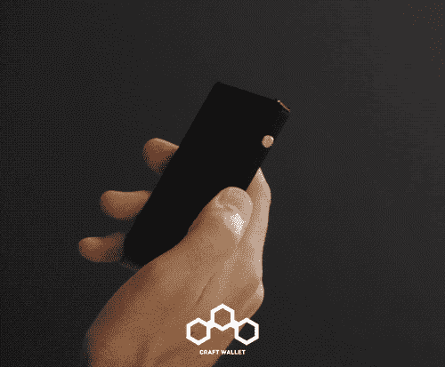

# 2018 年我们最大的错误

> 原文：<https://medium.com/swlh/biggest-mistake-in-product-development-and-launching-b502d973dd49>

2018 是[工艺钱包](https://craft-wallet.com/)疯狂的一年。它不再是一群大学生的兼职项目，而是一份全职工作。

> 在 Craft Wallet，我们设计并制造**高级迷你钱包**，能够携带您需要的一切。我们所有的产品都是由我们在葡萄牙的工厂设计和制造的。

以下是过去 12 个月中发生在我们身上的一些好事和坏事:

*   向 110 多个国家出售我们的钱包；
*   从**生产地狱到物流地狱；**
*   濒临破产；
*   在一次**众筹活动中筹集了超过 5 万美元；**
*   通过我们的**网站和其他销售渠道卖出了数千个钱包；**
*   累计近 **2000 订单积压**；
*   建了一座**工厂，垂直整合了**的生产和物流；
*   雇佣了我们的第一批员工**；**
*   ****等。****

**如果说去年可以用两个词来概括，那就是**失败**和**学习**。不要误解我的意思，对我们来说，这是非常成功的一年，但一路上，我们遇到了太多的问题，以至于我们甚至很难掌握过去 12 个月中我们经历的失败和吸取的教训。**

**尽管如此，有一个错误很突出。**它花费了我们 50.000 多美元**(当你正在启动时，失去这么多钱可能是致命的)**并导致几次不遵守交货期限**，使成千上万渴望尝试该产品的客户失望。**

## **错误:**

> **认为拥有一个工作原型意味着产品已经准备好进行大规模生产，并且可以运送给你的客户。**
> 
> **不是的。**

**这可能是一个错误，原因有几个。在我们的案例中，我们“幸运”地构建了一个原型，并且碰巧成功了。问题是当大规模生产开始时，一些我们在原型中无法识别的设计缺陷开始变得明显。**

**更糟糕的是，这些设计缺陷只能在一些钱包上看到。最后，其中的 50%工作正常，而另外的 50%根本不工作，我们不知道为什么。这是一个巨大的难题，我们无法理解，但我们必须做些什么。超过 1000 名顾客已经预购并支付了钱包款。**

**我们开始着手解决这个问题，尽我们所能来纠正缺陷。我们投入了大量的时间和金钱来寻找解决方案，不得不将大规模生产推迟几个月。我们发现自己被困在生产地狱中长达 8 个月。**

> ****生产地狱**是行业术语，指的是在进入生产阶段之前需要特别长时间开发的产品。开发/生产地狱中的项目并没有被正式取消，但是它们的工作会变慢或者停止。**

**当我们认为我们已经解决了所有问题并准备好大规模生产时，我们会收到已经收到钱包的客户的反馈，说出现了新的问题。每次出现这种情况，我们都不得不停止生产，重新设计钱包，更改交货期限。这种情况发生了太多次，我们都数不清了。**

**在生产地狱中，你解决了一个问题，另两个问题又出现了。我们的钱包有 11 个不同的部分，它们都需要调整。**所有的人。从团队的精力和创业公司的资金来看，这是一个巨大的消耗。****

****

**We had a “mountain to climb” and not a lot of “climbing material”**

**延误的结果是，我们有成千上万愤怒的顾客，他们的钱包花了太长时间才被运送。这并不容易管理，因为没有人习惯为一个我们社会认为理所当然的产品等待几个月:钱包。我们请他们理解，幸运的是，绝大多数人确实理解，并且更愿意等待一种他们知道不同的、比他们习惯的产品更好的产品。**

**从财务角度来说，这种情况以两种不同的方式影响了我们:**

*   **我们不得不进行几次生产运行，直到我们找到并消除所有问题的根源，在此过程中消耗了大量资金；**
*   **我们损失了几千美元的退款，这些退款是我们必须给那些不能再等下去拿钱包的顾客的。**

**这很苛刻，因为在一个白手起家的创业公司里，现金就是一切。我们必须对我们的资金投向非常谨慎。正是在这段时间里，我们最接近破产。那是一段非常紧张和恐怖的时期。**

****多亏了大量的辛勤工作和个人牺牲，设计缺陷不复存在，产品运行完美，我们正在发货并接受订单💪。****

# **经验教训**

**仅仅因为你的原型看起来工作正常，并不意味着你的产品已经上市。也许你只是“幸运”地让那台电脑工作了。**永远不要匆忙推出产品。****

**当大规模生产不同的产品时，这些产品并不总是具有相同的尺寸、形状和质量。当你想让某样东西长期正常工作时，这些微小的差异可能是关键。**

**最终，在产品问题全部解决之前，我们无法完成订单。与此同时，在完成现有订单之前，我们不能接受更多订单，否则我们会制造更大的问题。**

**这是我们发展的主要障碍。**

**2018 年是过山车式的一年，有很多复杂的感觉。**有一天你会成为世界之王。前几天你觉得自己像垃圾。企业家的生活中没有什么新鲜事。对大多数人来说，这似乎是一种艰难的生活方式，但如果我们不热爱我们的工作，[工艺钱包](https://craft-wallet.com/)早就不复存在了。****

**这些教训不仅存在于商业领域，也存在于个人层面:**

*   **花大量时间做客户服务和管理成千上万人的愤怒(其中一些人很粗鲁，并发出威胁)**极大地提高了我们的情商和抗压能力**。**
*   ****永远保持谦逊**。从长远来看，这是值得的。**
*   ****不要孤立自己**。成为企业家是一项孤独的任务。与朋友和家人社交会帮助你在一天结束时理清思路。**

> **我们在这里是长期的。我们今天犯的错误给我们的教训是明天火箭的燃料。**

****

# **关于作者:**

**佩德罗·安德拉德是一名 22 岁的葡萄牙企业家。他曾在三大洲生活和工作，是 [Craft Wallet](http://www.craft-wallet.com/) 的联合创始人之一。他目前在葡萄牙里斯本工作。**

****

## **这篇文章发表在 [The Startup](https://medium.com/swlh) 上，这是 Medium 最大的创业刊物，拥有+423，678 名读者。**

## **在这里订阅接收[我们的头条新闻](https://growthsupply.com/the-startup-newsletter/)。**

****