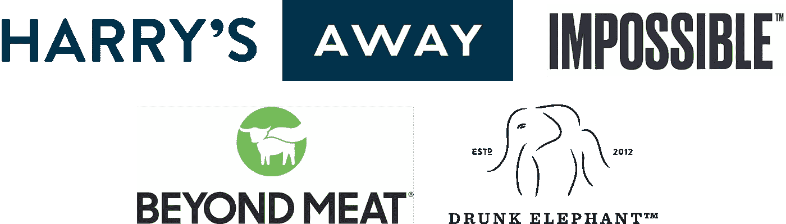

# 价值十亿美元的汉堡、剃须刀、包和大象

> 原文：<https://medium.com/swlh/billion-dollar-burgers-razors-bags-and-elephants-1680540f7b68>

在消费品领域有一种理论，认为偏好的扩散会导致更多的赢家和更小的结果。出于一些原因，我同意这一理论，但在过去的 10 天里，十亿美元品牌的头条新闻铺天盖地而来，而十年前这些品牌还不存在: