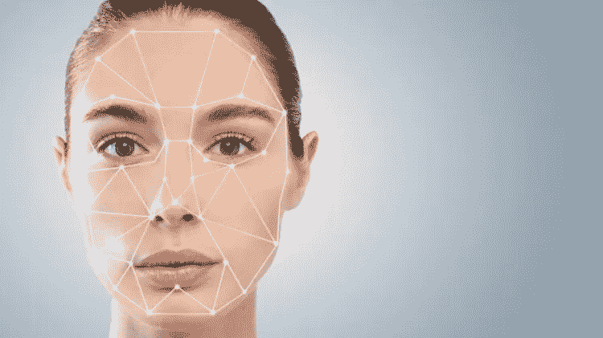

# 解锁 iPhone 的生物面部识别——是否违反第五修正案？

> 原文：<https://medium.com/swlh/biometric-facial-recognition-for-unlocking-iphone-does-it-violate-the-fifth-amendment-874ec80fe02c>

[https://moneyinc.com/wp-content/uploads/2018/07/Facial-Recognition-750x421.jpg](https://moneyinc.com/wp-content/uploads/2018/07/Facial-Recognition-750x421.jpg)

这篇文章最初于 2019 年 3 月 9 日发布在《NYU 知识产权与娱乐法杂志》(JIPEL)上，可通过[https://blog . JIPEL . Law . NYU . edu/2019/03/biometric-face-recognition-for-unlock-iphone-it-violate-the fifth-amend ment/](https://blog.jipel.law.nyu.edu/2019/03/biometric-facial-recognition-for-unlocking-iphone-does-it-violate-the-fifth-amendment/)访问