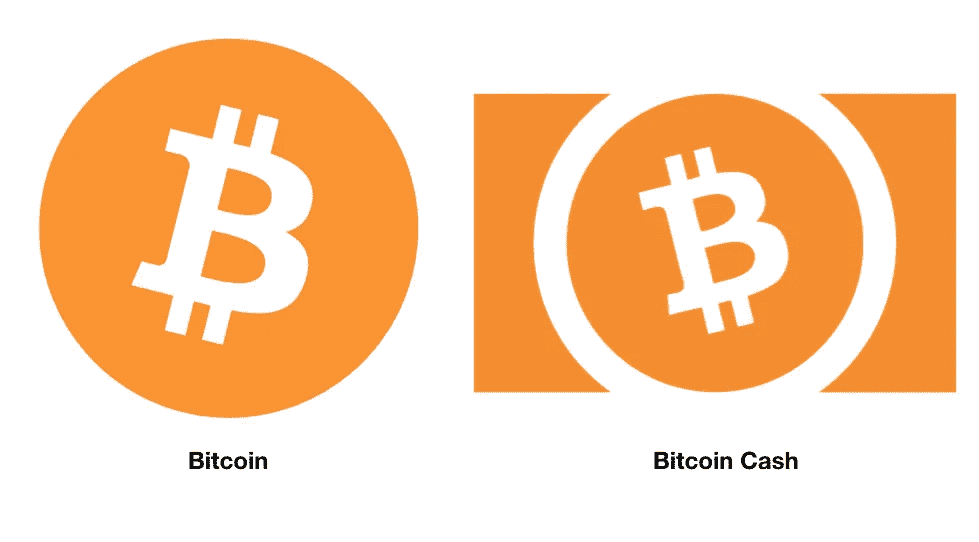
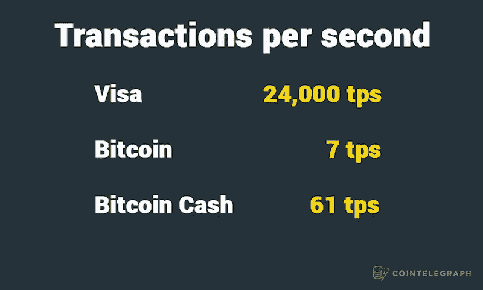

# 比特币现金过于简化:比特币现金初学者指南。

> 原文：<https://medium.com/swlh/bitcoin-cash-oversimplified-beginners-guide-to-bitcoin-cash-52408d121c55>

几乎所有人都知道，比特币是第一种加密货币，也是其中最著名的一种，它几乎是在十年前出现的，现在它和以往一样强大。今天，它不仅是世界上第一种加密货币，也是最稳定、最昂贵和最受欢迎的加密货币。

也就是说，它并不完美。比特币最关键的问题之一一直是它的可扩展性。更明确地说，它是一个交易块的大小，当比特币被创造出来时，它被限制在 1mb。这种限制限制了网络可以处理的事务数量，并导致事务处理时间的显著延迟。

然而，比特币现金是一个不同的故事。它与其他版本的不同之处在于，它允许将块的大小增加到 8mb。他们的总体目标是增加其网络可以处理的所有交易，希望比特币现金能够与 Visa 和 Paypal 等行业巨头目前可以处理的交易量相竞争。

# Roger Ver“比特币现金才是真正的比特币。”

Roger Ver 是比特币的早期投资者之一。他向许多新兴的加密货币和区块链初创公司投资了约 100 万美元，包括 Z.cash、ripple、Bitpay、blockchain.com、北海巨妖和 purple . io。他也是 Bitcoin.com 的首席执行官，是比特币基金会的五名创始人之一，他还捐赠了价值超过 100 万美元的比特币。Ver 将比特币视为未来和实现经济自由的手段。他在加密货币社区也被称为比特币耶稣。

此外，罗杰·韦尔(Roger Ver)目前正在倡导比特币现金。Ver 将比特币现金描述为“真正的比特币”，称其未来将拥有更大的交易量、用户群和市值。他还提到，他持有的大部分加密货币都是比特币现金。

# 比特币现金的故事

每个块的大小限制为 1mb 的原因是为了降低 DDoS 攻击和垃圾邮件的可能性。

当比特币开始一天天变得越来越受欢迎时，限制开始导致区块堆积，最终延长了过渡的时间。情况如此糟糕，以至于在 2017 年 5 月左右，一些用户报告说必须等待长达四天的确认。

在荷兰阿纳姆举行的比特币大会期间，一位名叫阿马里·塞切特的人宣布了比特币现金概念的第一次实施，他是脸书的前工程师之一。

Séchet 和他的团队决定将块大小限制增加到 8mb。像这样的巨大变化要求他们的创造从比特币的原始网络中分离出来。于是，比特币现金的发明。

***引文:***

*什么是比特币现金？(未注明)。https://coin telegraph . com/bit coin-cash-for-初学者/什么是 bit coin-cash # story-of-the-hard-fork*

*如果您想了解更多，请访问 BIDITEX 页面并提出您的问题，关注我们的* [*推特*](https://twitter.com/biditex_com) *，* [*脸书*](https://www.facebook.com/biditex/) *，* [*中型*](/@biditex) *，* [*电报*](https://t.me/biditex%20%28edited%29) *等。投标变更同***。**

**

## *这篇文章发表在 [The Startup](https://medium.com/swlh) 上，这是 Medium 最大的创业刊物，拥有+416，678 名读者。*

## *在这里订阅接收[我们的头条新闻](http://growthsupply.com/the-startup-newsletter/)。*

**