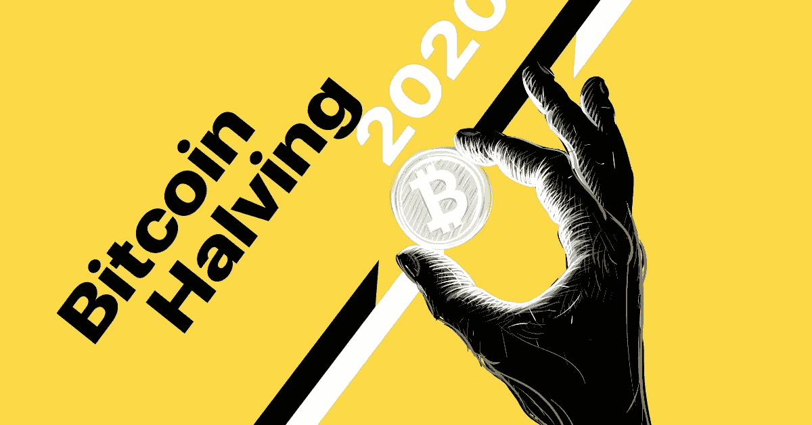
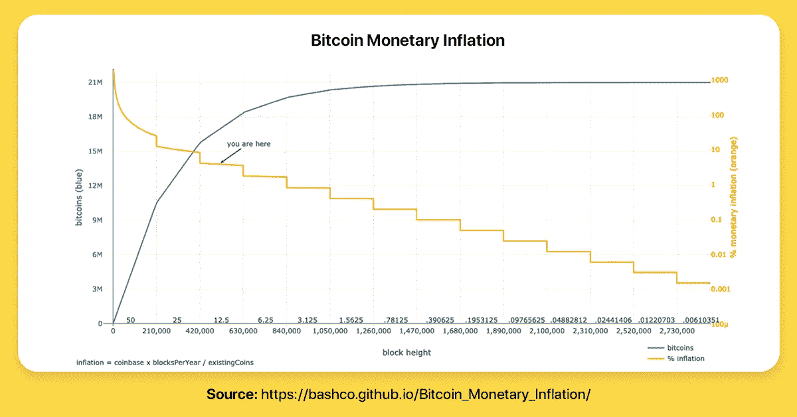
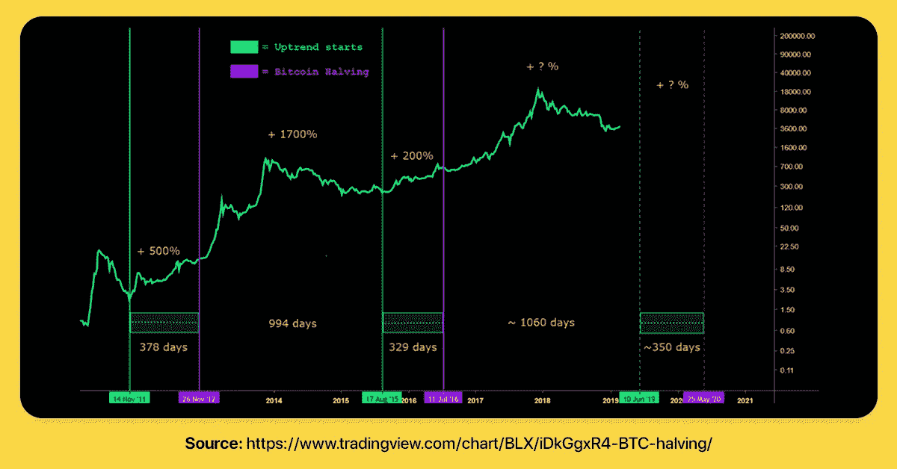

# 比特币 2020 年减半:我们真的站在反弹边缘了吗？

> 原文：<https://medium.com/swlh/bitcoin-halving-2020-are-we-really-standing-on-the-edge-of-a-rally-c9faea110b7b>

## 隧道的尽头有光明，至少他们是这么说的。一些 BTC 持有者认为，光被称为“比特币减半”——这一事件每 4 年发生一次，并已被证明能够有效引发世界上最受欢迎的加密货币的大规模增长。但是下一个减半会再次抬高价格吗？历史是这样说的。

要开始谈论比特币减半，我们首先应该了解这种加密货币是如何创建的。你可能知道，与法定货币不同，比特币不受中央机构监管。取而代之的是，全球数百万台电脑(又名“矿工”)记录交易并验证其准确性。

简单地说，比特币矿工的工作是向一个通常被称为“公共账本”的数据库添加新的信息块。对于他们的努力，以及支付采矿的所有相关费用，该网络用比特币奖励他们。

中央银行控制货币供应，将通货膨胀保持在合理的目标范围内。他们可以印多少钱没有限制。但比特币的情况就不同了。比特币供应量上限为 2100 万。换句话说，一旦区块链达到那个资本值，就不会再有 BTC 产生了。

那么，如何在货币发行的过程中防止通货膨胀呢？

早在 2008 年，中本聪就在一封电子邮件中提出了这个问题:

> *“新硬币的产生意味着货币供应量按计划增加，但这并不一定导致通货膨胀。如果货币供应量的增长速度与使用货币的人数的增长速度相同，价格就会保持稳定。如果它的增长速度赶不上需求的增长速度，就会出现通货紧缩，早期的货币持有者就会看到货币价值的增加。硬币必须以某种方式进行初始分配，恒定汇率似乎是最佳方案。”*

Bitcoin Monetary Inflation

通过将对矿工的奖励减半——最初为 50 BTC——该网络保证比特币在其渐进分发过程中不会遭受高通胀。

默认设计规定，每向区块链添加 210，000 个区块，奖励必须减少 50%。目前，奖金为 12.5 BTC。下一次下调——预计在 2020 年 5 月——将把奖金降至 6.25 BTC。

如上图所示，比特币的年通胀率现在接近 3.8%。明年的“halvening”将把通货膨胀率降低到 1.8%。

## 随着时间的推移,“Halvening”如何发挥作用？

考虑到比特币只有十年的历史，谈论历史有点难。但是，在查看图表时，可以发现一些有效的模式。

如果你关注下面这个，你会注意到之前的两个比特币减半日标志着大牛市的开始。伤亡？

Bitcoin Halving Dates

这还不是全部。几乎在每个减半日的一年前，上升趋势开始形成。根据这张图表，随着市场接近期待已久的 2020 年半，2019 年年中将成为下一个牛市周期的起点。

但比特币价格减半不仅在控制通胀方面有用。这种方法还通过激励矿工在更长的时间内保持参与网络来鼓励加密货币的可持续发展。

尽管事实上比特币总供应量的 83%已经被开采，但最终的比特币预计将在 2140 年发行。

## 奖励少了，还挖矿？

如前所述，比特币 halvening 减少了矿工服务所得报酬的一半。比特币减半对采矿活动有什么影响？

回到 2016 年，比特币区块链从每天释放 3600 个 BTC 变为 1800 个，块奖励从 25 个 BTC 减少到 12.5 个 BTC。

尽管这对任何人来说听起来都像是大幅减薪，但矿工们并没有关掉电脑。事实上，哈希速率——比特币网络消耗的计算能力——保持稳定。但是……为什么呢？

如果比特币价格上涨到足以补偿减半导致的奖励减少，那么 hashrate 可能不会发生重大变化。

比特币挖掘盈利能力多重因素。街区奖励只是其中之一。要了解采矿是否真的是一门好生意，矿工们还应该看看:

*   哈希拉特
*   开采难度
*   电费
*   功率消耗
*   游泳池费用

电费取决于采矿设备的物理位置。与美国或欧盟相比，阿根廷、俄罗斯或中国等国家提供了极具竞争力的费率。

矿工使用的设备性能也会影响结果。设备越复杂，性能功耗比就越好。

按照比特币目前 3896 美元的价格，在许多国家，采矿是无利可图的。委内瑞拉似乎是最便宜的地方之一。根据前几年的估计，在这个加勒比海国家开采一个 BTC 的成本将近 500 美元。

## 底线

虽然对这些事件的影响的预测可能会大相径庭，但有一点是明确的:下一个减半日期将在定义未来几年的加密市场条件方面发挥重要作用。这当然是一个密切关注密码矿工，持有者和所有爱好者的日子。

## 关于隐密处

[根据毕马威和 H2Ventures 的说法，Crypterium](https://medium.com/u/3c3059b00067?source=post_page-----c9faea110b7b--------------------------------) 是最有前途的金融科技公司之一。我们正在打造一款移动应用，以满足数字资产时代的银行需求。

我们的目标很明确:有了 Crypterium，无论你用传统货币做什么，你都可以用数字资产来做。这个想法得到了 TechCrunch 联合创始人 Keith Teare 和超过 40 万注册用户的支持，这个数字每天都在增长。

该团队由 Visa 中欧和东欧前总经理 Steven Parker 以及来自全球金融机构(如复兴保险、伦敦衍生品交易所、美国运通等)的高管领导。

加入我们的 [**电报新闻频道**](https://t.me/crypterium_en) 或其他社交媒体，保持更新！

[**网站**](http://crypterium.com)**๏**[**电报**](https://t.me/crypterium)**๏**[**脸书**](https://www.facebook.com/pg/crypterium.org)**๏**[**推特**](https://twitter.com/crypterium)**๏**[**bitcointalk**](https://bitcointalk.org/index.php?topic=2214098.0)****************

********

## ****这篇文章发表在 [The Startup](https://medium.com/swlh) 上，这是 Medium 最大的创业刊物，拥有+432，678 名读者。****

## ****在这里订阅接收[我们的头条新闻](https://growthsupply.com/the-startup-newsletter/)。****

********