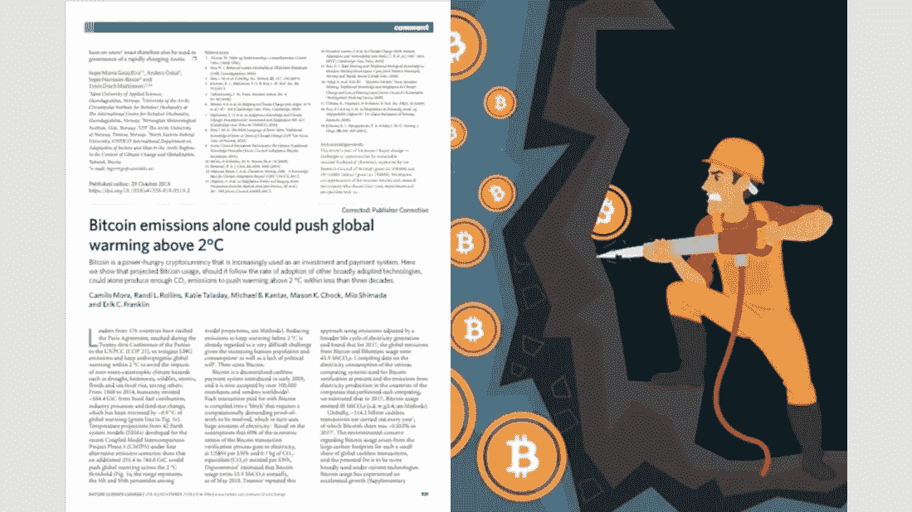
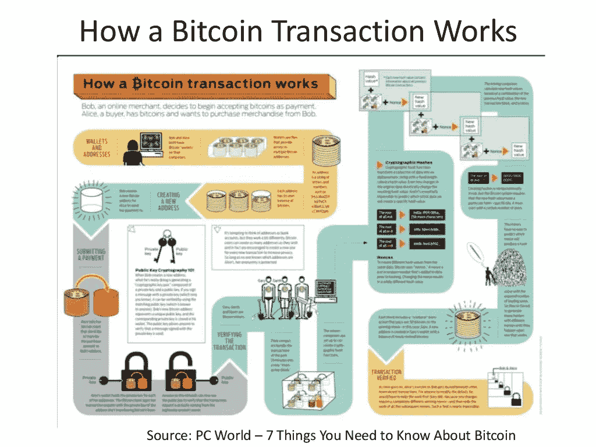
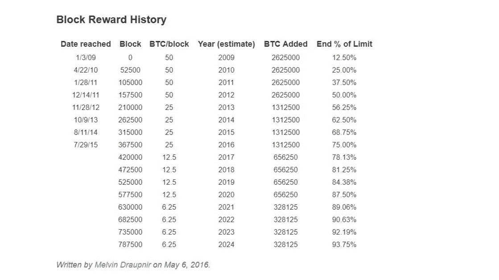
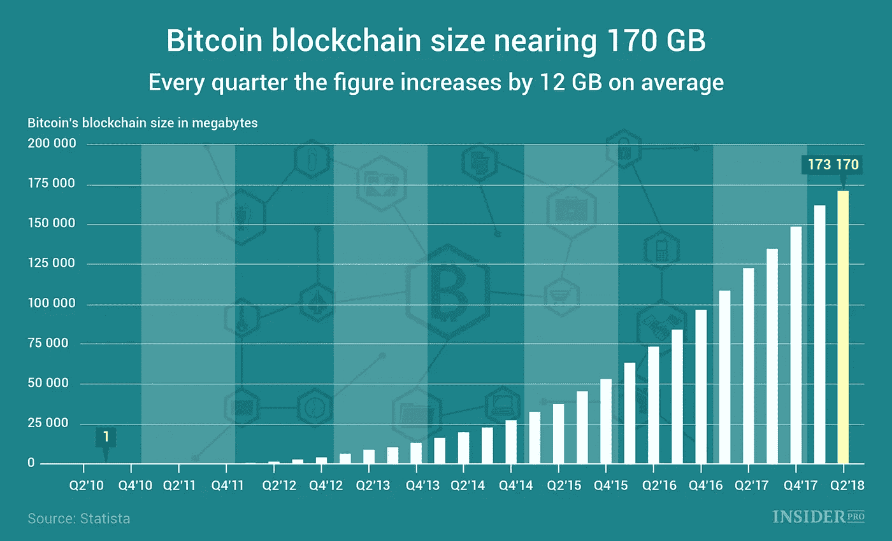
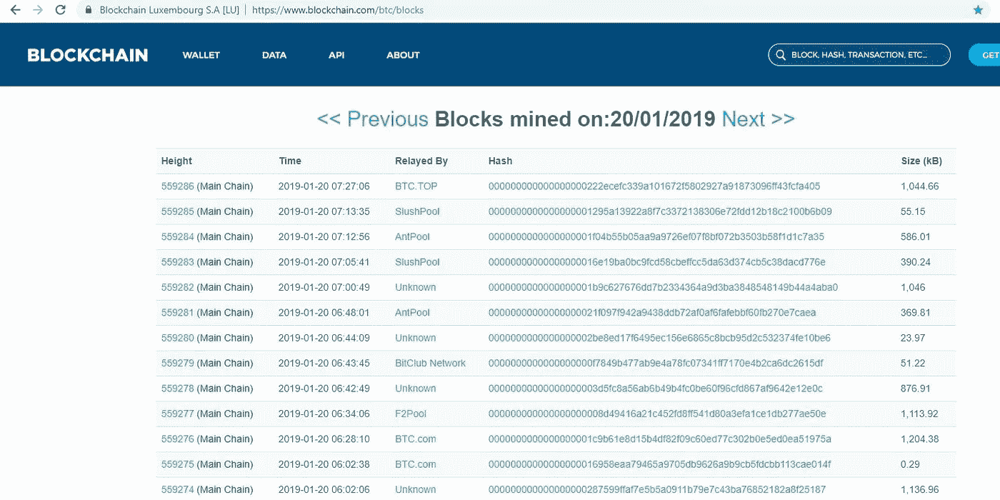
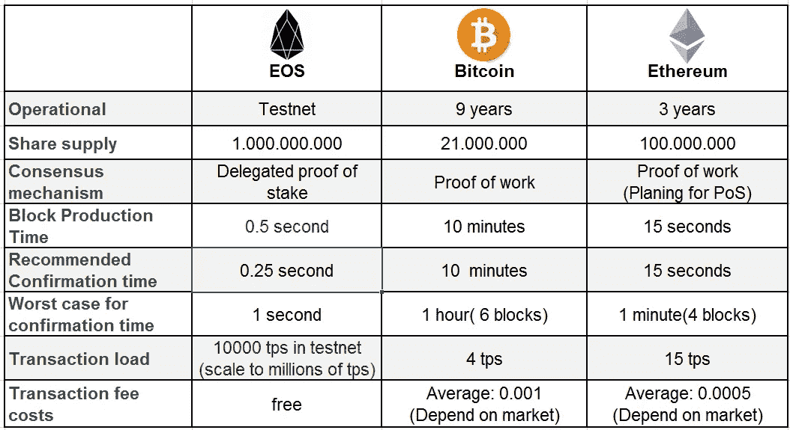
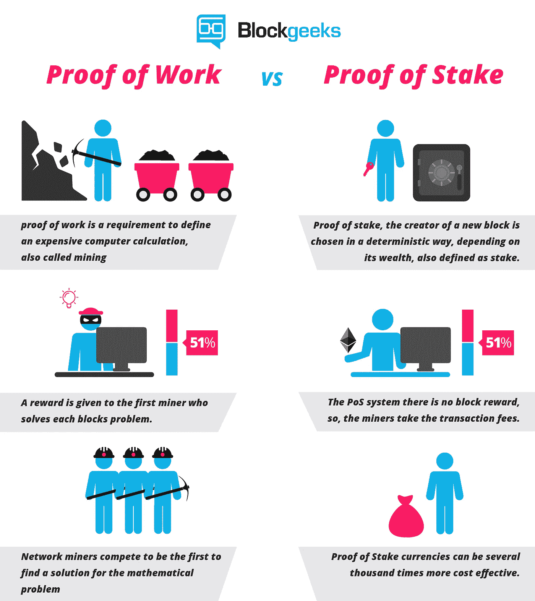
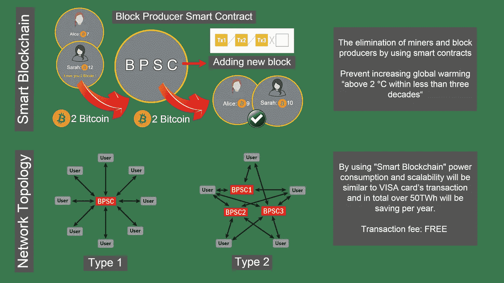

# 比特币挖矿；《大小谎言》

> 原文：<https://medium.com/swlh/bitcoin-mining-big-little-lies-c6911435aa77>

## 隐藏比特币的弱点不是解决办法。

十年前，比特币的工作验证机制是一个试点项目的好主意，也是第一个去中心化网络的启动。但这种长期生活的方式必须得到纠正，多年来，一个拥有一千万人口的国家所消耗的电力，不能只用于比特币交易。这是极端自私和不公平的。有必要首先尝试整顿比特币网络，而不是为区块链技术寻找奇怪和花哨的利用。

这篇文章的作者是索马耶赫·戈拉米女士和迈赫兰·卡泽米尼亚先生，文章于 2019 年 2 月以波斯语和英语写成。

[*波斯文*](https://www.soliset.com/bitcoin-mining)

在比特币出现的早期,“比特币挖矿”一词以及为 block producer 选择的名称“矿工”被用来描述区块链这个新的、稍微复杂的概念。但是我们知道，进入区块链的砌块生产商的活动和真实矿井中的采矿作业并不相似，在许多方面，它们是完全不同的。但这种幼稚搞笑的命名造成比特币矿工的巨大耗电似乎很正常。此外，区块链的专家们并没有采取有效的步骤来澄清这个问题，有时他们用复杂而神秘的言论，甚至假装比特币开采的环境问题是正常的和不可避免的。

不幸的是，命名方面的一个小谎言导致没有足够重视主题的成本效益分析(CBA)。所有的东西、照片、文章等都说明了区块链技术和真正的采矿一样复杂和昂贵。舆论惊叹于课题的复杂，或许也因为这种错误的比较，对极高能耗这一科学合理的要求少了一些质疑。今天，记录比特币交易需要消耗超过 50 太瓦(1 太瓦时= 3 600 000 000 000 000 焦耳)的电力！这意味着用于记录整个比特币账本的电量相当于一个拥有 1000 万人口的国家一年的耗电量。

很多人误以为超常消耗的电力是用来生产和开采比特币的，这样的开采工作就像是一种创造附加值的行业。但是大家要知道，这个能耗只是为了用工作证明的方法来确定赢家矿工和有效区块，而比特币并不是用这样的电来生产和开采的，基本上创造几百万个比特币的功耗是可以忽略不计的。

[*这项于 2018 年 10 月进行的关于全球气候变化*](https://www.nature.com/articles/s41558-018-0321-8.epdf?referrer_access_token=h1fcePQqnrntGZtW4POj5dRgN0jAjWel9jnR3ZoTv0N_BlBOQJDHfvssdGkz36RF4-C7V0a3_EVtpCvGlNw-EnbTe8aHj0G6zUia-Ph07D9stGSwVr33awLgvAeF6wJMemMg8v0fJW4Fv4fkvd4UVqUc8AUCraiFlL0wQQpzHXejfnfIUa7cgU5GVf1-m6vebGayFvjf-pOpjCNuCq4tFepjgz_m7haDpjlNlw-l34JwomIaiMXK1GzxOQL8y37Vhl3dzb0oAHggs8BswICMcLAdnfLZbGezQTIfriWLRys%3D) 的研究表明，在不到三十年的时间里，比特币开采可以使全球气温升高 2 摄氏度以上。 [*Digiconomist 也发表了一篇文章*](https://digiconomist.net/bitcoin-energy-consumption) 估计比特币的交易功耗比 Visa 卡的交易功耗大约多二十万倍(200K)。这些数字真的令人震惊，应该注意的是，如果我们想在一个集中的网络中记录和存储世界上所有的比特币交易，当然一个本地的中型银行就足以做到这一点。

[Global Warming](https://www.nature.com/articles/s41558-018-0321-8.epdf?referrer_access_token=h1fcePQqnrntGZtW4POj5dRgN0jAjWel9jnR3ZoTv0N_BlBOQJDHfvssdGkz36RF4-C7V0a3_EVtpCvGlNw-EnbTe8aHj0G6zUia-Ph07D9stGSwVr33awLgvAeF6wJMemMg8v0fJW4Fv4fkvd4UVqUc8AUCraiFlL0wQQpzHXejfnfIUa7cgU5GVf1-m6vebGayFvjf-pOpjCNuCq4tFepjgz_m7haDpjlNlw-l34JwomIaiMXK1GzxOQL8y37Vhl3dzb0oAHggs8BswICMcLAdnfLZbGezQTIfriWLRys%3D)

在下文中，我们以几个简单的问题和答案的形式推进讨论，因为我们想对区块链技术的一些误解给出明确的答案，并考察比特币挖掘的问题，尽管这些问题被反复问及但不幸的是，区块链技术专家的答案往往并不透明。例如，他们拐弯抹角地谈论来自地面的挖掘和比特币挖掘之间的相似性，并且没有对人民的问题给出简单准确的答案。

# 比特币矿工做数学计算是出于什么目的？而这样的计算又消耗了多少电力？

这些数学计算同时指定了两件事:首先，每十分钟，它通过一个完全随机的机制来确定赢家矿工，其次，通过执行这些计算，每个人都确信赢家所做的块是有效的，并且事务的数据中没有缺陷或没有被篡改。矿工消耗的几乎所有电力都是为了做这种数学演算。

获胜者确定后，他会将有效区块(也包含接收自己报酬的交易)添加到链的末尾，这样就完成了。矿工每十分钟有一次获胜的机会，总是需要消耗大量的电力。不同的人估算了全球矿工的耗电量。不幸的是，他们的报告显示，矿工消耗的电力非常高，每年超过 50 太瓦。

# 这样需要巨大功耗的数学计算解决了哪些问题？

这些数学计算解决不了任何问题，工作中也没有任何创造性。在这种计算中，只有大量的随机数被一个接一个地添加(组合)到特定类型的数学函数(块内容的散列)中，并且这种组合的结果是为每个随机数计算的。赢家是能比其他人更快找到正确随机数的人。适当的随机数是与数学函数结合产生特定结果的数。

很明显，这些计算对数学或解决实际问题没有帮助，而只是为随机选择获胜者矿工而计划的。同时，这种方法的惊人功耗是由于每次(每十分钟)大量矿工(或矿池)独立尝试无数随机数以获胜。

[How a Bitcoin Transaction Works](https://www.slideshare.net/thoodcpa/bitcoin-passing-fad-disruptive-technology-either-way-its-now-taxable/8-How_a_Bitcoin_Transaction_WorksSource)

# 中奖矿工是用比特币作为矿工费支付的吗？而这个支付过程中消耗了多少电量？

是的，有些比特币是付费的。通过这种方式，当获胜者矿工被确定时，他会向同一区块添加一个特殊的转移请求，并将一定数量的比特币(作为奖励)加上同一区块的交易费转移到其钱包中。这些比特币的总和被认为是赢家费用，尽管没有发送者，但其他节点认为这是一次有效的转移。当然，这项工作的功耗可以忽略不计，惊人的功耗只是为了赢得胜利。

[For example, Block #559286](https://www.blockchain.com/btc/block/000000000000000000222ecefc339a101672f5802927a91873096ff43fcfa405)

例如，您可能熟悉智能合约。令牌由智能合约产生，您只需在编码时设置令牌的数量。生产一百万个代币和十亿个代币所消耗的总成本和电力没有区别，并且消耗非常少的电力。生产比特币这样的加密货币也是如此。比如比特币的总数是两千一百万，但是以太的总数是一亿。这只是编码时间上的一个选择。

然而，“采矿”一词的使用与现实并不相称，额外的电力消耗并不是用来生产或提取比特币，而是用来选择赢家矿工。同时，这个选择完全是随机计划的。

# 事实上，从什么来源支付给矿工的费用？换句话说，开采比特币的电力消耗成本是如何融资的？

如前所述，在比特币总数达到其最大值 2100 万之前，每十分钟指定数量的比特币作为奖励被添加到赢家 miner 的钱包中(该数量目前为 12.5 比特币，每四年将减少一半)。显然，可交易比特币数量的增加对比特币市场产生了通胀影响，实际上，所有比特币持有者都以某种方式支付了这部分赢家矿工费用。此外，赢家矿工费用的一小部分是由每笔交易的发送者在交易时支付的同一区块的总交易费用。一笔交易的总费用通常低于一个比特币。

[Block Reward History](https://www.bitcoinmining.com/what-is-the-bitcoin-block-reward/)

如果从第一天开始，比特币的发送者直接以交易费的形式支付矿工的总费用，并且没有赢家矿工奖励，那么工作证明机制的低效和电力的巨大浪费很快就显而易见了。不幸的是，大多数矿工的费用和他们的电力成本是由赢家矿工的奖励提供的，其影响只通过通货膨胀来显示，这对大多数人来说不是很明显。

与此同时，矿工的报酬会随着时间的推移而减少，每四年就会减半。但是，比特币的价格并不是恒定的，未来根本无法预见。只能说一百二十年使用这种方法，可交易的比特币数量正好达到两千一百万，矿工的奖励也停止了。

因此，一百二十年后，唯一的网络收入是交易费，但也许在那个时候，根本就不会有工作证明机制！

# 每个比特币块的容量和大小是多少？网络中有多少个比特币区块，到目前为止其容量是多少？

比特币块的大小接近一兆字节，在撰写本文时，编号为 559286 的比特币正在被开采。同时，区块链比特币的总大小约为两百 GB 字节。这个数据量并不大，通常，所有人的笔记本电脑硬盘上都有超过 200 GB 的空闲空间。

[Bitcoin Blockchain Size](https://ihodl.com/infographics/2018-07-05/chart-day-bitcoin-blockchain-size-nearing-170-gb/)

事实是，一个拥有千万人口的国家的电力消耗被用来记录和存储比特币的交易。然而，这些数据的总容量还不到一个典型笔记本电脑的硬盘，而且在环保方面，功耗与工作不成正比。然而，区块链概念的新颖性和“采矿”一词的使用似乎掩盖了这种不相称性。

[Blocks mined on 20/01/2019](https://www.blockchain.com/btc/blocks/1547969311549)

如果您仔细观察一个月内块的大小，您会发现有时块大小非常小，并且只有非常少量的事务放在一个块中。然而，这类区块的赢家矿工奖与其他区块并无不同。目前的奖励是 12.5 比特币。有时，它会导致记录交易数据的矿商获得的奖励甚至高于整个交易的总额。例如，矿工已经奖励了超过 40，000 美元来记录几笔交易，但是一个区块的交易总额不到 20，000 美元。

主题的多样性和复杂性，尤其是“采矿”这个术语，让人们忽略了巨大的能源浪费。另一方面，矿工们总是不得不支付大量的电费和其他费用。但无论如何，这种能量的浪费不应该被隐藏，需要在最短的时间内找到一个好的节能方法，不伤害比特币和区块链技术。

# 比特币交易相对于 Visa 卡的交易有什么优缺点？

比特币交易的优势在于，交易是在没有金融机构或银行在场的情况下进行的。而区块链技术让互不了解、互不信任的人们完全信任比特币网络的交易信息和分布式账本，不需要中间金融机构来做这件事。

相比之下，正如你已经看到的，比特币交易的主要缺点是巨大的能源消耗。在这方面已经发表了几份报告。比如 [*，在一份报告中，*](https://www.weforum.org/agenda/2017/12/bitcoin-consume-more-power-than-world-2020/) 一个比特币的交易耗电量，比一张 Visa 卡的交易耗电量还要多两万倍计算出来。但是一份 [*更新的报告*](https://digiconomist.net/bitcoin-energy-consumption) 称，比特币交易的耗电量是 visa 卡交易耗电量的二十万倍。不幸的是，即使是较小的数字也非常高。

换句话说，比特币的交易，除了对环境的严重破坏，也比常规交易要昂贵得多。但用户只直接支付一小部分矿商费用作为交易费用。他们报酬的很大一部分是作为矿工奖支付的。这些新的比特币对比特币市场产生了通胀影响，间接的所有比特币持有者都在为此买单，但实际上，没有人关注这部分成本。

比特币交易的另一个缺点是比特币网络的低扩展性。简单的解释就是，比特币每秒交易的速度和数量都比通常的 visa 卡的交易少很多。

# 解决办法是不要隐藏比特币的弱点

如果你在谷歌或 Medium 上同时搜索区块链和节能两个词，你会发现几十篇关于如何通过区块链技术节能的研究和文章！当然，有些文章是有创意的，有些是花哨的，不适用的。而区块链技术，尤其是比特币网络的主要弱点和低效之处在于它们不同寻常的功耗。

此外，智能合约开发人员为最复杂的社会项目和流程(如保险类型、投票和公投类型、银行等)提出了智能合约，以某种方式消除人为因素并减少成本、错误和腐败。当然，他们的建议几乎是执行和创造性的。但不幸的是，为了记录这种智能合约的交易，矿工和区块生产商形式的人为因素有大量的成本和电力消耗。

[The comparison of transaction](https://steemit.com/eos/@chimnon/the-comparison-of-transaction-between-eos-and-bitcoin-ethereum)

事实上，比特币之后的区块链，像以太坊和 EOS，幸运的是，不像比特币那样使用工作证明机制，而是使用利益证明机制以及委托利益证明机制。在这种机制中，砌块生产商的总运营成本及其能源消耗大大低于工作验证机制。但应该注意的是，它们仍然无法与正常的 visa 卡交易相提并论。与此同时，比特币继续以主要的方式存在。

[Proof of Work vs Proof of Stake](https://blockgeeks.com/guides/proof-of-work-vs-proof-of-stake/)

每个人都知道比特币是世界上第一个区块链网络，被认为是世界上最受欢迎的加密货币。比特币的创造者不想让任何银行或金融机构负责自己点对点网络中的分类账和交易注册。出于这个原因，它建议使用一种工作证明机制来避免漏洞、欺诈和重复支出，这在当时是一种新的创新方法，但现在它必须进行改革，并急于这样做。

# 必须做什么？

***一—*** 首先，我们需要知道并相信区块链技术，尤其是比特币，还没有能够解决它们的主要问题。十年前，试点项目的 POW(工作验证)机制和第一个分散网络的启动是一个伟大的想法。但这种长寿命的方法需要纠正，它不能把一个千万人口国家的电力消耗多年来专用于比特币的交易。这是极端自私和不公平的。世界各地的人们都卷入了许多环境问题，而他们中的大多数都是穷人。事实上，有必要首先尝试整顿比特币网络，而不是为区块链技术寻找奇怪和花哨的用途。

***二—*** 其中一个建议是推出功耗更少的比特币并联网络。例如，这个新的网络可以像 EOS 网络一样使用授权的利害关系证明机制。逐渐地，我们必须要求所有的比特币所有者从新的加密货币中获得与他们的比特币等值的比特币，并且他们最初的比特币应该被同时烧掉。需要注意的是，这个问题与 fork 不同。

最近 EOS 网也在做类似的工作，EOS 社区的成果可以作为很好的体验。BlackOne 想推出其 EOS ICO 的时候，还没有加密货币，也没有 EOS 网络。该公司决定暂时使用以太坊 ERC 20 代币来筹集资金。在 EOS 加密货币和 EOS 网络建立后，任何人持有的 ERC 20 代币都被烧毁，同时，与被烧毁金额相当的 EOS 加密货币金额被支付给同一个人。

***三—*** 另一个建议是将矿工的活动时间从每天 24 小时减少到 16 小时。当然，不能有一天生产两次而每次休息持续四个小时的区块，记录交易要等待全世界矿工活动的正式开始。这样的话，会节省 30%以上的电量，这真的是一个很大的数字。矿工的下班时间可能是交易最少的时候。

***四—*** 我们的主要主张是用某种智能合约来取代矿商和区块生产商。这个方法是我们的小集合“soliset.com”的成果，我们称之为智能区块链。智能区块链交易的功耗和可扩展性将类似于 Visa 卡的交易。幸运的是，通过使用这种方法，巨大的功耗、比特币问题和所有其他加密货币将同时得到解决。

# 什么是「智能区块链」？

一年多来，在去中心化的网络中，我们试图在交易的瞬间获得交易的无瑕疵且准确的数据。因为在这种情况下，不需要像比特币和以太坊网络那样从一个区块中生成许多不同的替代方案，然后矿工通过消耗巨大的电力、花费成本和使用多种证明机制来选择有效的一个。

幸运的是，我们的努力取得了良好的结果；使用智能合约概念的最切实、最简单的方法是生产区块。要了解更多关于智能区块链的特性和更多关于这个主题的信息，您可以阅读以下两篇文章:

 [## 通过使用智能合同淘汰矿工和区块生产商

### (迈向智能环保区块链的第一步，也是最重要的一步)

medium.com](/swlh/the-elimination-of-miners-and-block-producers-by-using-smart-contracts-58b20e317e9b)  [## 智能区块链；拯救比特币，每年节电 50 多万瓦时

### 一个比特币交易的耗电量是一个比特币交易的 20 万倍

medium.com](/swlh/smart-blockchain-the-rescue-of-bitcoin-and-saving-electricity-more-than-50twh-per-year-c17606976fce) 

与此同时，我们还发表了两篇与此相关的文章，从不同的角度考虑了智能区块链的概念。以下链接与这两篇文章相关:

 [## 智能区块链，区块链技术和智能合约之间的互惠服务

### 《另类硬币》杂志上的索玛耶·戈拉米

medium.com](/altcoin-magazine/smart-blockchain-reciprocal-services-between-blockchain-technology-and-smart-contract-669986dbf845)  [## 智能合约是矿商和区块生产商的合适替代品

### 本文讨论了区块链技术发展的必要性，以及消除矿工和区块链的挑战。

medium.com](/@somayyeh_43305/smart-contracts-a-proper-replacement-for-the-miners-and-block-producers-51153f1b0ce5) 

[Smart Blockchain](/swlh/the-elimination-of-miners-and-block-producers-by-using-smart-contracts-58b20e317e9b)

比特币的现状不可能一直持续下去，智能区块链是拯救比特币，改造区块链技术的好方法。这种方法可以一次性解决比特币的所有问题和局限性，而比特币仍然不会依赖于任何金融机构和银行。我们在这里完成这篇文章，并期待您的反馈。

## 2019 年 2 月 26 日
索马耶赫·戈拉米
迈赫兰·卡泽米尼亚

[网站](https://www.soliset.com/)
推特
[电报](https://t.me/soli_set)

## 这篇文章发表在 [The Startup](https://medium.com/swlh) 上，这是 Medium 最大的创业刊物，拥有+428，678 名读者。

## 在此订阅接收[我们的头条新闻](https://growthsupply.com/the-startup-newsletter/)。

