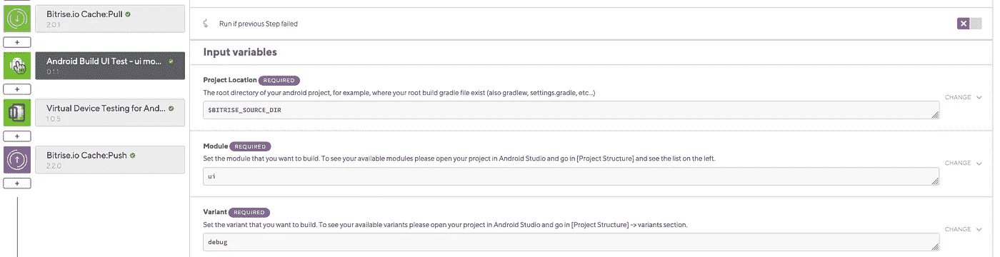
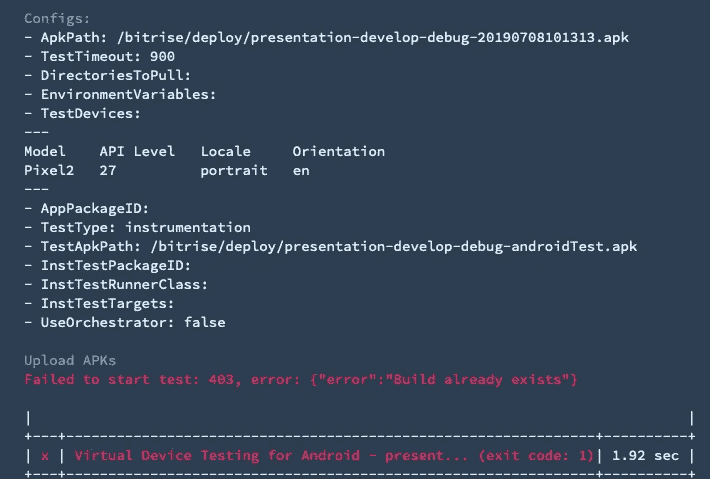
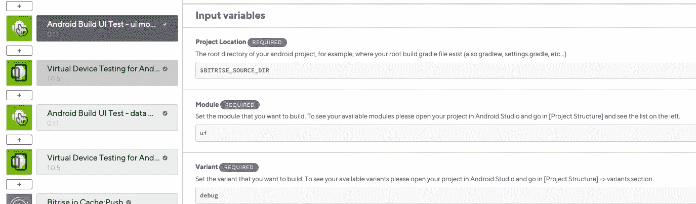
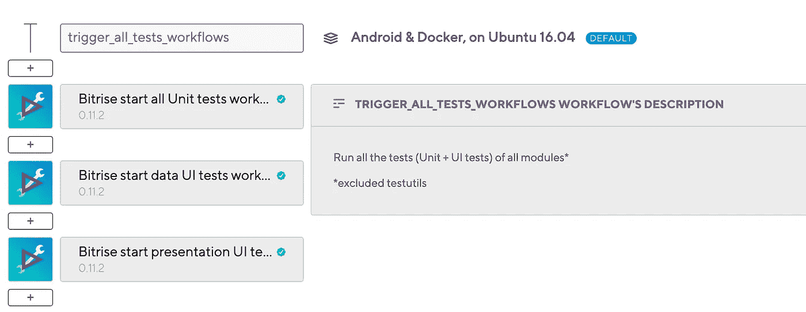
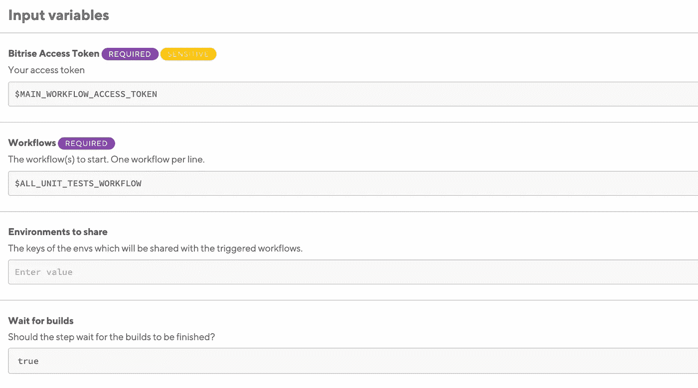

# bit rise——在同一个项目的不同模块上运行 Android 测试

> 原文：<https://medium.com/swlh/bitrise-run-android-instrumented-tests-on-different-modules-within-the-same-project-51a1fc38dfa1>

我最近遇到了这个问题，我发现很少有文档(大部分都已经过时了)，所以我决定写一个非常简单的*逐步*教程。

首先，让我们先简单介绍一下什么是*仪器化测试。*引用谷歌官方文件:

> 插装单元测试是在物理设备和模拟器上运行的测试，它们可以利用 Android 框架 API 和支持 API，如 AndroidX Test。

单元测试的一个很大的优点是你可以测试你的类的真实实例(没有*嘲笑*它们)，或者你可以简单地运行 UI 测试(这些类型的测试也称为 *UI 测试*)，但是另一方面它们非常慢。

# 如何运行测量测试

*免责声明:这里我假设你已经(或知道)如何在 Bitrise 上建立一个基本的工作流程。*

在 Bitrise 上运行*插装测试*非常简单，我们有一个专门的步骤可以让你实现这个目的:

让我们把重点放在称为 *Android Build UI Test* 的步骤上(我把它重命名为*Android Build for UI Testing—UI module*，我总是重命名步骤以更好地反映它们实际在做什么):它非常简单，你需要放入你想要运行插装测试的模块(在我的例子中是 *ui* )和哪个变体(在我的例子中是 *debug* )。

在这一步之后，您可以添加步骤*Android 虚拟设备测试，c* 软管*装备*作为*测试类型*，它将运行所有基于前一步构建的测试。

# 那么问题出在哪里？

当您需要为不同的模块运行多个插装测试时，问题就来了。

换句话说:你需要 2 个(或更多个)*构建用于 UI 测试*步骤和(以及 2 个或更多个*虚拟设备测试用于 Android* )。

如果你尝试这样做，你会得到一个类似这样的错误:

这是一个已知的*问题。*并不是一个真正的问题，是 Firebase 测试实验室如何工作(它由用于 Android s tep 的*虚拟设备测试使用):该步骤为每个构建向 Firebase 发送一个*构建模块*，因为主 apk(它是应用程序 apk)总是相同的，它将为两个步骤发送相同的*构建模块*，抛出提到的错误。*

所以有这样的东西:

我对 2 个模块( *ui* 和*数据*)运行*指令测试*的地方会使 Bitrise 构建失败。

# 解决办法

幸运的是，这个问题有一个解决方案:在不同的工作流中运行插装测试。

在 Bitrise 中，我们可以从一个工作流触发一个工作流，让我们看看下一个:

正如您在这里看到的，我们有一个*父*工作流，其中 3 个是从父工作流触发的:

*   一个运行我们所有的单元测试
*   一个在我们的*数据*模块中运行所有仪器测试
*   一个在我们的*展示*模块中运行所有仪表化测试

*您可以从添加了*位上升开始构建*步骤的工作流触发另一个工作流

让我们详细了解一下这一步通常需要什么:

*   一个 *bitrise 访问令牌*(您可以在 bitrise 中轻松设置一个)
*   我们要触发的工作流的名称
*   我们希望在构建中共享的最终环境
*   等待构建:**将它设置为 true** 是很重要的，否则在并行构建中触发插装测试将会导致我们与之前相同的错误

如果这些构建中的任何一个失败，整个父工作流都将失败。这在某些情况下很方便:例如，我们可以在父工作流的末尾添加一个步骤(比如发送一个 slack 消息，或者上传一个新的 Beta 版 apk ),只有当所有测试都通过了，它才会被执行。

# 考虑

这种方法解决了我们最初的问题，这是我们的主要目的。然而，也有一些缺点:

*   您不能在构建中共享整个项目，这意味着您必须为每个工作流(也就是每个测试)克隆整个项目
*   与所有测试都在同一个工作流中运行相比，构建时间将会慢很多
*   您必须在不同的工作流程中重复相同的步骤，这并不理想

没什么大不了的，但是值得考虑。

虽然还有另一种方法，那就是手动设置 Firebase 测试实验室，并通过 Bitrise 发送相关命令，但我没有深入研究过。