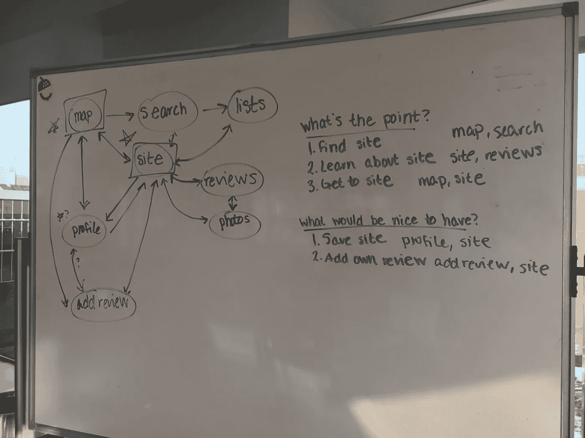
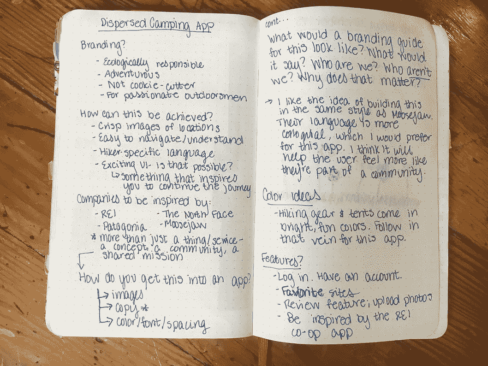

# Bivy:为免费露营地设计移动应用

> 原文：<https://medium.com/swlh/bivy-b5c71f69e1f8>

## 帮助经常露营者在旅途中查找和保存网站的 iOS 应用程序

一次去西部的公路旅行后，我想起了比维，在那里我努力寻找免费的露营场所。我是一名有抱负的设计师，开始这个个人项目是为了继续提高我的设计技能。这是我的第二个设计项目，也是第一个包含各种不同功能和用户流的项目。我花了四个月的时间在业余时间完成这个项目，并接受公司一位资深设计师的每周指导。

# 问题是

很难找到免费的露营地，尤其是当你已经在路上的时候。

喜欢户外活动的人之间有大量的共享知识，尤其是关于搭帐篷的好地方。狂热的露营者寻找与众不同的独特地点。那些露营多年的人有丰富的知识和建议，他们通常很乐意与其他徒步旅行者、骑车者、登山者和露营者分享。只要你喜欢花时间在外面，你就在俱乐部里，了解这个营地的知识。

然而，很少有地方可以在线收集所有这些共享信息。有一些不知名的论坛和土地管理局的地图，通常发布在难以找到的网站上，用户界面很差。这使得很难找到理想的地方搭帐篷，尤其是当你在路上用移动设备浏览这些网页的时候。如果你不知道该问谁，或者位置太偏远，不能问当地人，那些网站是你唯一的选择。

它们很难导航，尤其是因为它们不是为移动优化的。为了保存一个网站，浏览器标签需要保持打开，如果你有不良的接收，它可能不会加载备份。这些网站也无法连接到地图应用程序。

## 亲身经历

我花了很多时间开车环游这个国家，住在帐篷里。2016 年，我花了一个月的时间去西部露营和徒步旅行。这是我第一次长途旅行，我亲身经历了寻找免费露营地的困难——在偏远地区或人口稠密的地方。较长的野营旅行需要免费的场地，除非你愿意花 10 到 30 美元一晚来搭你的帐篷。付费网站通常也很拥挤，你不能保证得到一个位置。

我很难找到一个可以住的地方，尽管是一个特别的地方。美国西部到处都是美丽和偏远的景点，但能找到这些信息(和方向)的地方非常少，所以没有长期专家或当地人的人们通常只能靠自己旅行。

# 研究

在我最初假设有这种手机应用的需求后，我做了一些研究来证明它的合理性。我还努力更好地了解这个应用程序将服务的用户以及他们面临的问题。

## 当前解决方案

我确定了四个在长途旅行中寻找免费露营地的现有解决方案。

1. **USFS & BLMCG 应用**

我在搜索旅行资源时发现了[这个应用](https://apps.apple.com/us/app/usfs-and-blm-campgrounds/id654806302)。它可以免费下载，并由一家软件公司汇编了美国林务局和土地管理局的数据。

这款应用的优点是:

*   保存网站的首选选项
*   提供链接到您选择的外部地图应用程序的选项以获取方向
*   提供过滤选项(站点类型、拥有站点的组织、海拔)
*   包括关于海拔和 GPS 坐标的信息
*   每个网站页面显示当前天气
*   地图视图和可搜索列表视图
*   能够导入 GPX 文件
*   链接到谷歌搜索结果，脸书，Yelp，谷歌图片
*   只需轻轻一点，即可在地图上找到自己的位置

这款应用的不足之处:

*   大多数页面加载缓慢，尤其是地图和外部链接页面
*   导航栏在页面之间变化，令人迷惑，难以使用
*   图像学很难解释
*   免费网站与付费的 KOA 露营地混在一起
*   网站页面提供的关于网站本身的信息非常少，除非链接到一个很小并且很难在手机上阅读的 recreation.gov 页面
*   应用内图片是通过 Flickr 提供的，大多数网站根本没有图片
*   为了查看大多数网站信息，你必须完全退出应用程序，通过链接到社交网站和谷歌搜索结果的浏览器网页
*   站点信息隐藏在站点页面中，使得从地图或列表视图中做出明智的决策变得困难
*   难以比较网站和在选项之间快速移动

2.**搜索网络论坛**

旅行前我花了很长时间在谷歌上搜索“分散露营”。我发现了一个名为[freecampsites.net](https://freecampsites.net/)的网站，它提供免费网站的评论和评级。界面已经过时，充斥着广告。我把这些网页截图发到了我的手机上，以便在路上参考。我在国家森林服务网站上也做了同样的事情，其中包括在地形图上绘制的缺少道路名称或方向的地点。

3.**谷歌地图**

国家森林和 BLM 土地可以免费露营。很多新营员不知道这一点。在露营知识方面，我从我妈妈那里学到了这一点，而我妈妈又从住在犹他州的徒步旅行朋友那里学到了这一点。我在谷歌地图应用程序上调出了国家森林(用绿色标出)，开车穿过它们，寻找僻静的地方停在路边，徒步进入树林露营。

4.**询问当地人**

当我第一次长途旅行时，我在自行车店和运动用品店向当地人询问住宿的好地方。我被指引去那些小城市之外的偏远地方，去国家公园的秘密小路，还有便宜洗澡的地方。户外社区是一个温暖而有吸引力的社区，充满了对伟大的露营地有着多年知识的人们。Bivy 收集的正是这些信息，这样全国各地的露营者都可以访问这些共享的知识。

## 了解用户

在开始设计工作之前，我创建了一个用户角色，并寻找鼓舞人心的公司来帮助我更好地了解 Bivy 用户。

1.**人物角色**

我为一个可能在长期野营旅行中使用 Bivy 的人创建了一个角色。这是一个虚构的 Bivy 用户原型。这个角色是基于一群真实的人，他们喜欢徒步旅行和露营，并且经常在旅行中寻找免费的露营地。这些引用也是虚构的，尽管它们是基于从参加用户测试的个人那里收集的信息。

Actually my brother, not August Davidson

> **奥古斯特·戴维森** 3M 公司材料策略工程师
> 年龄:28
> 明尼苏达州明尼阿波利斯
> 
> **职业** 整周在工厂和工程办公室工作；工作是确保工厂尽可能高效，特别是他们订购的材料，他们如何运输和储存，以及工厂工人如何操作
> 
> “压力很大，所以我每年都要和朋友去几次大型野营旅行来逃避压力。我们的旅行以我们想做的徒步旅行和骑行为基础，一旦我们到了那里，我们就试图找到露营的地方。”
> 
> **体验等级** 每年三到四次为期一周的野营旅行，持续 6 年；一次两个月的长途旅行；经验丰富的山地车手，业余攀岩爱好者，对露营和徒步旅行非常有经验
> 
> “去年我们开车去了犹他州，在 Slickrock 骑山地车。我们真的很难在摩押城外找到一个露营的地方，实际上我们在一家酒店的停车场睡了几个晚上。”
> 
> **与产品互动** 旅途中没有太多科技产品，因为数码设备充电和使用困难；仅偶尔使用电话
> 
> “我的朋友有一台数码相机，他会带一台笔记本电脑来上传他的照片，但其他人都只使用他们的手机。我们查看天气，获取方向，并经常使用地图来寻找国家森林或其他我们知道可以免费露营的地方。在手机上搜索网页很难，但有时我们会试着用谷歌搜索我们附近的地方，看看是否能找到任何关于分散的酷网站的线索或帖子。
> 
> **目标和关注点** 方向(和距离)优先化；网站图片；易于在移动设备上使用；快速获得结果/在选项之间跳跃
> 
> “在我们寻找场地的时候，每个人都又累又饿。找地方花的时间越长，大家的耐心就越短。我们需要找一个附近的、免费的地方，最好是一个凉爽、没有拥挤人群的地方。”

2.**鼓舞人心的公司**

我寻找那些拥有我想用 Bivy 模仿的风格和品牌的公司。我还想到了那些肩负使命的公司，我希望 Bivy 背后的公司也能参与其中，比如环保和可持续发展。

**Moosejaw** 是一家位于密歇根州麦迪逊高地的装备公司。他们的品牌基调是随意、古怪和愚蠢的。他们印上贴纸，上面写着“如果是发酵的，算不算果汁清洁剂？”他们的网站上有一个标题为“我妈妈喜欢这些”的栏目我希望 Bivy 有一个更随意的语气，这样用户就可以舒服地使用应用程序，并与他人分享他们最喜欢的网站(通常是神圣的、秘密的英特尔)。最终，Bivy 中的副本非常少，语气最终比 Moosejaw 的要柔和得多。

**巴塔哥尼亚**是一家户外用品店，它不仅仅是一家商店。该公司是户外社区的支柱，由一个“垃圾登山者”在 70 年代创立，他想为他在约塞米蒂山谷的朋友生产更好的攀岩装备。他们的个人使命远远超出了他们销售的东西。巴塔哥尼亚向保护工作捐赠了数百万美元，可持续地采购许多关键材料，尽管它很受欢迎，但仍然是一家私营公司，对员工非常关心。

回过头来看，如果 Bivy 成为一个更大的平台——以及一家真正的公司，巴塔哥尼亚将是一个更好的灵感。如果一家公司正在开发一款旨在向喜欢公共空间的人开放公共空间的应用程序 Bivy，我希望它拥有这种精神和模式。保护重点将是理想的。

## 研究课程

我希望在开始勾画这个项目之前，我已经创建了更多的人物角色，并对潜在用户进行了采访。我开始 Bivy 是因为我想使用它，并在构建过程的中途回到研究中来帮助通知和证明我正在构建的线框。在构建 MVP 时，如果有一个可靠的人物角色来参考诸如“用户是否应该建立个人资料”和“在选择网站时，距离或评级更重要”这样的问题，将会更容易专注于主要目标没有这些，我偶尔会陷入构建我认为我会想要的东西的陷阱，而不是构建我知道用户想要的东西。

我想对那些不了解 Bivy 的人进行用户访谈。我特别想与年龄在 21-45 岁之间的人交谈，他们从事朝九晚五的工作，利用周末和假期徒步旅行、骑自行车和爬山。与喜欢野外露营的人交谈会有所帮助。如果能和业余户外爱好者和有户外经验的人交谈就更好了——这些人把露营看作是以户外活动为中心的旅行的一个小方面。

不适合接受用户采访的人:喜欢带砖砌浴室和野餐桌的付费露营地的人，把露营本身视为一项活动的人，不熟悉 LNT 的人，寻找带房车连接和预订的露营地的人。

# 构建和迭代

这是我最喜欢的部分！产品流和低保真度线框是我可以努力的地方，以确保我的设计解决了我在研究阶段发现的问题。

## 用户旅程和目标

上面的图片概括了我提到的主要用户旅程。我专注于应用程序的五个主要目标，并列出哪些页面应该包括哪些功能。

我确定了六个目标:

1.寻找场地
2。了解一个网站
3。到达一个网站
4。保存一个站点
5。添加站点评论
6。在个人资料中查看个人网站评论

所有的关键功能都可以从应用程序中的至少两个位置访问。该图还显示了如何从其他屏幕访问这些英雄屏幕。

我喜欢在白板上做这种早期的框架工作，因为它让我能够快速迭代，并轻松地可视化应用程序的流程。我发现，如果我有空间在功能旁边画出工作流，我就能更好地了解全貌。

## 线框化

当我做原型时，我专注于创建一个具有独特的站点列表、完整副本和完整图标的 MVP。在这个过程中，我学到的一些关键知识是“在问题空间思考，而不是在解决方案空间思考”和“推动过去的解决方案”。我写下了诸如“你现在最大的问题是什么？”以及“你是怎么处理的？”在建造过程中回顾过去。

我发现在纸上画出线框通常是最好的开始方式，这样我可以快速地完成整个迭代，而不会在草图上分心，也不会在对齐或像素上浪费时间。

我希望我已经完全用黑白线框开始了这个项目，因为我浪费时间在空间和颜色上，而不是专注于手头的实际问题。在低保真度的线框中工作使我能够快速地处理潜在的流程，并对它们进行迭代，总是由问题本身驱动。

在原型制作过程的中途，我写了一个后续步骤的行动项目列表:哪些仍然可以削减，这个*真正的*是为了什么(是关于网站、BLM 土地还是评论)，以及一个必须拥有/最好拥有的功能的排序列表。该列表为下一组线框提供了信息，并帮助我决定优先考虑哪些内容，删除哪些内容，以发布该应用的第一个版本。

## 根据用户旅程确定功能的优先级

我写下了我正在考虑添加的所有功能，并根据用户体验对它们进行了优先排序。这帮助我确定了 Bivy 设计的第一次迭代需要什么。

这里的要点是，发布一个完整版本的应用程序并不意味着它已经完成了。我一直想让这个项目尽善尽美，这意味着它永远也不会发布。为了摆脱项目炼狱，我建立了这个列表中所有的“必须拥有”的功能，并认为这是一个可运输的 V1。这个列表是在这个项目的未来迭代中要回来的东西。

## 早期原型

地图视图的布局在整个过程中保持相当一致，但是导航栏经常改变。还有一个搜索状态，其中有三个单独的列表(附近的网站，你附近的热门网站，Bivy 上的热门网站)，访问不清楚，地图内的列表中有额外的嵌套列表，所有这些页面之间的导航都很困难。

最初的可用性测试显示，寻找一个好的露营地不需要个人资料，漫长的创建过程是进入的障碍，之后整个入职流程被削减。该应用程序的目标是找到一个露营地，这一流程延长了，没有一个明确的原因。

该配置文件的早期版本包含保存的站点和“共享的站点”,它们位于同一配置文件页面的不同选项卡中。这是一个混乱的视图，将更关键的“保存的站点”嵌套在第二个关键页面(profile)中。术语也不清楚。这个早期的轮廓显示在左下方。

早期版本的“添加评论”页面是该应用的重要组成部分，充斥着过大的组件和杂乱无章的内容。这最终被清理干净，以专注于手头的任务——添加图片、添加文本、网站排名和发布评论。这个早期回顾页面显示在右下方。

在这个早期的原型开发过程中，大部分的工作都集中在导航性、功能性和编辑掉不必要的组件来简化整个应用程序。所有的变化都围绕着在用户旅程和早期线框图过程中确定的六个关键目标。

# 使生效

在低保真度线框完成后，我有了一个完整的 MVP，我通过反馈、设计评审和可用性测试对设计进行了微调。

## vision 中的多轮反馈

Bivy 在 Invision 中经历了六轮反馈。关于低保真度线框的反馈集中在导航、页面组织以及某些 CTA 和工作流是否真正解决了寻找和选择一个好营地的主要问题。

后来的反馈集中在按钮位置和标签、间距、颜色、饱和度、文本大小以及每个图标的功能上。在一些可用性测试之后，Bivy 的所有部分都被删除了，另外一些部分在设计评审中也被删除了。

我在公司一位高级设计师的持续指导下完成了这个项目。我们每周见面进行设计评审，他帮助我完成整个设计过程，一路上提供反馈、意见和建议。他还在 Invision 中提供了几轮具体的设计反馈。

在这个过程中，我了解到粉点是你的朋友。在这个构建过程中，我收到的反馈帮助我看到了在哪里削减、收紧和改进我的工作。我发现原型在每一轮反馈后都有所改进，这是我设计过程中最重要的方面之一。在未来的项目中，我希望在发布之前继续积极地收集至少三次工作迭代的反馈。

## 设计评论

设计评审是这一过程中另一个富有成效的有价值的部分。他们提供了大声思考某些工作流程的机会，在许多情况下表明它们可以被削减。我添加额外画板的评论很少，通常选择削减功能和简化整个应用程序。“杀死你的宝贝”这一设计陈词滥调在评论中经常被重提。

设计评论也帮助我走过了那些让我烦恼的街区和地方。当我有机会讨论我收到的一些更复杂的反馈，并为下一步行动列出一个清单时，就发生了这种情况。我花了几个月的时间才意识到，我可以依恋早期的工作流程和想法，这些评论提供了一个关键的机会，让我从工作中退一步，用批判的眼光来看待它。在设计评审期间，我在 Bivy 上有了一些最大的突破。随着时间的推移，这是我越来越喜欢的过程的另一部分，也是我将在未来的项目中继续做的另一件事。

## 可用性测试

我进行并记录了五次可用性测试，以收集完整 MVP 的不同迭代的反馈，并在每次测试后进行迭代。

1.数据工程师卢克·r .

这是我进行的第一次可用性测试，一开始感觉很失败。第一页是闪屏，没有点击指示器，也不会自动进入下一页。“是这个吗，开始了吗？”由于页面缺乏导航性，Luke 陷入了非常基本的流程中。他花了前五分钟不情愿地填写入职页面并创建了一个账户，同时询问他如何才能“直接进入地图”大量未标记的图标使得全面测试功能变得困难。

这个测试最终对项目产生了巨大的影响。我削减了整个入职流程，一次性删除了 20 多个画板。这是可用性测试带来的最大变化，让人们在下载应用的那一刻就能更容易地找到网站，这是这个工具的最终目标。我还为大多数页面添加了导航，包括关闭添加评论和从列表移回地图视图的选项。

2.**Chris c .——全栈开发者**

该测试促使对地图视图进行了相当多的更改，这在第一次测试迭代后将用户立即放入地图中是有意义的。地图视图中的评级和对评级和图像的关注，而不是距离，来自于这个测试。克里斯遇到的最大问题是在地图上定位自己，这个问题通过一个位置图标得以解决。这个测试比第一个快得多(大约快 50%)，而且没有 Chris 卡住的页面。

他根本没有创建个人资料，这也是卢克在第一次测试中不想做的，所以个人资料的概念(包括技能等级等。)被砍了。这是众多可用性测试中的第二大削减。

3.**山姆·l——产品设计师**

该测试揭示了列表视图和站点页面组织的一些问题。首先，删除了“热门网站”和“附近网站”的单独网站列表。这项测试表明，对于积极寻找附近网站的用户来说，应用程序上的整体顶级网站并不相关，因此列表视图被合并为一个附近网站的列表，带有排名和排序菜单。再一次，作为可用性测试的结果，对应用程序进行了重大削减。

作为这次测试的结果，还增加了一些视觉指示器，包括成功评论帖子的祝酒词和较小模态上的药丸，以表明它们可以被上下拖动。

4.**艾玛·t——大学生**

Emma 在测试中根本没有使用列表视图。她直接在地图视图中完成所有的导航和搜索。我在测试中写了一个笔记“列表可能会过时——太多的滚动。”这是为数不多的几次我选择在应用程序中保留一些在可用性测试中没有被触及的东西。我保留了这个列表，因为它被其他测试对象所利用。

然而，她所有的工作都是从地图上开始的，她想要一种简单的方法在搜索的时候保存网站。在地图上的站点模式中保存站点的选项是这个测试的结果。

5.**凯尔·t .——经常徒步旅行者/露营者**

Kyle 自发地完成了所有主要的工作流程:查看站点页面、保存站点、查看图像和获取方向。我想这是大多数第一次使用的用户会遵循的用例，并确认保存站点的配置文件是值得的。

他曾经说过“我希望有一个返回基地”，所以导航栏现在出现在应用程序的每个关键页面上。他还想要一个列表视图，更清楚地显示距离(以英里为单位)和五星的总体评分。这是我在多次测试中收到的反馈，它改善了列表视图和每个网站的列表。

# 高保真设计

这是设计工作的最后一个方面。我开始从露营和徒步旅行本身，以及在我看到 Bivy 所在的市场中运营的公司中寻找灵感。

## 灵感

我通过创建灵感的情绪板开始了高保真的过程。当时，巴塔哥尼亚(Patagonia)等户外服装公司推出的图案和颜色让人想起 80 年代和 90 年代初。Gear 的颜色也很鲜艳；橙色、亮绿色、蓝色和洋红色是外套、攀登绳和帐篷等物品的常见颜色。

## 风格指南

在开始高保真设计之前，我创建了一个风格指南，这样一切都会很有凝聚力。它还节省了大量的工作时间，因为像字体、颜色、图标和间距这样的事情已经决定了。

**名字**

我将这个应用程序命名为 *Bivy* ，它是单词“露营”的缩写露营是一个临时的露营地。我觉得这很好地代表了应用程序的目的，可以帮助用户快速识别这个应用程序是为了帮助他们找到一个搭帐篷的地方而设计的。

**字体**

Bivy 中的正文字体都是 SF Pro，这是 iOS 应用的约定俗成。我选择遵循这个惯例是为了确保这种字体在移动设备上易于阅读。

品牌字体是 Eagle，我选择它是因为它是一种尖尖的字体，让人想起帐篷角。字体又粗又壮，在户外品牌中比较常见。

**颜色**

我希望应用程序有一个简单、清晰的界面，专注于解决手头的问题，所以我利用品牌的主要地方是在配色方案中。我选择通过互补、明亮的颜色来表达品牌，以符合户外装备的趋势，并帮助用户觉得 Bivy 作为露营时的另一个重要工具是有意义的。

**图标**

Bivy 中只有少数几个图标，每个图标清楚地描述其用途是很重要的。喜欢的网站的心形图标和个人信息的图标是很容易的选择，评级的星星、方向的箭头和添加新条目的加号也是如此。我在地图视图上使用了大头针和导航图标，以符合地图应用程序的 iOS 惯例。

地图视图的导航图标经历了几次不同的迭代。单击图标会将用户带回到地图，图标代表站点、地图和列表视图。在选择一座山之前，我尝试了几个不同的地图图标，我觉得这代表了三视图包含的“一个停留的地方”的所有迭代。

我还选择在导航条上标记图标，因为有反馈说未标记的图标不容易理解。这也是我在很多 iOS 应用中看到的约定。我在应用程序中使用了开源图标。

我确实设计了 Bivy 帐篷图标。我觉得现代帐篷的轮廓与简单的用户界面保持一致，同时清楚地表明这个应用程序是关于什么的——寻找伟大的露营地。

# 最终产品

点击这里查看[成品的互动版本。](https://invis.io/VWS9NSRG4M3)

## 满足关键目标的功能

1.在列表和地图中寻找附近的地点
2。根据评论轻松选择网站
3。获取站点的方向

4.为将来的访问保存网站
5。留下网站的个人评论
6。查看您自己的已审核网站

## 关键要点

我从这个项目中有四个主要收获。

1.**早点研究透彻**

早期的市场研究、用户访谈和人物角色有助于为整个项目打下基础。这些通知产品的目标，然后作为设计过程的路标。如果这在过程中发生得太晚，或者如果设计在研究发生之前就开始了，产品可能会感觉脱节，并且包含不了解情况的工作流，这些工作流在以后不可避免地会被删减。

2. **Lo-fi，只要需要**

线框制作过程最终比高保真工作花费的时间要长得多。满足用户需求的用户流和特性需要迭代和仔细的思考，这在低保真度的工作中发生得更快。这项工作只专注于应用程序能做什么，没有任何关于它应该看起来像什么的耗时决定。

3.**经常失败，快速失败**

在用户测试和一轮又一轮的设计反馈之后，我花了几周时间追求的工作流程被完全砍掉了。我希望我花了更少的时间来构建每一个完整的画板，而没有做任何关于这些工作流对用户是否有意义的初步调查。

保持每次迭代也很重要。我浪费了很多时间在一个画板上做决定，而不是复制画板，创建各种各样的选项来收集反馈。我在早期的草图页面中丢失了几个小时的工作，因为我在一个画板中完成了所有的迭代，而不是创建带有细微变化的副本来进行比较。

4.**运输所需的费用**

一个项目永远不会完美，也永远不会感觉完全完成。写下一张“必须拥有，最好拥有”的清单，让我很容易决定哪些目标需要通过 Bivy 的 V1 来实现。它还帮助我选择添加额外的功能，如果我将来回到这个项目。写下我需要达到的关键目标的列表，为第一个版本提供了“准备发货”的定义。

> 想了解更多？联系我@madi.to