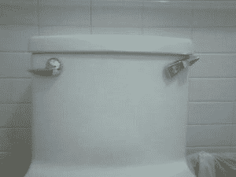

# 离奇的创业面试小故事

> 原文：<https://medium.com/swlh/bizarre-startup-interview-short-stories-77b8ea220f11>

## 在旧金山找到我的文化契合点

Real Toilet from a Co-working Space in SF

“你有纹身吗？”招聘人员在旧金山 SOMA 的 Creamery 举行的初创公司面试中途问我，因为这家初创公司还没有办公室。

“呃，不，我不知道，”我被这个问题弄糊涂了。