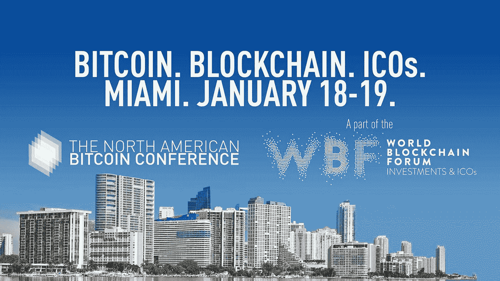

# 阻止你的约会:北美比特币大会将点燃迈阿密

> 原文：<https://medium.com/swlh/block-your-dates-the-north-american-bitcoin-conference-is-all-set-to-ignite-miami-7bbe925c7593>

将于 1 月 17 日、18 日和 19 日在迈阿密举行的北美比特币大会无疑是比特币、金融和加密货币领域持续时间最长、参与人数最多的区块链会议之一。这一年度会议旨在展示区块链空间内最前沿和最具前瞻性的趋势、技术和项目。

北美比特币大会将为期两天，预计将有来自世界各地的 1000 名区块链爱好者参加。在为期两天的峰会期间，顶级行业领袖、投资者和服务提供商将发表主题演讲，并将进行各种小组讨论，涵盖许多关于加密经济学和区块链可扩展性的有趣观点和思考。

# 举办地点

为期三天的活动将于 2018 年 1 月 17 日、18 日和 19 日在迈阿密的多个场地举行。会议的主要议程将围绕区块链技术的未来展开，特别关注加密和金融、安全令牌、法律和 KYC/反洗钱法规。

如果您想预订座位[，请点击此处](https://btcmiami.com/tickets/)

# 著名的演讲者

目前已宣布的著名演讲者包括

目前已宣布的著名演讲者包括

哈尔西·米诺，CNET 的创始人

艾柏利·李，投资总监

比特币先驱查理·施雷姆

Bloq 联合创始人马修·罗扎克

Blockchain.com 总统马尔科·桑托里

克雷格·塞拉斯，系绳公司的联合创始人

WAX 联合创始人威廉·奎格利

学院联合创始人杰森·金

布洛克·皮尔斯，区块链资本管理合伙人

亚历克斯·科哈诺夫斯基，梦之队创始人

DMarket 创始人 Volodymyr Panchenko

杰弗里·塔克，美国经济研究所

你可以在这里跟踪发言者[。](https://btcmiami.com/speakers/)

# 如何成为这一盛事的一部分？

要参加这个盛大的活动，你可以在线购买[的门票](https://btcmiami.com/tickets/)。

如需赞助和参展机会，请发送电子邮件至 [amy@keynote.ae](mailto:amy@keynote.ae) 。

## 关于主题演讲

Keynote 由区块链策略师莫·莱文(Moe Levin)于 2012 年推出。欲了解更多关于主题演讲和活动的信息，请访问[www.btcmiami.com](http://www.btcmiami.com)

## 北美比特币大会活动官方渠道:

*   网址:[http://btcmiami.com/](http://btcmiami.com/)
*   推特:[https://twitter.com/keynote_ae](https://twitter.com/keynote_ae)

## 这篇文章发表在[《创业](https://medium.com/swlh)》上，这是 Medium 最大的创业刊物，有+409714 人关注。

## 订阅接收[我们的头条新闻](http://growthsupply.com/the-startup-newsletter/)。

