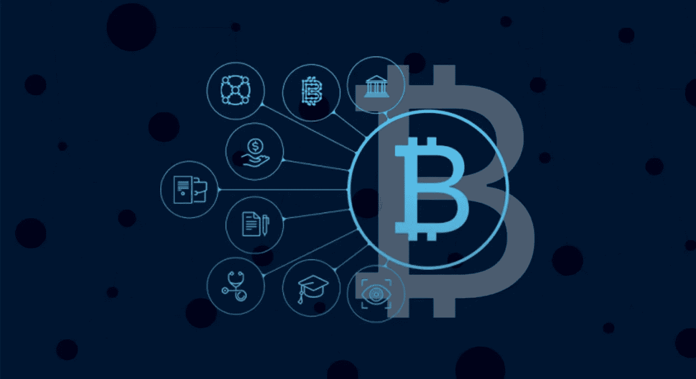
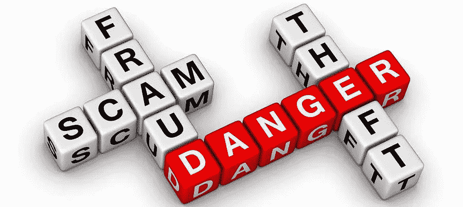
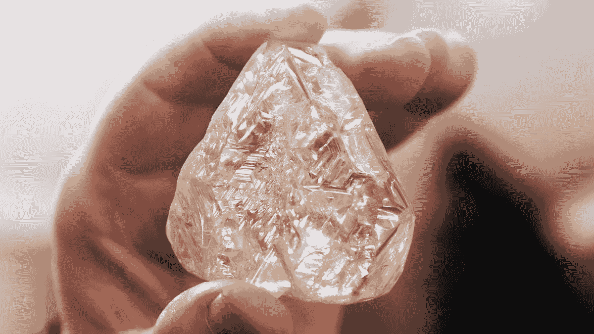

# 区块链公司:价值在哪里？

> 原文：<https://medium.com/swlh/blockchain-companies-where-is-the-value-5983b782e6b8>

区块链技术被认为是第四次工业革命和下一个大的颠覆者，真正能够对数百万人的生活产生重大的积极影响。虽然仍处于起步阶段，但这项技术可以减少文书工作，简化流程，提高生活质量。尽管有这些优点和积极的一面，但也有很少人意识到的黑暗面。

在加密领域，你可能听说过 Ripple、Machine Xchange Coin (MXC)、ICON、Aelf 等项目。如果你看得更深一点，像 Ripple、MXC 等项目正在为社会增加许多积极的价值，帮助人们过上更好、更有意义的生活。

另一方面，我们有像 Centra、Pincoin 和 Arisebank 这样的项目，它们诈骗了数以千计的投资者数以亿计的美元，破坏了信任，并在整体上造成了对加密的负面看法。

根据一项研究，在 ICO 繁荣市场期间，据报道，80%的 ICO 行为都是骗局。例如，Pincoin 诈骗了其客户 6 . 6 亿美元，而 Arisebank 却卷走了 6 亿美元。这些是大鱼。有 100 多个小的 ICO 或项目欺骗了客户的血汗钱。

即将过去的 2018 年，根据 [**DeadCoins**](https://deadcoins.com/) 和 [**Coinopsy**](https://www.coinopsy.com/dead-coins/) 的数据，2018 年大约有 1000+个加密货币相关的项目失败，现已死亡。值得注意的是，这些死亡项目中的大多数曾被认为是下一个大事件，它带来了良好的收益，并被所谓的加密影响者所欺骗。

所有这些死硬币在消失或消亡之前都遵循着相似的模式。这些项目中的大多数都有成功的 ICO，但是没有交付产品或任何关于他们正在进行的进度的项目开发更新。这些硬币大部分价格都是通过“抽水-倾倒”计划被严重操纵的。许多容易受骗的投资者涌向这些油泵，以为轻松赚钱，过了一点，价格暴跌，让他们身无分文。

所有这些死亡项目还有其他明显的危险信号，包括过于雄心勃勃的路线图，承诺不切实际的回报，匿名团队等等。

这些都是死的故事或骗局项目。但是，一些现有的项目试图人为地抬高代币的价格，给那些仅从交易角度评估代币的交易者一种虚假的希望感。一些技巧包括

*   **洗盘交易**——用自己的资金进行买卖，以显示市场需求增加
*   **抛售**——在一个小型交易所人为购买过量的硬币，推高价格，然后抛售给不知情的交易者
*   **先令—** 人为地为一枚硬币制造虚假的宣传和刺激，通常是为了个人利益
*   **烧钱:**减少发行量抬高价格。

阅读以上所有内容，你可能会思考和困惑如何选择一个好的项目，既能帮助创造积极的社会影响，又能帮助你的投资创造价值。让我用一个例子来详细说明你。

# MXC

Machine Xchange Coin (MXC)由 MXProtocol 驱动，旨在实现各种设备之间的支付。MXC 实现了机器对机器(M2M)交易的自动化，分散了大数据，实现了设备数据经济。MXC 的主要目的是推动数据所有者、数据接收者和数据网络主机的大规模采用，这将推动硬币在日常交易中的使用。

当我选择投资一个项目时，我基于三个参数

# 适应

一个项目的质量可以通过看到与它相关的实体来定义。MXC 因与韩国最受尊敬的能源服务商之一 [WithSystem](https://withsystem.co.kr/) 合作而成为新闻焦点，该合作旨在通过构建一个整合了 LPWAN、机器 Xchange Coin (MXC)和 MXProtocol 的首个电力监控和消费者警报平台来降低韩国的电力消耗。MXC 也因与美国、韩国和中国政府的合作而出现在新闻中。这充分说明了各级政府对 MXC 的信任。

# 投资者

项目的质量可以由与它一起工作的人以及支持它的个人/实体来定义。让我们调查一下该项目的一些主要支持者。MXC 得到了 Vchan foundation、Fenbushi Capital、Node Capital、BlockAsset Venture、Longhash、QuarkChain 等公司的支持。

# 团队。

MXC 拥有业内最优秀的人才之一。MXC 由 Aaron Wagener 和 Xin Sheen Hu 领导，MXC 拥有业内最佳和平衡的团队之一。此外，MXC 电报集团被认为是冰冻圈毒性最小的公司之一。

# 结论

任何加密货币投资，都是你的钱，也是你的责任。请记住保持聪明，并尝试投资像 MXC 这样的项目，这些项目对数百万人的生活产生积极影响，也赢得了各种政府机构的信任。