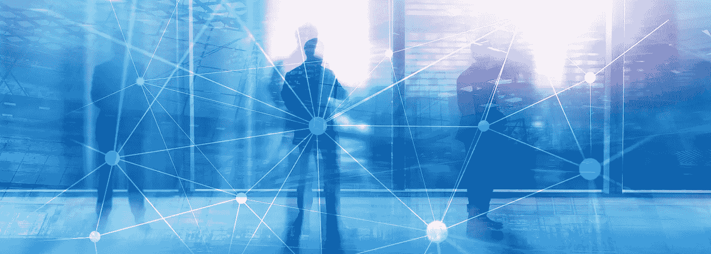
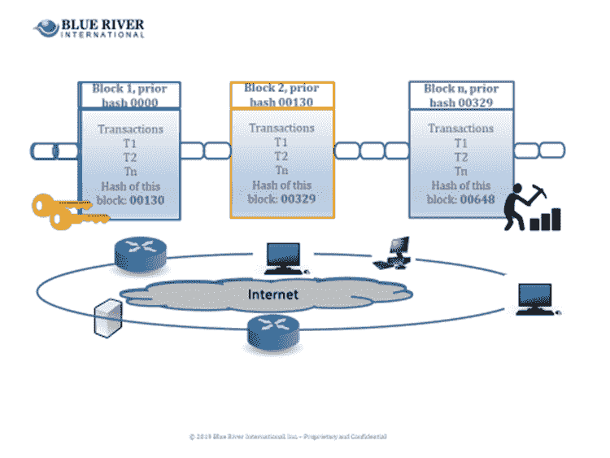

# 区块链——去神秘化！用简单的英语讨论区块链技术

> 原文：<https://medium.com/swlh/blockchain-demystified-33e9737873d7>

区块链解释道。消除区块链、比特币、DLT 的困惑。

“所有好的表现都始于明确的目标”——肯·布兰查德。

我参加了一个科技高管会议，参观了科罗拉多州丹佛市的供应商展台。我在其中一个摊位前停下来，与该公司的代表进行了交谈。

在讨论了他公司的产品和服务后，我们开始聊区块链及其潜力。“围绕这项技术仍然存在混乱，”他回答道，并继续说道“我从另一个会议飞到丹佛，我也在那里目睹了混乱。”

会议结束了，但我一直记得那次谈话。我对他的评论感到困惑。然后我意识到，与已经存在并被理解的 AI 或 IoT 不同，区块链是一种新技术。它仍在发展。此外，它可以通过多种方式实现，例如，根据目标公开或秘密实现。对于不涉及区块链的人来说，所有这些都非常令人困惑。

**简史**

历史上，区块链的概念是在 2008 年由中本聪，一个人或一群人使用这个名字宣传的。出版后不久，中本聪就消失了。然而，这个概念已经扎根。比特币加密货币，一个区块链*应用*，是用 2009 年开采的第一个比特币开发的。比特币区块链旨在仅支持加密货币。

2015 年开发了区块链*平台*以太坊。一个区块链平台可以支持多个特定用途的区块链应用。以太坊引入了“智能合约”的概念。

智能合约是区块链上的一段自动执行的代码。对于给定的协议，例如被保险人和保险人之间的协议，智能合同编码了合同条款和当满足合同上编码的条款时的响应。

当满足合同条款时，例如，被保险人提出有效的索赔，索赔付款自动发放给被保险人。不需要中介或人工、劳动密集型的索赔处理。

智能合约受益于区块链特性。其中包括透明性、可审计性、自动化和不变性。区块链也非常安全。

**区块链讲解**

区块链经常与构成其基础的分布式账本技术(DLT)混淆。DLT 是一种数字分布式分类账或数据库。它允许参与的计算机网络(也称为节点)在交易发生时同时记录交易。

DLT 是一个分散的系统，即没有一个中央机构将相同的分类账副本分发给所有节点。相反，所有节点通过一种机制定期同意它们的分类帐副本匹配。区块链和 DLT 是不可互换的术语。DLT 不是区块链，但区块链是 DLT。区块链取消了 CRUD(创建、读取、更新、删除)操作中的“更新”和“删除”功能。所以不能贴上数据库的标签。

在区块链中，交易以固定大小的区块写入，例如 8 MB。每个块都经过加密哈希处理。当一个块填满时，会打开一个新的块，上面有前一个块的哈希。这将新的区块链接或链接到前一个区块，从而形成区块链。

下面的幻灯片展示了公共区块链上的这一概念，其中每个后续区块通过其哈希链接回前一个区块。区块链可以是公有的，也可以是私有的，这取决于它是如何实现的。我的文章大部分描述了公共区块链的工作方式。

私有区块链遵循类似的原则。其处理速度可能比公共区块链快得多，但安全性较低，具体取决于其实现方式。

区块链可以记录任何类型的交易。它们可能是财产所有权、已付索赔记录、数字权利、毕业证书、数字身份、汇款记录等等。区块链上的每一笔交易都有时间戳，按时间顺序写入，并且是不可变的——即，一旦写入，就不能更改或删除。

如上图所示，参与节点维护区块链网络。每个节点维护其上所有事务的同步副本。这是通过共识机制完成的。

在公共区块链上，任何人都可以随时加入或离开。任何人都可以对其读写事务。参与者因遵守公共区块链的参与规则而获得奖励。

在私有区块链上，根据授予授权用户的权限，只有授权用户才能参与、读取和/或写入。例如，一组公司可以选择创建他们自己的私有区块链，定义参与和交易书写规则。

**区块链使用**

不变性、可审计性、安全性、自动化、可信赖性和非中介化等区块链特征允许部署强大的用例。对于本文，我将继续使用保险示例用例。我还要说明，我下面的陈述并不是绝对的。根据区块链的实施方式及其操作规则，用例特征可能会有所不同。

保险公司每天与许多实体进行交易。实体可能包括被保险人、服务提供商、政府机构(数据报告)等。他们之间的交易被核实和记录。

如果出现问题，必须对记录进行审计，有时由外部审计员进行审计。所有这些都是劳动密集型和高成本的。即使没有争议，管理多个交易方之间的记录也是一项艰巨的任务。

由于区块链记录是不可变的，所以审计很容易，也很便宜。人们总是可以查看所有的交易，而不会产生任何额外的费用。所有相关方对真相的看法都是一致的。双方之间不需要劳动密集型和昂贵的记录对账。

再举一个例子，当被要求识别时，我们提供的信息比识别所需的一些属性要多得多。区块链应用程序允许人们只发布与情况相关的属性。

例如，如果商店只需要图片 id 和签名来验证一个人的身份，那么只需要发布这两个属性。他们不再需要像驾照一样共享整个记录，因为驾照上有更多的数据。

区块链在医疗保健、金融服务、保险业、供应链、网络安全、物联网和其他领域同样有效。虽然这项技术还很年轻，但它的用途是引人注目的。它已经在几个行业证明了自己。

在 Medium 上发表的其他关于区块链的文章:

[除了炒作，区块链和数据库，哪一个适合你？—业务考虑因素第一部分](/swlh/blockchain-or-databases-which-is-right-for-you-8619925596b7?source=friends_link&sk=00ed365000499daf91e64dd0f2856b15)

[除了炒作，区块链和数据库——哪一个适合你？—技术考虑，第二部分](/swlh/blockchain-or-databases-which-is-right-for-you-8619925596b7?source=friends_link&sk=00ed365000499daf91e64dd0f2856b15)