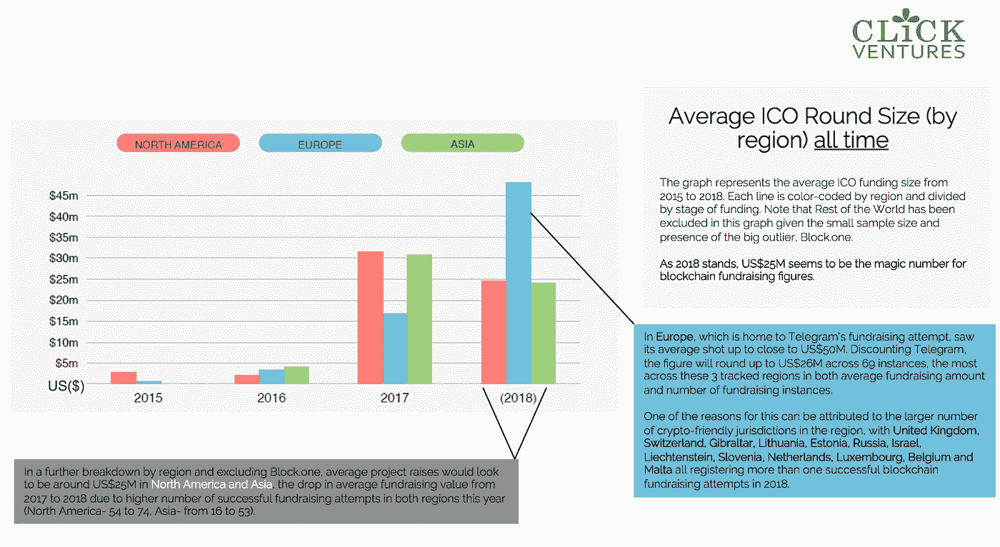

# 区块链基础知识，2018 年数字和加密监管生态系统更新

> 原文：<https://medium.com/swlh/blockchain-fundamentals-2018-ecosystem-in-numbers-and-crypto-regulation-update-54b176c1f5f>

## 宣布 Click Ventures 的首份区块链生态系统报告！

*We spoke to blockchain heavyweights, from project owners, infrastructure builders, token owners, investor, to consortium to learn about the space. Check out* [*our report*](https://www.slideshare.net/clickventures/click-ventures-blockchain-ecosystem-report-2018-128251949) *to read excerpts of their interviews with us!*

一如既往，区块链生态系统经历了又一个疯狂的大起大落的一年，充满了 FUD、FOMO 和激动人心的稳定的未来

Source: random disgruntled HODLer on Bitcointalk

许多人被抛弃并离开了舞台，有些人仍然坚持认为区块链从根本上来说是一种突破性的技术，将使世界上许多当前低效的流程自动化，并创造新的商业模式(我们选择在 Click Ventures 采取的立场)。

虽然时间会证明谁是对的，但有一件事是肯定的，那就是区块链经历了过山车式的一年，从中可以吸取很多教训。

通过这一切，我们在 Click Ventures 学到了很多关于区块链生态系统的知识，我们希望向所有人开放源代码。我们与@Tech.eu、@Oddup 和@Funderbeam 的合作伙伴一起，编写了我们的首份区块链生态系统报告 2018，其中包括:

*   **区块链基本概念**
*   **跨行业和企业的区块链实际使用案例**
*   **区块链重量级人物采访摘录**
*   **数字生态系统发展概述**
*   **生态系统参与者名单，包括矿商、做市商、交易所等**
*   **区块链各大枢纽的加密法规汇总**

一些高层次的要点:

**1。我们的实地观察是，2018 年最实用、最活跃的使用案例涉及使用区块链的以下核心功能之一:**

1)脱媒；

2)在一个不可变的共享分类帐下索引和存储数据；

3)使用不可变智能契约的过程自动化；

4)试图建立自主代理来交易区块链记录的数据

一个很好的例子是区块链在电子商务领域的应用。在双 11 销售期间(或 2018 年 11 月的光棍节销售)，蚂蚁金服使用区块链追踪全球 24 小时销售期间售出的价值高达 1.5 亿美元的产品的来源。

事实证明，企业正在一个不变的区块链上索引信息，以促进对零售的信任。

**2。神奇的数字是 25**

2018 年开始时，ICO 热潮变得强劲，每个人都在谈论有多少钱被投入到生态系统中——所以在所有关于区块链筹款的头条新闻和聊天中，如果他们走 ICO 路线，区块链项目平均会筹集多少钱？

在 298 个记录在案的成功完成的 ICO 中，我们发现，扣除大型区块链项目 Telegram 和 Block.one，平均每个项目可以筹集 2500 万美元。另外值得注意的是，这些融资大多发生在今年上半年-这是我们在 2018 年 2H 目睹的 ICO 市场崩溃的明显迹象。

**3。清晰的法规是吸引区块链项目的关键**

在过去的几年里，许多区块链项目走上了公用事业令牌路线，因为它允许他们在法律灰色地带筹集资金，而不触及证券法。

就 2018 年的情况而言，许多对区块链友好的司法管辖区，如以色列和立陶宛，对什么算作安全令牌做出了明确的裁决，并就加密项目的税收影响提出了指导方针。事实证明，区块链项目喜欢这种清晰性，并将其项目转移到立陶宛和爱沙尼亚等有明确指导方针的国家。

为了帮助创始人更清楚地了解不断发展的加密领域，我们的团队已经在流行的区块链枢纽的最新监管指南中取消了互联网。我们团队将不断更新的谷歌文档的链接可以在报告中找到。

**该报告于 2019 年 1 月 14 日在香港亚洲金融论坛上正式发布。**

**点击** [**此处**](https://www.slideshare.net/clickventures/click-ventures-blockchain-ecosystem-report-2018-128251949) **阅读报道！**

## 这篇文章发表在 [The Startup](https://medium.com/swlh) 上，这是 Medium 最大的创业刊物，拥有+415，678 名读者。

## 在此订阅接收[我们的头条新闻](http://growthsupply.com/the-startup-newsletter/)。

