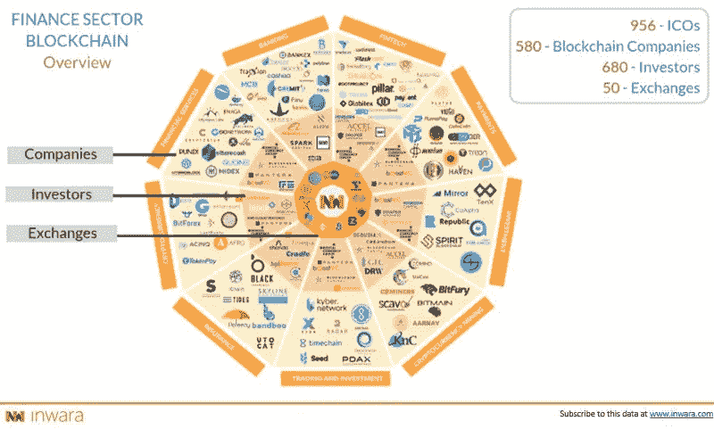
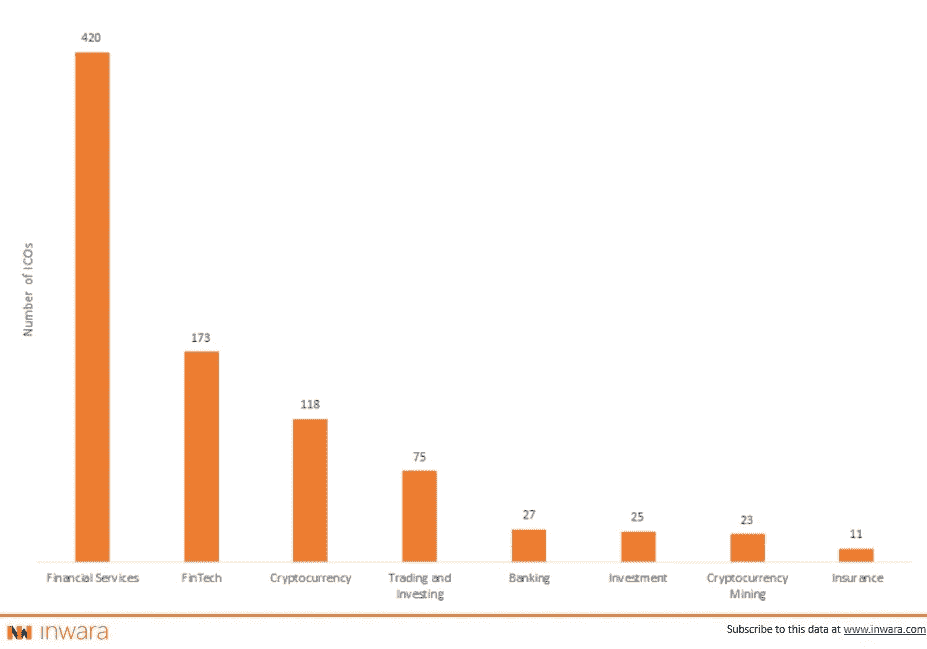
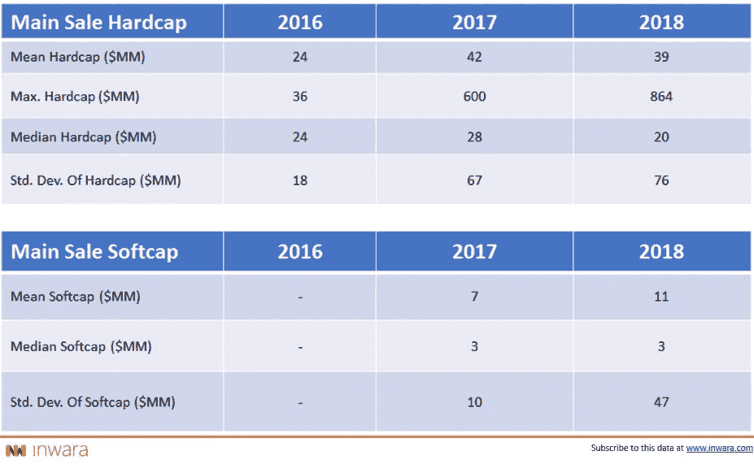
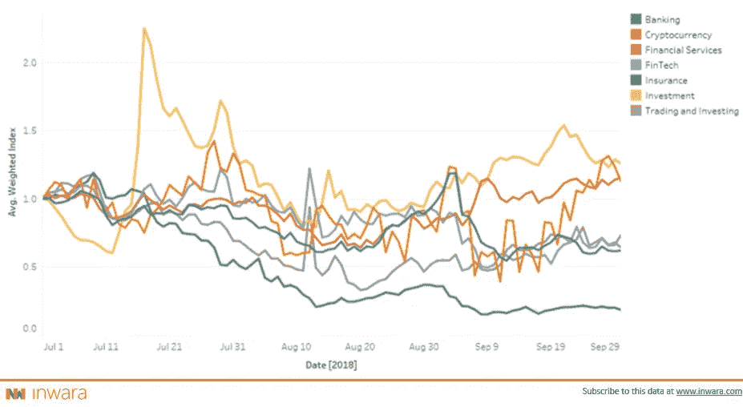
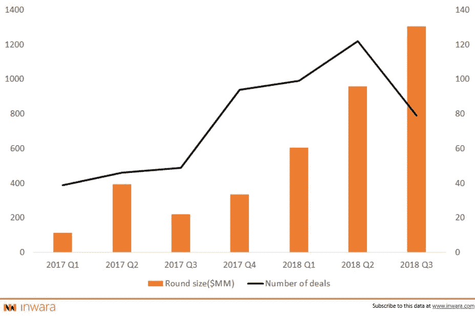
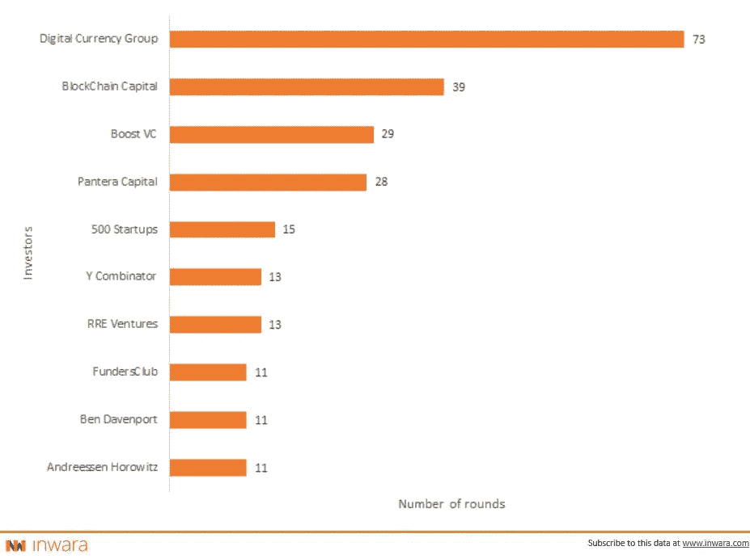
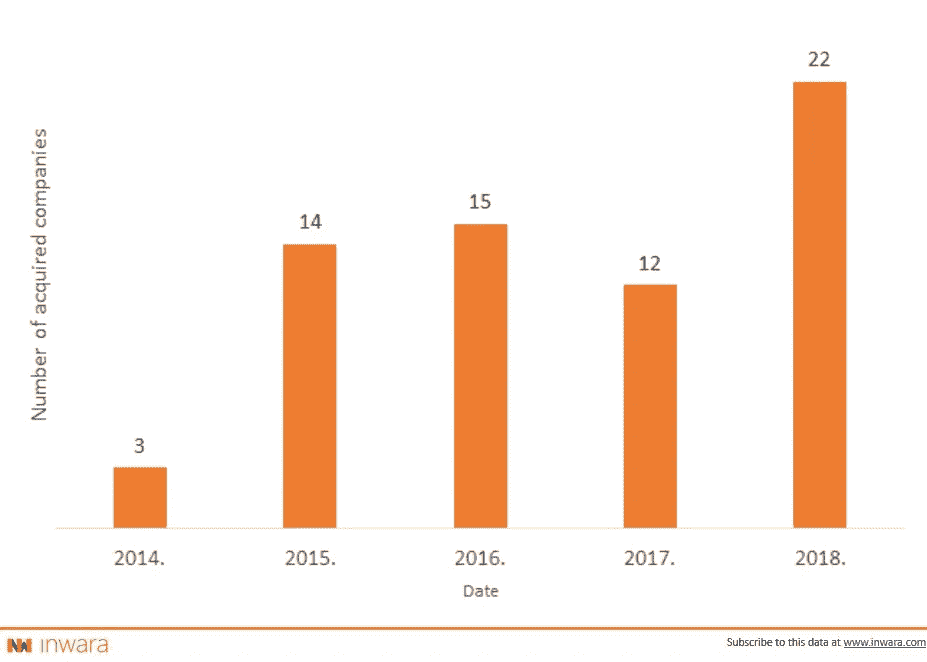
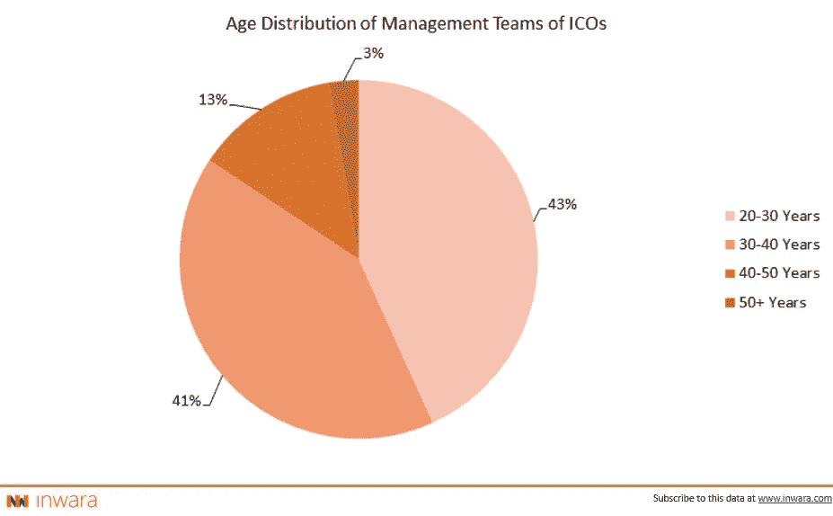
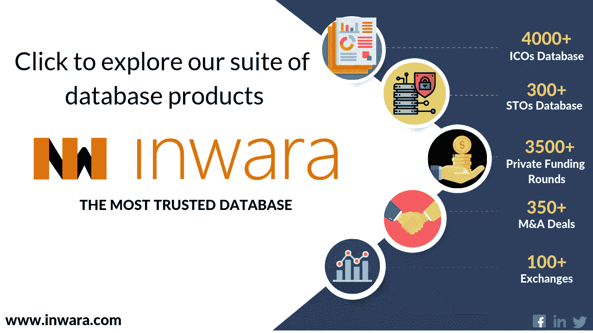

# 金融领域的区块链:行业即将反弹！

> 原文：<https://medium.com/swlh/blockchain-in-finance-complete-analysis-on-finance-sector-icos-private-funding-and-m-a-covered-5eb91d79c5a2>

## ICO 市场研究、私人融资活动和多边核方案

区块链已经成为传统金融格局的挑战者。许多团队正试图定义管理区块链金融发展进程的基本规则。尽管存在技术挑战和监管障碍，但团队正在更快地创新，以跟上生态系统中新的参与规则。在现金转移、资本和风险的中介方面，初步结果是明显的。

InWara 研究了拥有区块链技术的公司中有无 ICO 的趋势。该报告基于对参与机构投资者代币的 ICO、通过私募轮融资的资本以及基于通过 ICO 融资的公司发布的信息的数据的分析，提供了见解。

这项研究涵盖

*   金融子行业— ICO 前景
*   金融 ICOs 市场趋势
*   私人筹资活动
*   兼并和收购
*   杂项统计

> [下载完整的 50 页付费报告](https://www.inwara.com/blockchain-in-finance-top-icos-in-finance-sector/)

# 金融行业 ICO 前景

金融作为一个行业占主导地位，迄今为止有超过 957 个 ico，但是，并不是所有的 ico 都成功筹集了资本以达到各自的硬上限。在金融部门中，金融服务这一子部门的成功 ico 数量最多，为 137 个。

[Source: InWara’s Finance sector report](https://www.inwara.com/report/finance-report?utm_source=finstartup&utm_medium=finstartup&utm_campaign=finstartup)

**金融服务**占金融行业 ico 总数的 40%以上，而金融行业又占所有 ico 的 40%以上。

## 资本筹集需要一个喘息的机会，门槛平均硬资本看到边际收缩

[Source: InWara’s Finance sector report](https://www.inwara.com/report/finance-report?utm_source=finstartup&utm_medium=finstartup&utm_campaign=finstartup)

## 理解金融领域的符号组学

整个金融业在 2017 年筹集了 24 亿美元，2018 年年初至今筹集了 19 亿美元。2017 年和 2018 年年初至今，平均筹集资金保持在 4000 万美元。

值得注意的是，2018 年与 2017 年相比，硬资本和软资本之间的差异有所缩小。这是由于硬资本的同时减少和软资本的增加，表明市场日趋成熟，对资本要求和部署有了更好的理解。拥有成功 ico 的关键人物包括:

## 龙币(DRG)

[Dragon](https://drgtoken.io/) 是一家总部位于区块链的公司，以安全、透明和经济高效的方式为娱乐行业提供支付解决方案。

## 普马佩(PMA)

[PumaPay](https://pumapay.io/) 是一种基于区块链的支付协议，它包括拉式支付的独特架构。

## 液体(QASH)

Quoine 的 [Liquid](https://www.liquid.com/) 平台是一个全球采购的交易平台，拥有一套相关的经纪服务。结合起来，这些提供了世界上最高的流动性——允许任何人获得新的加密经济提供的机会和财富。

> [下载完整的 50 页付费报告](https://www.inwara.com/blockchain-in-finance-top-icos-in-finance-sector/)

## 投资回报:危险水域中的保险 ico

[Source: InWara’s Finance sector report](https://www.inwara.com/report/finance-report?utm_source=finstartup&utm_medium=finstartup&utm_campaign=finstartup)

尽管大盘波动较大，但基于投资、加密货币和金融服务的 ico 仍保持积极，并为 2018 年第三季度提供了稳健的回报。不幸的是，保险 ico 已经出现了二次探底的下降趋势，是这个领域中最受压制的。

# 金融 ICOs-市场趋势分析

本节涵盖影响市场的宏观新闻和事件:

*   富达投资案例
*   洲际交易所巴克特的秘密制度化
*   谷歌对加密货币的立场

# 私人筹资活动

私人投资者坚定地支持这一行业，2018 年投资轮次增加了 65%。2018 年第三季度，融资空间在私人投资轮次中筹集的资金总额已超过 10 亿美元。总体而言，与 2017 年相比，私人资金在 2018 年年初大幅增长了 150%以上。

[Source: InWara’s Finance sector report](https://www.inwara.com/report/finance-report?utm_source=finstartup&utm_medium=finstartup&utm_campaign=finstartup)

在私人投资者中，风险资本对预售和非公开销售的参与稳步增加。

# 金融领域十大最活跃的风险资本投资者

[Source: InWara’s Finance sector report](https://www.inwara.com/report/finance-report?utm_source=finstartup&utm_medium=finstartup&utm_campaign=finstartup)

专注的区块链基金在 2018 年一直在打开他们的钱包，由[数字货币集团](https://dcg.co/) & [区块链资本](https://blockchain.capital/)进行大量投资。

# 并购:2018 年金融行业并购增长 61 %

[Source: InWara’s Finance sector report](https://www.inwara.com/report/finance-report?utm_source=finstartup&utm_medium=finstartup&utm_campaign=finstartup)

这一节将分析像 Earn.com[收购比特币基地](https://www.coinbase.com/)这样的大规模交易。

部门报告中有更多详细信息！

# 杂项统计

本节详细介绍了活动 ico、故障 ico 和已结束 ico，以及对其成功率和故障率的详细分析。这份报告还分析了创始人的年龄、背景、经历等。

[Source: InWara’s Finance sector report](https://www.inwara.com/report/finance-report?utm_source=finstartup&utm_medium=finstartup&utm_campaign=finstartup)

80%以上的 ico 由年龄在 35-40 岁之间的管理层领导。

# 综上

尽管 2018 年放缓，但未来似乎很乐观。从图表上退一步，对潜在基本面的教育表明，数字资产已被无缘无故地击败，反弹即将到来。

> [下载完整的 50 页付费报告](https://www.inwara.com/blockchain-in-finance-top-icos-in-finance-sector/)

*免责声明:这不是财务建议。欲了解更多详情，请访问 t & c*

## 这篇文章发表在[《创业](https://medium.com/swlh)》上，这是 Medium 最大的创业刊物，有+415，678 人关注。

## 在这里订阅接收[我们的头条新闻](http://growthsupply.com/the-startup-newsletter/)。

