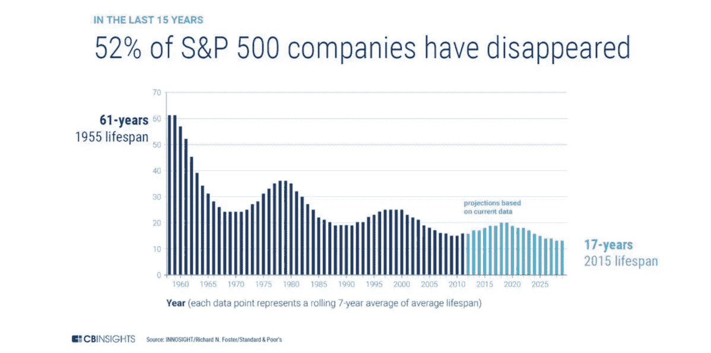
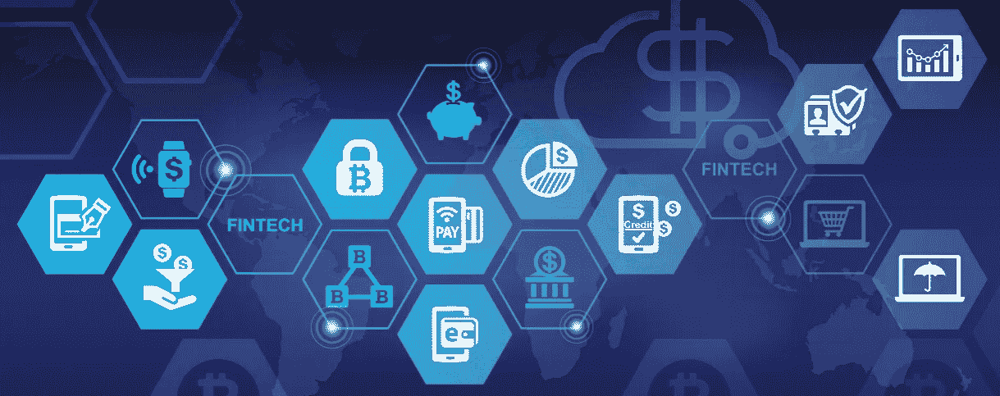
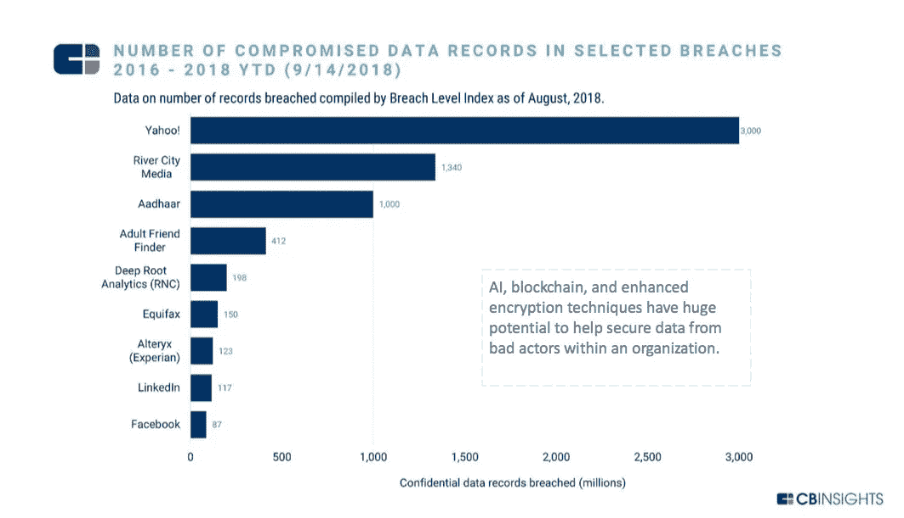
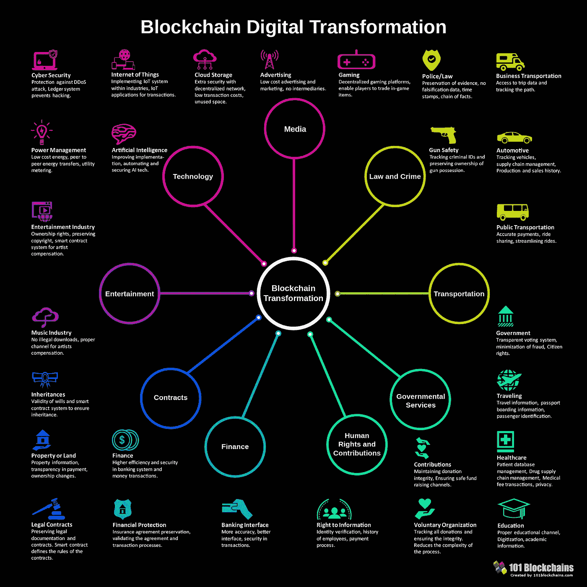
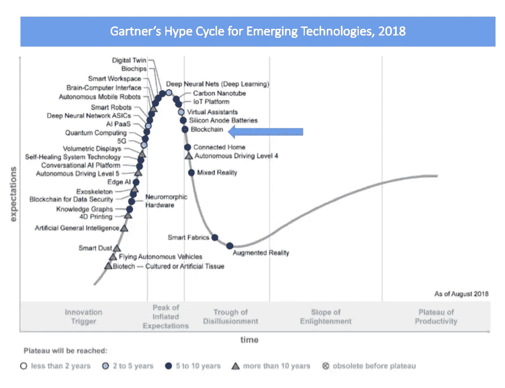

# 区块链对商业有好处。那么下一步是什么？

> 原文：<https://medium.com/swlh/blockchain-is-good-for-business-so-what-is-the-next-step-6eefd821d102>

> “区块链的意义不亚于 25 年前的互联网。”~ Blythe Masters，数字资产控股公司首席执行官

区块链技术被吹捧为第四次工业革命的主要驱动力，并正在改善许多行业价值链中的业务流程。但是这是必须的吗？*也许*是一个强烈的词。

然而，证据越来越多，在商业世界中保持竞争力至关重要。

# 为什么是区块链？

1.  **分散式** 分布式分类账支持业务网络成员之间共享记录系统。这消除了对不同分类账进行对账的需要
2.  **许可** 区块链网络上的成员将拥有访问权限，信息可以在需要知道的基础上与他们共享
3.  **廉洁** 要求网络上的成员达成共识。此外，交易被永久记录。即使是系统管理员也不能删除交易
4.  **降低成本** 据估计，区块链可以降低三分之一的银行支付和其他金融基础设施成本的运营成本。因此，成本优化将提高利润

尽管这项技术背后有各种宣传，但值得注意的是，它仍在不断成熟。区块链要走向成熟，需要大量的实验和信念。理论上，区块链能够让生活变得更轻松，但这需要时间。

# 区块链的产业应用

1.  **医疗保健** 跨医院和联合医疗机构的临床数据使患者能够控制自己的数据，并提高对患者的护理质量
2.  **零售业** 零售业严重依赖库存控制、运营管理和消费者满意度
3.  **银行&金融机构** 
4.  **保险** 
5.  **政府**
    区块链确保公民的数据是安全的、受保护的和准确的，以维持对政府的信任
6.  **供应链&汽车**
    区块链允许创新的移动服务，增加可追溯性和安全的金融交易
7.  **出行&交通**
    区块链将减少欺诈，提高运营效率，并确保乘客和其他利益相关者更快地进行交易
8.  **媒体&娱乐**
    利用区块链不变、安全且不可信的网络，围绕数字内容构建了一个安全的生态系统
9.  **农业
    区块链将提供农产品从生长到消费的透明跟踪，确保食品真实性**

# 成为早期采用者的好处

采纳者已经从区块链中受益—

 [## 大区块链:探索区块链的 50 家最大上市公司

### 接触区块链创新的方式不止一种。除了购买非处方产品或…

www.forbes.com](https://www.forbes.com/sites/michaeldelcastillo/2018/07/03/big-blockchain-the-50-largest-public-companies-exploring-blockchain/#769075642b5b)  [## 世界上最大的 10 家公司现在正在探索区块链

### 不管你喜不喜欢，世界上最大的公司再也不能忽视区块链了。分布式分类帐…

www.forbes.com](https://www.forbes.com/sites/michaeldelcastillo/2018/06/06/the-10-largest-companies-exploring-blockchain/#4a2035a1343d) 

**中国工商银行**:1650 亿美元销售额
- [申请专利使用区块链技术验证数字证书，而不是可信的中央机构](https://smartereum.com/11648/chinas-largest-bank-icbc-to-design-blockchain-based-certificate-issuing-system/)

**美国银行**:1030 亿美元销售额
-致力于使用以太坊区块链自动创建信用证

**苹果**:2475.3 亿美元销售额
——申请了一项使用区块链技术给数据加时间戳的专利

**荷兰皇家壳牌**:3220 亿美元销售额
——与英国石油公司合作创建能源商品平台

**丰田汽车公司**:2650 亿美元销售额
——探索区块链支付如何实现无人驾驶汽车

**三星电子**:2250 亿美元销售额
-宣布推出“Nexledger”平台，用于追踪全球供应链

# 区块链商业咨询公司

世界上大多数人对区块链有所了解，但下一步似乎是最难的——下一步是什么？我们应该去找谁？

在这种情况下，你可以考虑聘请区块链的咨询公司。

区块链顾问是有技能的个人或团体，他们可以提供必要的步骤，推动未知行业向前发展。雇佣顾问的主要好处是他们带来的临时专业知识。采用按服务付费的理念，从长远来看，聘用顾问比聘用全职员工更具成本效益——员工福利、人力资源问题。顾问在某种程度上也是可有可无的，提供了一个简单的方法来清除无用的东西。

有一个随叫随到的顾问为组织提供了巨大的价值。一家咨询公司通常包含来自各种背景和专业知识的个人，允许顾问客观地思考，并纯粹为了招聘公司的业务发展和收入增长而制定创新战略。与普通员工相比，顾问可能还拥有必要的商业专业知识和经验。

一个好的区块链顾问应该对区块链地区的现行法规和法律有很好的理解。由于各种 ico 带来的虚假承诺，当局终于开始赶上炒作，并带来新的立法和法律，这只会对行业有利。

让我们看看新加坡区块链咨询公司 Moonwhale Ventures 如何开展咨询服务。

Moonwhale 专注于为现有业务提供区块链解决方案，并将大量资源投入到他们的[区块链业务咨询](https://moonwhale.io/business-consulting/)。聘请咨询公司的第一步总是包括对技术是否真的能对你的业务有帮助的初步讨论。

## 识别

*   通过区块链应用创造运营效率
*   为您的企业确定行业和部门特定的区块链用例
*   识别遗留系统、安全风险和降低复杂性的建议
*   确定现有的和合适的区块链应用程序进行实施

一旦你，企业主，同意了月鲸团队提出的条款，那么他们将进入下一阶段

## 制订战略

*   概念验证服务，展示区块链应用的业务和技术可行性及其市场潜力
*   针对整个价值链(忠诚度和奖励系统、支付系统、数据存储和共享解决方案、供应链、金融交易和保险)的分布式账本技术(DLT)的定制建议，以及通过分散式业务网络(数据存储、数据传输、支付系统、通信)优化安全性
*   区块链实施的全成本收益分析和 SWOT 分析

运筹帷幄可以说是最重要的。与您的顾问一起，您将决定不同国家的不同区块链议定书和法规的优缺点。顾问应该清楚地解释这些因素。

## 发展

*   利用或构建许可的私有区块链协议、应用和平台来优化或替换传统系统
*   在现有基础设施中集成 DLT 和智能合同
*   开发代币生态系统定制加密货币，以推出您定制的加密硬币，例如客户忠诚度和奖励产品
*   设计完全自动化、分散化和自治的、自我管理和自我执行的业务合同和工作流

这一阶段涉及区块链解决方案的实际实施。

## 火车

*   培训员工处理和维护新的系统结构
*   根据实施的业务优化，对顾客和客户进行互动和交易新方式的培训
*   对所有利益相关者进行业务改进、变革管理方面的培训

在与 Moonwhale 达成业务之前，他们将对您的员工进行新实施的解决方案的培训。

对于一个组织来说，跟踪顾问提供的好处是很重要的。最好的顾问是那些在整个过程中教育客户的人。

> “加密货币目前的熊市趋势已经淘汰了获利的‘游客’，并为技术的蓬勃发展提供了一个环境，”Moonwhale Blockchain Ventures 首席执行官丹尼·克里斯特(Danny Christ)说。

在下一篇文章中，我们将讨论安全令牌产品，以及令牌化如何带来融资业务扩张的新时代。

希望你喜欢这篇文章！请在下面随意评论。:)

# **关于作者**

**伊利亚扎基是** [**月鲸投资**](https://moonwhale.io) **的营销和业务发展主管。**

Moonwhale Ventures 是一家 [STO 金融咨询公司](https://moonwhale.io/investment-platform/#third)，为公司提供关于 STO 进程&结构的战略建议，以及代币发行，包括其项目的生命周期管理和二级市场参与。Moonwhale 还在建立一个端到端证券令牌(STO)投资平台，该平台将迎合寻求投资 STO 项目的投资者，以及寻求通过 STO 筹集资金以资助业务扩张或新企业的公司。

欲了解更多信息，请访问:[月鲸 STO 解决方案](https://moonwhale.io/investment-platform/#third)

Twitter|[LinkedIn](https://www.linkedin.com/company/moonwhalebv)|[脸书](https://www.facebook.com/MoonwhaleBV/) |

## 这篇文章发表在 [The Startup](https://medium.com/swlh) 上，这是 Medium 最大的创业刊物，拥有+414，678 读者。

## 在这里订阅接收[我们的头条新闻](http://growthsupply.com/the-startup-newsletter/)。

