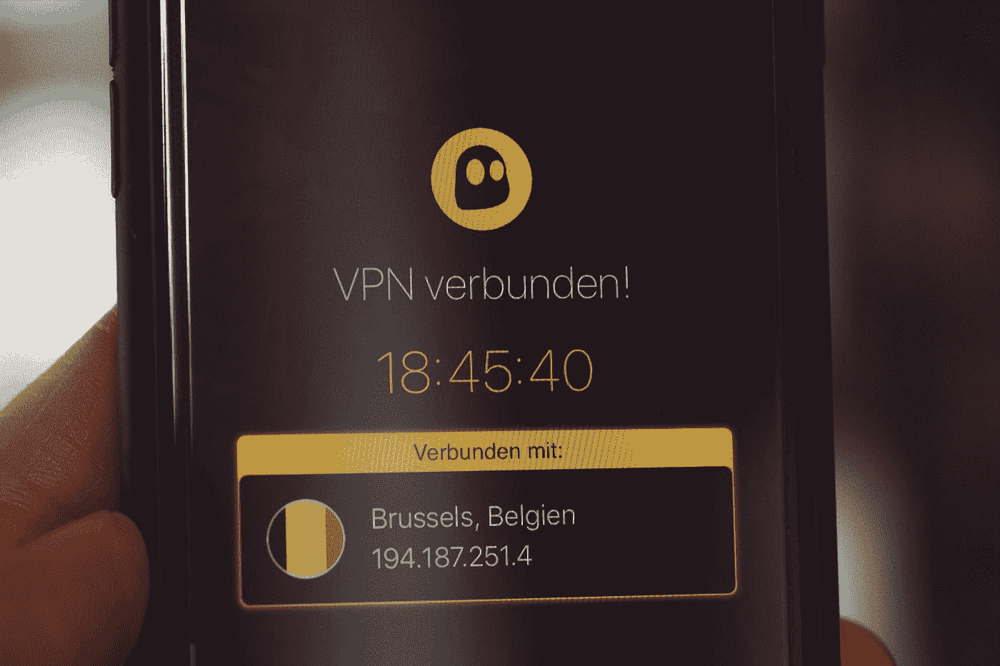
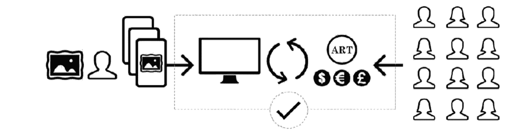
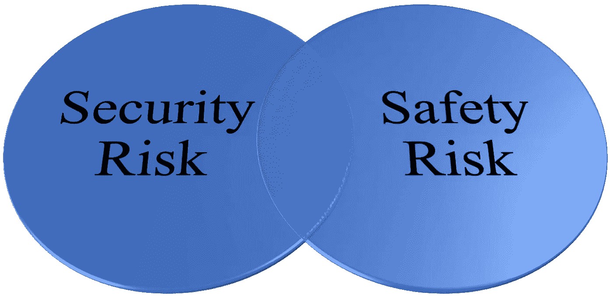
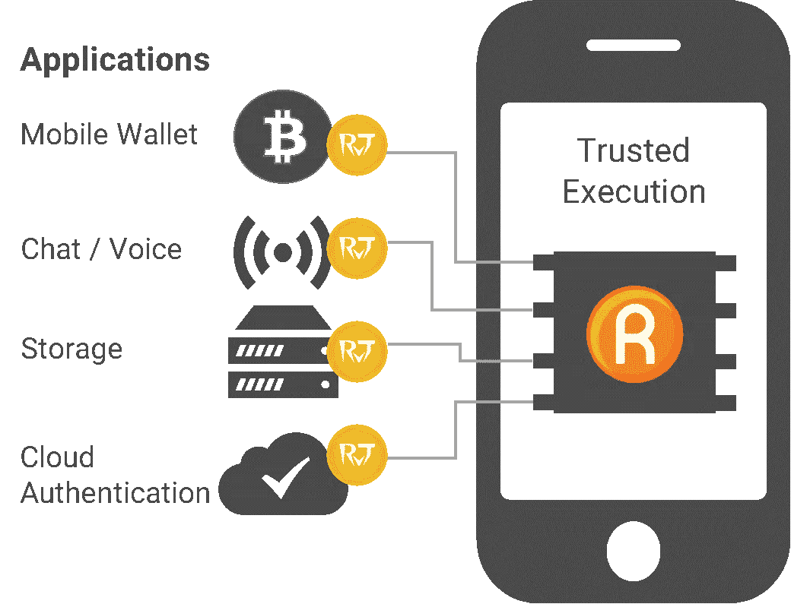
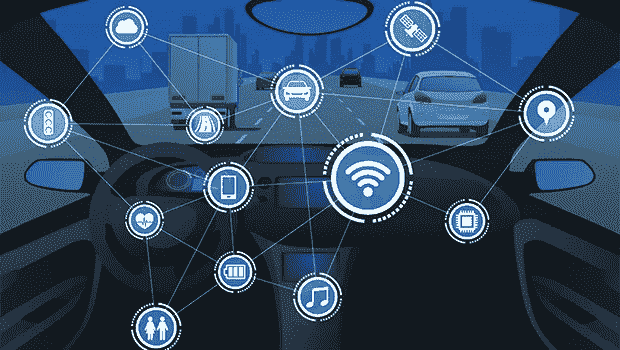
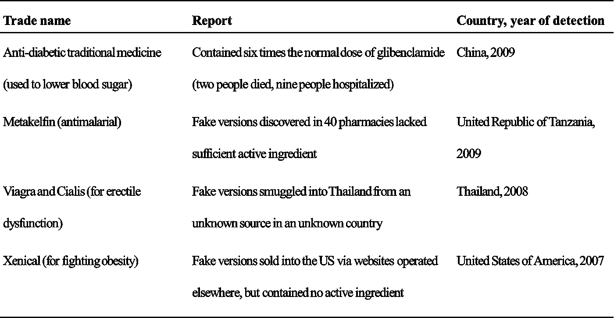
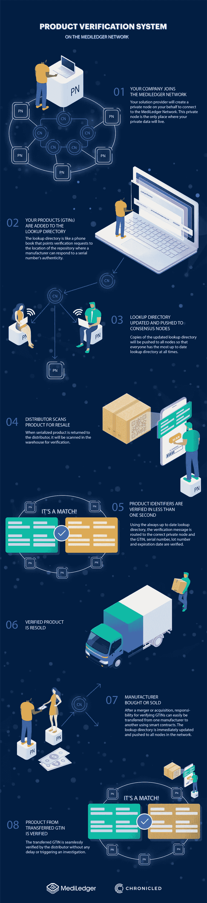
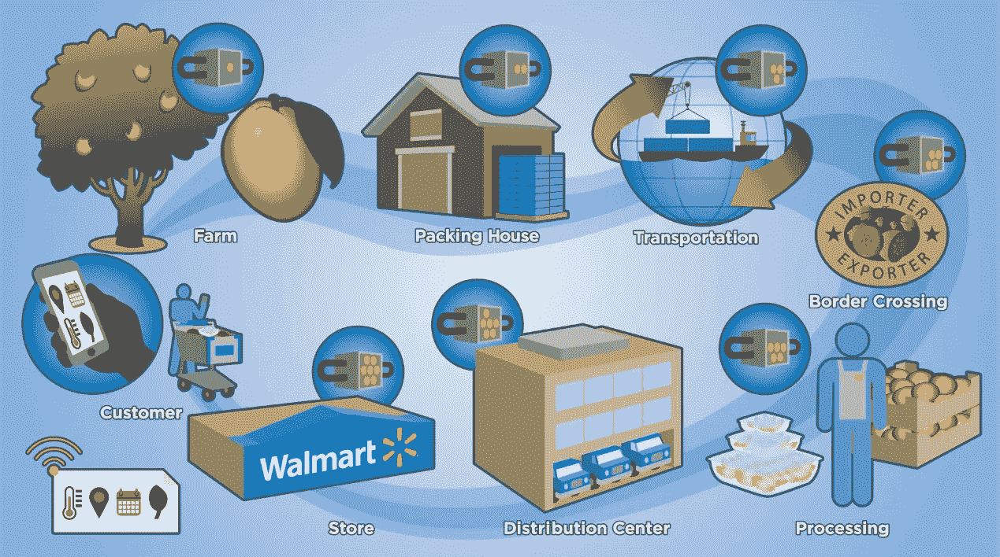
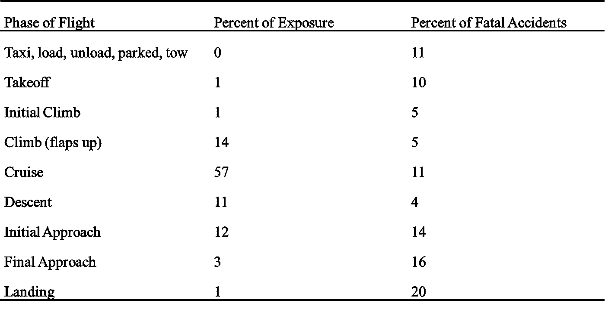
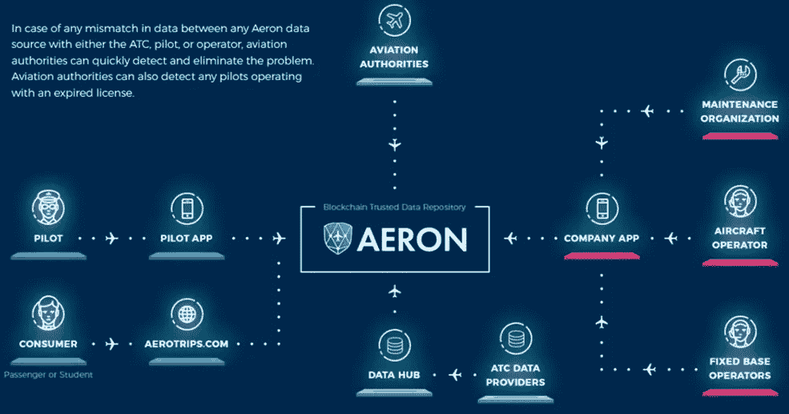

# 区块链——通过认证为物联网提供安全性

> 原文：<https://medium.com/swlh/blockchain-providing-safety-through-authentication-for-the-iot-41c2a0a19283>

## 区块链会拯救我们吗？

Photo by MIT Sloan Management Review

> 可靠的认证是参与物联网(IoT)的系统的常见障碍。

无论您面对的是集中式网络、供应链还是作战系统，无法进行身份认证都可能是成功与失败或生死的关键。哈希、工作证明(PoW)、分散式 P2P 网络和共识的使用使区块链成为一种非常安全可靠的方式来为物联网存储和维护数据。

为了成功篡改区块链，一个不良行为者需要首先改变链上的所有区块，然后对每个新修改的区块重做 PoW，最后控制 P2P 网络上超过 50%的所有节点。有了这些安全警卫，这几乎是不可能做到的(Decuyper，2017)。区块链上的数据代表真相，物联网依赖于这样的信息才能正常运行。系统的可操作性高度依赖于安全可靠数据的无缝传输/接收。区块链满足了这种需求。物联网行业处理任何类型的数据或交易都有可能被基于区块链技术的用例所破坏。

# **安全相关物联网区块链用例**

使用区块链解决现实世界问题的好处包括减少时间延迟和人为错误。同样，区块链可用于监控成本、劳动力需求、浪费和排放等。银行和金融服务是目前人们谈论最多的区块链用途。这在很大程度上是由于比特币自推出以来获得的人气，但区块链也在其他方面证明了对行业的变革。

**诈骗**

Photo by [Markus Spiske](https://unsplash.com/@markusspiske?utm_source=medium&utm_medium=referral) on [Unsplash](https://unsplash.com?utm_source=medium&utm_medium=referral)

通过哈希、PoW、分散式 P2P 网络和群体共识的分层安全性，金融交易变得更加安全可靠。传统的交易建立在中央系统的基础上。因此，他们更容易受到不准确的影响，因为他们的真相来源于单点故障。在集中式系统中，有效性检查是独立的，而分散式系统则不是。

> 使用区块链防止欺诈的一个强大用例是保证艺术品的真实性。

在正常情况下，这是很困难的，因为权威认证是艺术市场有效合法运作的必要条件(Amineddoleh，2015)。但问题是，谁能做出这样的决定？人类不可避免地无法独自做出这些决定，因此技术应该被纳入审查过程。

在艺术界，认证分为三个不同的类别。它们共同构成了数百万美元决策的基础。这些类别如下:

1.法医鉴定——检查有助于确定一件作品是否是在卖家声称的时间和地点制作的，或者材料是否是在艺术家之后制作的

2.出处——从原艺术家到当前所有者的所有权链是鉴定的一个重要方面，在艺术市场上被视为作品真实性的有说服力的证据

3.鉴赏力——理解艺术的细节、技术或原理，并有能力担任批判性评判的人(梅塞纳斯，2017)

一家名为 Maecenas 的初创公司认为，通过使用区块链来“万无一失”地保护系统，他们已经找到了答案。使用区块链技术，它创建了一个非集中式的艺术数据库，通过为每件作品分配唯一的真实性代码来验证每件作品。所有者和购买者都可以使用这些单独的区块链代码来验证作品的真实性，并监控它们在世界范围内的移动(Thompson，2015)。图 1 描述了与艺术品鉴定及其在买方和卖方之间的最终安全交易相关的信息流。

*图 1 艺术品鉴定流程图(Maecenas，2017)*

Photo by Maecenas

智能合约允许数据安全地存储在区块链上。该信息可以包括时间戳，时间戳将确保容易确定一件艺术品的确切年代。类似地，如果年龄可以被储存，它的起源和创造者也可以被记录。想象一下在一幅画上滚动艺术家的签名和验证其真实性的数字认证证书。

新系统不仅能确保真实性，还能为买卖双方提供一定程度的安全匿名，这在匿名买家屡见不鲜的艺术界是一个重要因素(Thompson，2015)。超越真实性的两个重要组成部分(虽然同样相关)是商品的安全支付和交换的合同方面。

使用区块链，交易速度的提高和跨境交易的简化在国际上取得了重大进展。艺术品交易的国际交易可能需要数周的时间来处理，对于那些希望交易立即发生的人来说，这是不可接受的。区块链切断了中央集权，中央集权决定了交易处理的速度，并且仅仅受到 PoW 和共识所允许的时间限制的限制。

**赛博**

Photo by [Nahel Abdul Hadi](https://unsplash.com/@nahelabdlhadi?utm_source=medium&utm_medium=referral) on [Unsplash](https://unsplash.com?utm_source=medium&utm_medium=referral)

> 网络犯罪是对世界上每家公司安全的最大威胁，也是当今人类面临的最大问题之一。

对社会的影响反映在每年被利用的漏洞数量上(Morgan，2017)。这在很大程度上可以归因于个人、基础设施和业务系统之间日益增强的互联性。被盗数据市场的不断增长和日益开放是网络风险快速增长的众多原因之一。此外，易受攻击的公司和个人的数量呈指数级增长。随着网络安全攻击不断增加，对全球组织造成不同程度的负面影响，有必要承认各种规模的组织和行业的网络安全格局不断变化(Nexia International，2017)。

在系统设计过程中，安全性和安全性通常是分开处理的，但区块链提供了一个将这两种功能结合起来的机会。安全性和安全性之间的关系经常导致这两个学科的从业者从对立的两方站出来。这是一个不幸的情况，因为每一个降级都会导致损失，因此密切相关。问题是背景，这是分歧的来源。

简而言之，安全和安保之间的关系是这样的，安保方面的弱点会增加风险，而风险又会降低安全性。因此，安全和保障是成正比的，但两者都与风险成反比(Cusimano & Byres，2010)。图 2 显示了安全性和安全性之间的重叠。

*图 2 安全和安保重叠(Baird，2017)*

问题来了，这两个学科如何才能在一个有着共同目标的统一战线下联合起来？当讨论利用区块链系统架构(提供显著的安全收益)的价值以及提高安全性的好处时，这带来了一个重要的区别。Coursen Security Group 的创始人 Spenser Coursen 提出，安全是确保安全的过程。此外，他指出，为了使安全有效，如何定义安全的组成部分需要保持一致(Coursen，2014)。

明确定义的安全组件必须作为 it 和安全之间的基本原则来共享。首先要调查系统可能承受的潜在损失以及损失是如何实现的。这个想法是，如果一个共同的分析方法被应用，那么相似的共同缓解将被识别以消除/降低风险。Praxis Critical Systems 进行的研究表明，进行综合分析并记录安全和安保的综合论证可能有实际好处(Jackson，Cooper 和 Lautieri，2005 年)。

一家名为 Rivetz 的初创公司提出了一个使用区块链技术应对网络攻击威胁的解决方案。他们认为，从移动和分布式系统的角度来看，网络安全不能满足公众的需求。Rivetz 还将物联网列为网络世界中日益增长的漏洞的主要组成部分，并指出物联网中使用的终端设备几乎没有可证明的安全性。初创公司认为，端点至关重要，因为它最容易受到攻击，因此最不安全。这是因为它通常在没有人工干预的情况下运行，并且是系统其余部分决策的来源。整个物联网系统假设终端如实报告准确的数据(Rivetz，2017)。

Rivetz 提出，应该只允许经过验证的硬件参与区块链。一般来说，这就是所谓的可信硬件，几十年来已经通过类似的方式实现了一种称为可信引导的计算机功能。使用可信引导(在启动时)如果引导设备固件与已知配置不匹配，则认为它已被篡改。如果是这种情况，系统将不会运行。从可信硬件是移动设备上的处理器的意义上来说，Rivetz 解决方案就是如此。如果处理器身份不在区块链上，那么它将被列入黑名单，从而无法通过接口参与。图 3 描绘了区块链上列出的可信设备的单个实例。同样，区块链上也存在可信应用(移动钱包、聊天/语音、存储和云认证)。

*图 3 网络安全物联网接口流程图*

Photo by Rivetz

需要考虑替代我们以前处理网络安全的方法。鉴于其安全性，centeric 架构区块链是针对个人数据真实性和隐私的网络威胁的理想解决方案。这是因为区块链上包含的数据是使用哈希方案、PoW、分散式 P2P 网络和共识安全可靠地加密的。虽然对于努力实现透明性的系统来说，不能保持公开匿名，但这是特别有吸引力的。主要的网络安全使用案例利用了对真实性的需求，就像在物联网(IoT)设备中发现的那样。

**汽车**

Photo by [Samuele Errico Piccarini](https://unsplash.com/@samuele_piccarini?utm_source=medium&utm_medium=referral) on [Unsplash](https://unsplash.com?utm_source=medium&utm_medium=referral)

> 汽车制造商正在推动联网汽车。

实时监控、可审计性和可扩展性是有利于区块链技术用于联网汽车、网络安全和自动驾驶汽车的关键因素。移动性、供应链物流、零售和租赁是在区块链应用上实施或原型化的一些汽车关键功能领域(Mukta，2018)。这些领域中的每一个都与安全或安保或两者都有关系。区块链支持每种实现方式的改进，因此促进了更安全的系统。

交通事故的三个常见原因是技术问题、天气条件和人为因素。区块链正被用于通过改进以下内容的认证、监控和记录来提高航空安全:

维护

试点经验

飞机位置

类似的解决方案可以应用于拼车服务、商业卡车运输和私人运输。当车辆成为物联网的一部分时，可以自动决定允许或不允许某些行为/事件发生。此外，机器学习可以分析趋势并在事故发生前预测事故。当行动因为可能导致事故而停止时，运输安全将向前迈出巨大的步伐。

美国的交通安全涵盖了美国的交通安全，包括汽车事故、飞机失事、铁路事故和其他公共交通事故，尽管大多数死亡事故是由道路事故造成的(维基百科，2018)。通过整合智能技术，有机会改善美国和全球的交通安全。改进车辆监控系统，增加对情况的了解，可以减少涉及各种交通方式的事故。

不良的车辆状态记录会导致事故。例子包括如下:

实现超过安全限制的速度

接收不准确反映车辆维护的数据(如燃油油位)

无人驾驶汽车无法避免碰撞

根据最近的研究，互联智能汽车提供了一系列复杂的服务，使车主、运输当局、汽车制造商和其他服务提供商受益。这可能会使智能车辆面临一系列安全和隐私威胁，如位置跟踪或远程劫持车辆(王帆、斯泰格、坎 here 和尤尔达克)。连接级别的提高为恶意行为者利用系统带来了新的机会。汽车、飞机、火车等。可以通过物联网(IoT)引入的各种攻击面加以利用。这些剥削不仅危及车辆的安全，而且直接关系到乘客的安全。

对于汽车和摩托车，研究表明，随着未来与物联网的集成增加，可以将几种应用应用于交通领域。随着贸易空间的发展，其中一些应用也可以应用于其他形式的运输。图 4 描述了这种与安全和安保相关的应用。

*图 4 汽车领域的区块链(Casey，2018)*

Photo by Kevin Casey

这些与区块链相关的应用提供了一些有价值的改进。对于“空中下载”更新，它们提供了通过证明真实性来验证软件版本的机会。车辆保险保证按需共享隐私敏感数据。可信数据也可以在每辆车的基础上分配，并且仅在需要时共享(例如，当发生事故时)。充电期间的电动汽车可以连接到具有私有和分布式安全、支付和会计的充电站。像优步和 Lyft 这样的汽车共享服务可以利用同样的能力。

**公共卫生**

Photo by [Kendal James](https://unsplash.com/@hikendal?utm_source=medium&utm_medium=referral) on [Unsplash](https://unsplash.com?utm_source=medium&utm_medium=referral)

在美国，公共安全由州和联邦两级管理。公共安全也可以与公共安全联系在一起。这是因为安全性的失败会导致包括公众安全在内的功能退化。顾名思义，致力于公共安全的组织的唯一目的是确保公众的福祉。也就是说，公众面临的威胁多种多样，范围广泛。它们可能包括暴力行为或小偷小摸等普通事件。不管怎样，问题仍然存在——如何消除犯罪或将犯罪降低到可接受的水平？

> 假药带来了巨大的安全风险。国际刑警组织估计，每年有近 100 万人死于假药。这个数字主要归因于发展中国家发生的死亡。

根据世界卫生组织(世卫组织)的数据，在发展中国家销售的药物中，十分之一是假药或劣药，导致数万人死亡，其中许多是非洲儿童因肺炎和疟疾治疗无效而死亡(Hirschler，2017)。表 1 提供了全球假药贸易的高层次感觉。世卫组织估计，在发展中国家，10-30%出售的药品可能是假药；在非洲、亚洲和拉丁美洲的一些地区，这一比例可能更高(Shetty，2011)。

*表 1 假药检测(Shetty，2011)*

Photo by Shetty, 20011

像这样的数字可能很难衡量，特别是在很少关注这一问题的地方。世卫组织对 2007 年至 2016 年的 100 项研究进行了汇总分析，涵盖了 48，000 多个样本，显示中低收入国家有 10.5%的药物是假药或劣药。这些国家的药品销售额每年接近 3000 亿美元，这意味着假药贸易是一个 300 亿美元的行业(Shetty，2011)。

对于一个如此大的假货市场来说，肯定有各种各样的假货被典当给不知情的顾客。抗生素、皮质类固醇、治疗勃起功能障碍的药物、治疗癌症的药物和治疗艾滋病毒/艾滋病的抗逆转录病毒药物也是被伪造最多的药物。然而，根据药物安全研究所的说法，犯罪组织现在瞄准每一种治疗类别的药物。

Mediledger 是一个由制药领域的几个参与者合作形成的项目。在基因泰克和辉瑞这样的制药公司的工程师和技术专家的带领下，他们的目标是开发管理药品供应链的工具。Mediledger 的目标是为制药行业创建一个基于开放标准和规范的许可区块链网络。节点将是分布式的——由行业参与者和服务于行业的技术提供商运营。由于解决了数据隐私问题，这是可能的——商业规则可以强制执行，但区块链上不共享商业智能(Mediledger，2018)。

图 5 描绘了制造商、分销商、配药员、服务提供商和客户端之间的关系，以及医药供应链的区块链分布式账本。

*图 5 区块链制药流程图(Mediledger，2018)*

Photo by Mediledger

Mediledger 成功的关键是它支持互操作性的能力。提供一个利用区块链技术的可互操作系统，使受信任的药品制造商、经销商和配药商联盟能够:

降低遵守法规的成本和工作量，同时提高安全性和公共安全

阻止假冒/掺假产品进入美国供应链

改善医药供应链的整体业务运营(Mediledger，2018 年)

随着药物技术变得越来越复杂，我们开始进入个性化医疗领域。这为对某些药物敏感或可能对不同剂量产生不良反应的患者提供了更高水平的支持。Mediledger 正在开发的区块链技术可以为药品提供更好的监管链。通过这种方法，可以提供不可变的监护记录。此外，使用区块链和智能合同可以确保药品的所有法律和政策在其整个生命周期中得到执行。

**食品卫生**

Photo by [Megan Hodges](https://unsplash.com/@organicdesignco?utm_source=medium&utm_medium=referral) on [Unsplash](https://unsplash.com?utm_source=medium&utm_medium=referral)

安全食品和食品供应在推动全球经济方面发挥着重要作用。因此，食品安全也影响着一个国家的贸易和旅游业、食品和营养安全以及可持续发展。因此，确保全球供应链中的食品流动始终得到管理至关重要。

食品可能在生产和销售的任何环节受到污染，主要责任在于食品生产商。然而，很大一部分食源性疾病事件是由食品服务机构或市场中不适当准备或不当处理的食品引起的。并非所有食品从业者都了解他们必须扮演的角色，例如在购买、销售和准备食品时采取基本的卫生做法，以保护他们和更广泛社区的健康(世界卫生组织，2017 年)。

> 从本质上讲，食品与食品运输系统(供应链)的每个阶段都有着内在的联系。

无论是从农场到餐桌还是从生产工厂到餐桌，都必须确保食品的质量和安全。两者都必须符合最高标准。因此，有必要强调供应链中每个环节的重要性，因为如果供应链中的一个环节受到威胁或缺失，就会影响整个供应链(Bendekovi、Naletina 和 Nola)。

根据 IBM 公司提供的统计数据，以下是支持当今食品供应链来源的重要性的理由:

每年有 6 亿人——世界上几乎十分之一的人——因食用受污染的食物而患病，其中 42 万人死亡

每年 555 亿-932 亿美元——仅在美国，由食源性疾病(因无法工作和/或死亡造成的经济生产力损失，医疗费用)造成的总成本

食品事故没有停止，而是每年增加 100 亿到 150 亿美元(Galvin，2017 年)(Galvin，2017 年)

显然，开发更安全的食品供应链解决方案有着巨大的经济和人类安全理由。图 6 描述了从农场到客户的供应链流程是如何运作的，如上所述。

*图 6 食品安全区块链流程图(Galvin，2017)*

Photo by WalMart

IBM 公司提出了一种方法，他们认为这种方法可以节省时间，从而降低成本。此外，他们建议通过解决食品篡改、欺诈和网络犯罪的威胁来降低风险。所有这些都增加了消费者的信任。食品制造商/零售商最大的噩梦是食品安全问题。一个挑战是方便地追踪问题的根源，然后确定问题的范围。由于召回以预防疾病的紧迫性以及政府的重大责任和监管，这变得更加复杂(Barnard，2017)。

鉴于区块链的特点，它非常适合解决食品安全供应链生态系统面临的挑战，因为它为所有交易/交换建立了一个可信的环境。就全球食品供应链而言，所有参与者——种植者、供应商、加工者、经销商、零售商、监管者和消费者——都可以在交易中获得关于食品原产地和状态的已知和可信信息。这可以使食品供应商和生态系统的其他成员使用区块链网络在短时间内追踪受污染产品的来源，以确保安全地从商店货架上移除并阻止疾病的传播(IBM Corporation，2017)。

**航空**

Photo by [Ken Yam](https://unsplash.com/@starocker?utm_source=medium&utm_medium=referral) on [Unsplash](https://unsplash.com?utm_source=medium&utm_medium=referral)

这些年来，航空安全有了很大的改善。事实上，致命事故的概率已经越来越低。这在很大程度上归功于事故分析，事故分析为工程师提供了数据，并激励他们通过设计寻求安全途径。随着系统工程师越来越普遍地采用安全工程实践和技术，这是所有工业领域的共同主题。

工程师们感兴趣的一个领域是与飞行各阶段相关的统计数据。分析表明，事故风险因阶段而异。表 2 显示了在典型飞行的每个阶段发生的飞行时间的百分比以及在该阶段发生的致命事故的百分比(小奥斯特、斯特朗和左恩，2013 年)。

*表 2 2002-2011 年按飞行阶段划分的致命事故和暴露情况(Oster Jr .，Strong，&左恩，2013 年)*

Photo by Oster Jr., Strong, & Zorn, 2013

了解这些事故最有可能发生的原因和时间有助于工程师开发提高航空安全的机制。利用从航空事故中获得的信息，可以在以后的设计中减少以前发现的风险。

区块链就是用于改善航空安全的缓解技术的一个例子。一家名为 Aeron 的公司提出了一种方法来解决许多与人为相关的错误，这些错误导致他们估计每年高达 3302 起航空事故(Aeron，2018)。如上所述，他们研究了许多与导致事故的人为错误相关的因素。在全球范围内，飞行员提到的许多关键问题包括由于飞行日志记录被伪造而导致的飞行经验不足。虽然在美国或其他发达国家这可能不是问题，但是这种性质的文件伪造可能导致少报飞行小时。同样，在使用数据库的国家，黑客可以利用安全漏洞，为自己的利益和个人利益更改记录(Aeron，2018)。

> 区块链技术可以改变飞行员和飞机维护日志，这些日志最好是在笨重的数据库中，最糟糕的是在纸质活页夹中。

区块链将确保采购的备件是合法的，并可以提供飞机上每个部件来源的“虚拟副本”不可改变的记录，从飞机存在开始，每次都由谁处理过。这种可见性是深刻的，可以将飞机维护、安全和安保的实践提升到新的水平(Aeron，2018)。图 7 详细说明了可以使用基于区块链的航空安全运输系统管理的拟议数据流。

*图 7 Aeron 区块链流程图(Aeron，2018)*

Photo by Aeron

Aeron 的解决方案基于一个分散的系统，该系统存在于每架订购其系统的飞机上。与区块链直接对接的是航空当局，他们负责决定何时授予着陆和起飞授权。Next 公司应用程序，管理与维护组织、飞机运营商和固定运营商相关的所有数据。这个应用程序允许用户添加关于油、加油和飞机维护的信息。利用区块链的不变性，用户(如果他们愿意的话)可以查看历史记录，以便进行分析和统计汇总。飞行员的应用程序允许操作员写入和读取区块链，确保他们发送和接收的所有信息都通过共识算法进行审查。同样，由于区块链支持的透明度，消费者可以访问这些信息。最后，数据中心支持实时访问区块链上记录的所有航班的状态。

表 7 中列出的每个飞行阶段都有需要人为决策的组成部分。在影响这些决定的区块链上存储信息将有助于确保飞行员在最需要的时候收到正确的信息。在起飞前的操作和成功着陆所需的动作中尤其如此。Aeron 展示了区块链技术如何彻底改变航空安全。

# **区块链会拯救我们吗？**

区块链技术为物联网的安全性和安全性带来了许多改进。区块链通过其核心特征提供了更高的安全性，因此本质上支持更安全的解决方案的开发。加密、工作证明、去中心化和共识一起工作，使系统更加安全。它们一起降低了安全风险。此外，如果安全和安保风险之间的重叠是可接受的，它们必然会降低与安保相关的安全影响的可能性。这一点在物联网领域尤为突出。

在考虑我们的技术未来时，日益增加的复杂性带来了新的安全和安保挑战，远远超出了个人在个人基础上保护设备所面临的困难(于尔达克、坎 here 和王帆)。区块链带来了利用分布式系统优势的机会。仅这一特性就标志着区块链架构支持更安全、更安全系统开发的切入点。

区块链支持在不可信方之上创建安全网络。这对于存在大量异构设备的物联网来说是可取的(于尔达克、坎 here 和王帆)。基于区块链的物联网生态系统的优势将体现在交通运输(汽车、航空、铁路等)领域。)、家电、军事应用、金融、供应链等。这些领域和其他领域将体验到区块链提供的更高的安全性，从而降低其安全风险。随着世界各地的设备不断相互连接，基于区块链的架构解决方案将变得更加普遍。

# **参考文献**

艾伦。(2018 年 2 月 8 日)。从 Aeron 检索:www.aeron.com

Amineddoleh，L. (2015 年)。在一个充满赝品的市场购买艺术品:买家的风险和法律补救措施。国际文化财产杂志，17。

贝尔德，P. (2017 年 5 月 18 日)。安全与保障的关系。从 https://www.google.com/url?取回 sa = t & RCT = j & q = & esrc = s & source = web & CD = 10 & ved = 0 ahukewjlm 92 lyxaahudh-AKHTIyBYMQFghSMAk & URL = https % 3A % 2F %2F www . FDA . gov % 2f 下载% 2f 医疗设备% 2FNewsEvents %工作场所会议% 2f UCM 559599 . pdf & usg = aovvaw 1 fxgozahdngvnefh 4 iw

巴纳德，J. (2017)。食物链中缺失的一环:区块链。旧金山:下一个决定。

Bendekovi 法官、Naletina 法官和 Nola 法官(未注明日期)。供应链中的食品安全和食品质量。

Coursen，S. (2014 年 8 月 31 日)。安全与安保:了解两者的区别可能很快就能拯救生命。

Cusimano 和 e . Byres(2010 年 4 月)。安全和安保:一枚硬币的两面。控制全局，请按 2。检索自 Tofino Security:https://www . Tofino Security . com/professional/safety-and-Security-two-sides-same-coin

Decuyper，X. (2017 年 11 月 13 日)。区块链是如何工作的。检索自 sav JEE . be:https://www . sav JEE . be/videos/simple-explained/how-do-a-区块链-work/

王帆，a .，斯泰格，m .，坎纳雷，S. S .，&尤尔达克，r .(未注明)。区块链:汽车安全和隐私的分布式解决方案。

高尔文博士(2017)。IBM 和沃尔玛:食品安全的区块链。IBM 公司。

Hirschler，B. (2017 年 11 月 28 日)。世卫组织称，数万人死于 300 亿美元的假药交易。检索自路透社:https://www . Reuters . com/article/us-pharma ceuticals-fakes/数万人死于 300 亿元假药-trade-who-say-iduskbn 1 DS1 XJ

IBM 公司。(2017).利用区块链技术解决全球食品安全问题。TechXplore。

杰克逊博士、库珀博士和劳蒂埃里博士(2005 年 2 月)。SafSec:安全和安全保证之间的共性。英国巴斯。

鲁尔区尤尔达克、S. S .卡内雷和 a .王帆(未标明)。物联网中的区块链:挑战与解决方案。

梅塞纳斯。(2017).梅塞纳斯。电报。

医疗记录。(2018 年 3 月 5 日)。回家。从医学分类账中检索:https://www.mediledger.com/

摩根·s .(2017 年)。2017 年网络犯罪报告。网络安全风险投资。

Mukta，A. (2018 年 4 月 3 日)。汽车领域的区块链。检索自启动:https://medium . com/swlh/区块链-in-automotive-dea04e51a079

Nexia 国际。(2017).全球网络安全报告。Nexia 国际。

小奥斯特、斯特朗、J. S .、K. C .左恩(2013 年)。分析航空安全:问题、挑战、机遇。运输经济学研究，148-164 页。

里维兹。(2017).白皮书。里维兹。

谢蒂，P. (2011，03 03)。假药:事实与数字。检索自 Sci Dev Net:https://www . scidev . Net/global/health/feature/fake-drugs-facts-figures-1 . html

汤普森(2015 年 9 月 27 日)。利用区块链打击犯罪，拯救生命。检索自 TechCrunch:https://TechCrunch . com/2015/09/27/利用区块链打击犯罪和拯救生命/

维基百科。(2018 年 3 月 5 日)。美国的交通安全。从维基百科检索:https://en . Wikipedia . org/wiki/Transportation _ safety _ in _ the _ United _ States # United _ States _ comparated _ to _ other _ nations

世界卫生组织。(2017 年 10 月 31 日)。食品安全。从世界卫生组织检索:http://www . who . int/en/news-room/fact-sheets/detail/food-safety