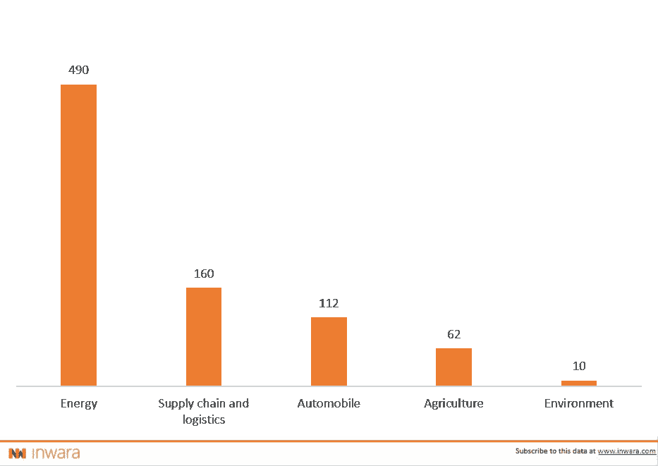

# 区块链准备改造供应链和物流业

> 原文：<https://medium.com/swlh/blockchains-poised-to-revamp-the-supply-chain-industry-blockchain-impact-on-supplychain-industry-b78996528f53>

> 今天就下载 40 页的完整报告。

供应链对于业务运营至关重要，它帮助企业将原材料转化为为客户创造收入的产品和服务。在当今全球化的经济中，企业在不同的业务部门、不同的国家运营着多个供应链网络，并分包给不同的实体——子公司或分包商。物流是跨产品供应链的关键支持，在某些情况下，也是提供服务的关键支持。

## 供应链网络为什么需要区块链技术？

供应链和物流传统上被视为繁琐复杂的管理流程。分销商、零售商、制造商和其他方之间的付款需要几天才能确认。在开发的每一个阶段都有中间商的参与，使得运营成本更高。很多时候，涉及律师和银行家的法律合同，除了减缓流程之外，还会增加一些复杂的全球供应链的成本。

如何利用区块链来缓解这些问题？

> 这就是区块链的价值所在，区块链本质上是一个分布式数字账本，记录所有交易，使多方验证更容易实现！

区块链网络的分散性质消除了第三方验证或监督交易的需要。企业有望在不需要中介的情况下直接进行 B2B 交易，并跟踪每个产品的所有阶段。将这些原则应用于供应链和物流，本质上意味着在完美的世界中，支付、仓储、运输或交付过程中面临的许多复杂和繁琐的问题都可以得到缓解。

有几家公司试图利用区块链来革新供应链和物流行业。InWara 跟踪这些公司，既有在区块链投资和经营的公司，也有做 ICO 的公司。

ICOs 在区块链采用供应链的各个部门筹集的资金总额。

Source: InWara’s ICO+STO database

这些行业传统上一直受到效率低下的困扰，各种公司纷纷涌现，试图通过将区块链技术集成到他们的供应链网络中来缓解这些问题。

> [今天就下载你的 40 页报告。](https://www.inwara.com/report/annual-report-2018?utm_source=supplychainstartup&utm_medium=supplychainstartup&utm_campaign=supplychainstartup)

# 供应链行业上市的 ico 数量与 ico 数量

[Source: InWara’s ICO+STO database](http://www.inwara.com/?utm_source=supplychainstartup&utm_medium=supplychainstartup&utm_campaign=supplychainstartup)

根据 InWara data 的数据[，到目前为止已经有 61 个 ico 试图缓解行业面临的各种问题。10 家 ico 已在多家交易所上市。](http://www.inwara.com/?utm_source=supplychainstartup&utm_medium=supplychainstartup&utm_campaign=supplychainstartup)

# 相关行业 ico 的故障率

[Source: InWara’s ICO+STO database](http://www.inwara.com/?utm_source=supplychainstartup&utm_medium=supplychainstartup&utm_campaign=supplychainstartup)

> [今天就下载你的 40 页报告。](https://www.inwara.com/report/annual-report-2018?utm_source=supplychainstartup&utm_medium=supplychainstartup&utm_campaign=supplychainstartup)

尽管解决了遗留行业的问题，但 ico 的失败率相对较低。供应链管理行业的失败率为 16.39%，紧随其后的是环境和汽车行业，失败率分别为 11.1%和 9.3%。

传统公司采用区块链管理供应链

尽管试图使用区块链改造供应链的新公司激增，但试图成为早期采用者的传统公司正在探索实施这些技术的创新方法。

一个很好的例子是福特[奥德汽车公司](https://www.ford.com/)、[华友钴](http://en.huayou.com/)、 [IBM](https://www.ibm.com/) 、 [LG 化学](http://www.lgchem.com/global/main)和 [RCS Global](http://www.rcsglobal.co.in/) 之间的战略伙伴关系，以增加关键全球矿产供应链的透明度。提议的网络将在从矿山到最终用户的供应链的每个阶段都有参与者。

该财团将首先测试一个以矿物钴为重点的试点项目，最终目标是开发一个开放、分散的区块链平台，该平台在整个行业中无所不能。该联盟希望，随着这一全行业网络的发展，企业将能够更好地追踪每一种用于制造消费品的矿物。

本文所有数据均来源于 in wara 2018 年度报告。

> [立即下载 40 页的完整报告。](https://www.inwara.com/report/annual-report-2018?utm_source=supplychainstartup&utm_medium=supplychainstartup&utm_campaign=supplychainstartup)

*免责声明:文章来源于 InWara。这不是财务建议。InWara 不提升/降级任何公司/ICO。本信息或其他媒体中的观点、陈述、估计和预测仅属于作者个人。它们不一定反映 Inwara 或其任何附属公司(“Inwara”)的意见。Inwara 没有义务更新、修改或修正此消息或其他媒体，或以其他方式通知其接收者，如果此处陈述的任何事项或此处陈述的任何意见、预测、预测或估计发生变化或随后变得不准确。本邮件或其他媒体中提供的任何内容、信息和材料均按“原样”提供。Inwara 对其准确性、完整性或及时性，或收件人获得的结果不做任何明示或暗示的保证，并且不对任何收件人在此的任何不准确、错误或遗漏承担任何责任。在不限制上述规定的情况下，Inwara 对任何消息或媒体的接收方不承担任何责任，无论是在合同、侵权行为(包括疏忽)、担保、法规或其他方面，对于此类接收方因其或任何第三方决定的任何行动、意见、建议、预测、判决或任何其他结论或任何行动过程而遭受的任何损失或损害，无论是否基于此处包含的内容、信息或材料。*

## 这篇文章发表在[《创业](https://medium.com/swlh)》上，这是 Medium 最大的创业刊物，有+414，678 人关注。

## 订阅接收[我们的头条新闻](http://growthsupply.com/the-startup-newsletter/)。

