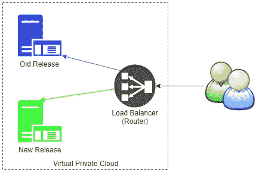

# 确保零停机的部署策略—蓝绿色部署

> 原文：<https://medium.com/swlh/blue-green-deployment-with-zero-down-time-222a76ad846f>

Photo by [Panaya](https://www.panaya.com)

今天，我将讨论我们如何在生产环境中部署，同时牢记服务的高可用性和零停机时间。我们能用于此目的的技术很少。今天我们将讨论**蓝绿部署**或**红黑部署**。在我看来，简单部署策略是一个花哨的词。

# 蓝绿色部署

蓝绿色部署的基本思想是您并排运行两个应用程序，一个使用旧版本，另一个使用最新版本。我们已经大致了解了什么是蓝绿色部署，现在让我们深入了解一下蓝绿色部署的流程。

假设我们有一台运行旧版本的**蓝色**服务器。并希望在生产环境中部署新版本。在我们的生产服务器上创建一个副本绿色服务器()。在一台服务器上部署新的构建，并称之为**绿色服务器。**一旦构建被部署，运行一个冒烟或健全的测试来验证一切工作正常。现在，当您确定新版本(绿色服务器)一切正常时，让我们为用户推出它。现在，我们可以使用两种策略来推出新版本。有一点很重要，那就是你应该让服务器保持运行一段时间，以便在绿色服务器上的新版本出现任何问题的情况下回退到以前的版本。

*   将所有用户重定向到新的绿色服务器。
*   逐步推出新版本，也就是将一定比例的用户重定向到绿色服务器，以确保新版本运行良好。一验证，增加绿色服务器的负载。

Blue Green Deployment Diagram

## 蓝绿色部署清单

这是您应该维护的蓝绿色部署清单

1.  您有两台正在运行服务器(新旧版本)
2.  在具有新版本的服务器上运行健全性测试
3.  将一些流量路由到新服务器，以便逐步推广。
4.  将所有流量路由到新服务器(具有最新版本)
5.  保留旧服务器一段时间，以便在新的生产版本出现问题时进行回滚。

## 最后的话

如果我们的服务器托管在 AWS 上，我们可以使用 AWS 的托管服务来实现这一点，对于路由，我们可以使用 **Route53** 。但是，如果服务器位于数据中心，并且没有托管服务，那么我们需要制定一些新版本的部署策略。而蓝绿部署策略是个不错的选择。出于路由目的，我们可以利用我们的负载平衡器或任何其他服务。

## 这篇文章发表在 [The Startup](https://medium.com/swlh) 上，这是 Medium 最大的创业刊物，拥有+421，678 名读者。

## 在此订阅接收[我们的头条新闻](https://growthsupply.com/the-startup-newsletter/)。

