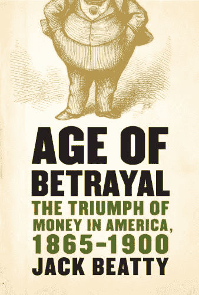

# 书评:背叛的年代:金钱在美国的胜利，1865-1900，作者杰克·贝蒂

> 原文：<https://medium.com/swlh/book-review-age-of-betrayal-the-triumph-of-money-in-america-by-jack-beatty-fef524800730>

纽约:古董书，2008 年。483 页。

“这本书是一篇当代历史论文。它伴随着我们国家的诞生。”

共享所有权(或者是共谋？)预示着杰克·比提的*背叛时代*，他对镀金时代的详尽和令人筋疲力尽的探索，这个时期…