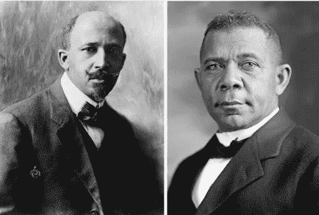

# 妥协还是反对

> 原文：<https://medium.com/swlh/bookertdubois-7062fbc4737d>

W.E.B Du Bois (left) Booker T. Washington (right) Source: Public Domain via Wikimedia

## 历史的教训——加布里埃尔·麦地那

## 布克·t·华盛顿和 w·e·b·杜·博伊斯的公司分裂教训

大多数学习美国历史的学生——甚至是不太熟悉的学生——都非常清楚 20 世纪 50 年代和 60 年代的非裔美国人民权运动。这些学生已经了解到，在那场运动中出现的两个领导人…