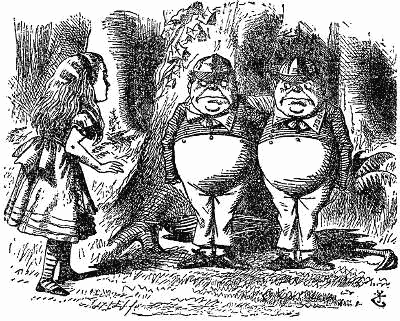

# 使用 Scala 编译器的布尔逻辑

> 原文：<https://medium.com/swlh/boolean-logic-using-the-scala-compiler-41d83e6891ec>

“Contrariwise,” continued Tweedledee, “if it was so, it might be; and if it were so, it would be; but as it isn’t, it ain’t. That’s logic.” — Lewis Carroll, Through the Looking Glass

作为一个长期的逻辑爱好者，和一个最近的类型级编程爱好者，我认为将两者结合起来才是正确的，这正是我们将要做的！

这个项目的目的是在 Scala 的类型层次上编码布尔逻辑，从而允许我们在编译时评估表达式的真实性，并显示布尔函数是可满足的还是重言式的。如果…