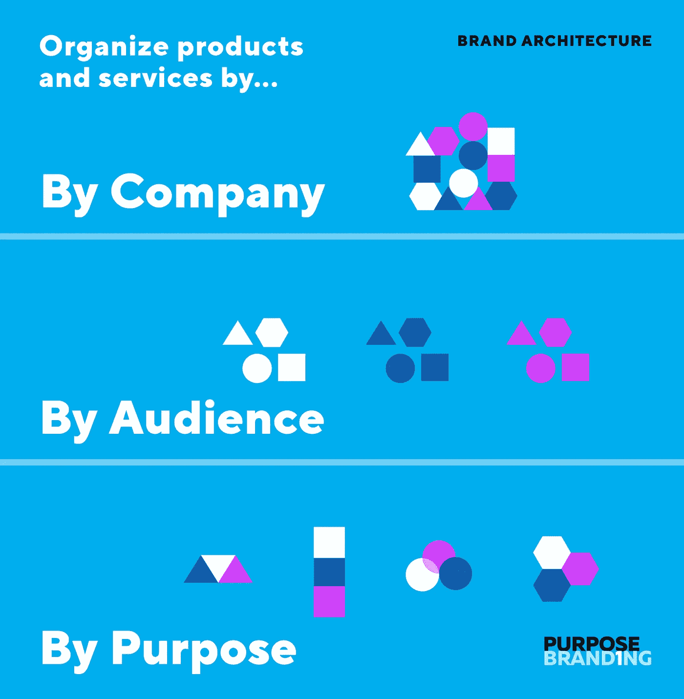

# 品牌架构:消除混淆。提供结构。

> 原文：<https://medium.com/swlh/brand-architecture-eliminating-confusion-providing-structure-c034ddb9600d>

您对您的产品和服务以及它们如何组合在一起有疑问吗？对成长中的公司来说，你的产品或服务有些混乱是正常的。你需要决定如何处理这些产品或服务。

随着公司的成长，产品和服务也随之成长。事情开始变得混乱和复杂。没有人…