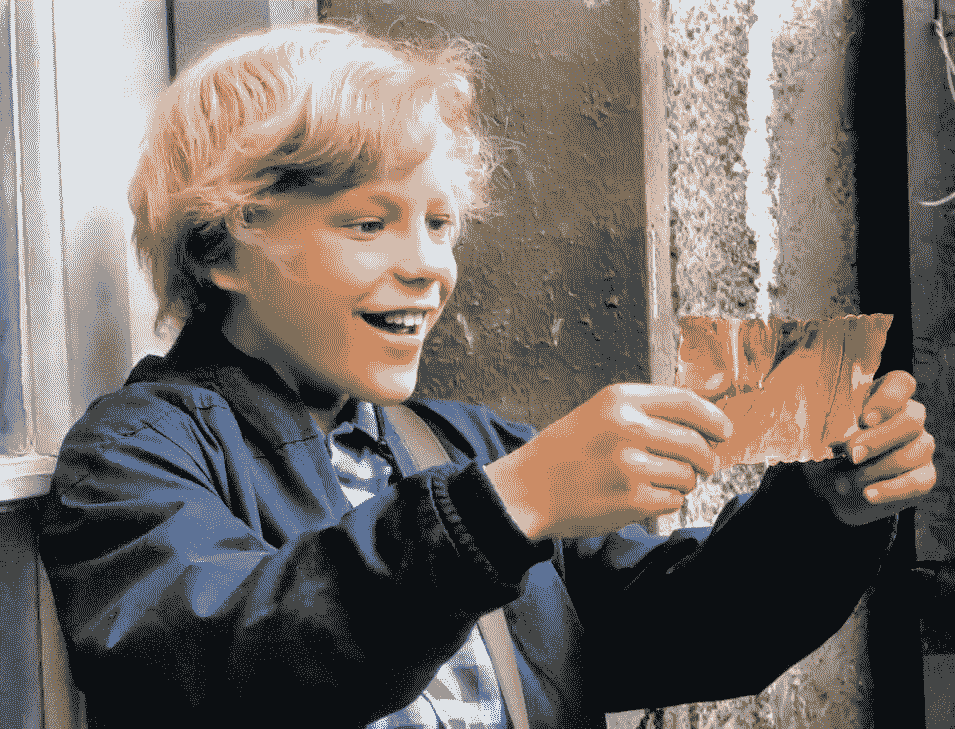
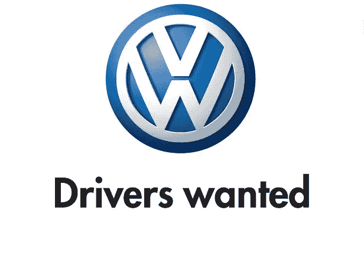
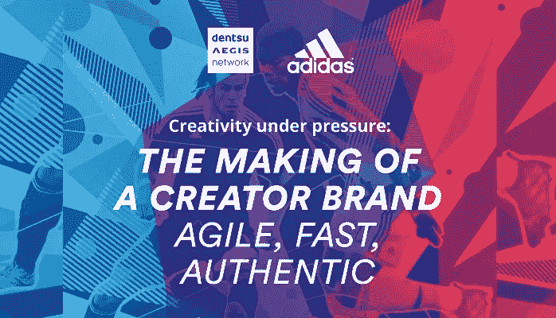
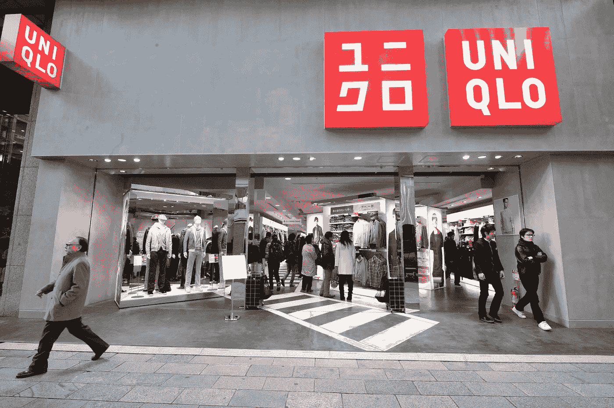
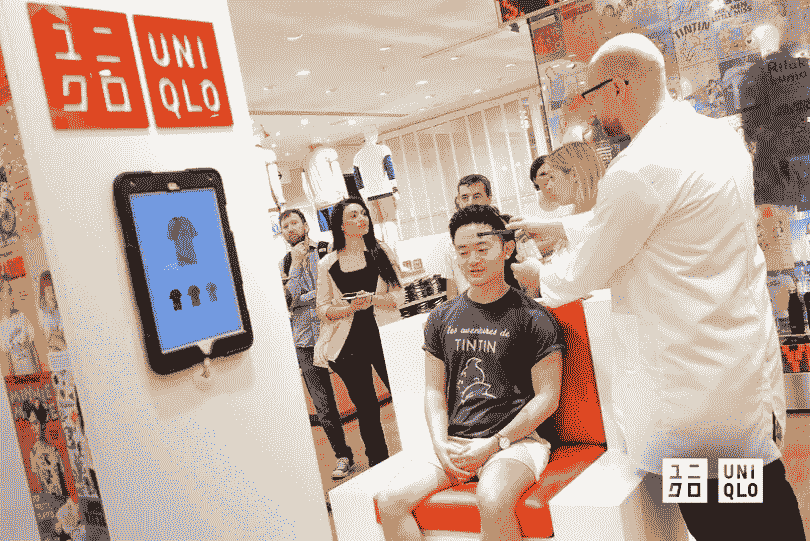

# 品牌资产:你的员工是你的金奖券

> 原文：<https://medium.com/swlh/brand-equity-your-people-are-your-golden-ticket-286499b5c27>

根据 Inc .的说法，品牌资产是“人们对一个品牌的估价”但并不总是这样。过去是品牌告诉消费者该相信什么。思考什么以及如何相应地行动。

**下面我列举了几个在品牌“控制时代”的品牌信息的例子:**

**可乐:**“真货”

**麦克斯韦:**“好到最后一滴”

**加州牛奶处理器板:**“有牛奶吗？”

汉堡王:“随心所欲”

**小麦:**冠军早餐。

**IBM:** “我思故我在 IBM。”

**宝马:**“终极驾驶机器。”

这样的例子不胜枚举…

**广告狂人时代:**所有这些广告语都定位在一个“品牌”由受控感知定义的时代。我们称之为品牌形象。一个品牌如何看待自己，以及他们将如何在市场上讲述这个故事。他们希望被告知的方式。那是唐·德雷柏时代。激动人心吧！？也许对我们 x 世代来说。

但是我们现在生活在一个不同的世界。一个不再被像大卫·奥格威这样的麦迪逊大街超级英雄领导的季度广告和印刷广告所控制的世界(是的，他曾经带着黑色斗篷和一杯苏格兰威士忌在曼哈顿闲逛)。一个不再被“肚子里有火”的疯子控制的世界，正如他在他的开创性著作《一个广告人的自白》中所写的那样。我们生活在一个通过全渠道通信和自动化控制运动的世界里。

**文化转变:**事实上,“Target Marketing 的最新研究显示，超过 74%的受访者表示，拥有一个有凝聚力的全渠道体验非常重要、相当重要或非常重要。展望未来，人们用来访问在线资源和购物的大多数设备都将变得集成。”

可以说，我们正在一个充斥着越来越多的频道的富媒体内容的时代建立品牌。

无休止的活动反馈，数十亿双眼睛每天滚动信息，因为文化通过向上滑动，然后向下滑动，再返回到喜欢，点击，评论，分享，最后发布(如果你幸运的话)来塑造每个故事。

于是，品牌进化的美丽循环开始了。每一天，当每个人拿起他们的手机来获取他们的信息时，它就会一遍又一遍地播放。早上的第一件事…晚上的最后一件事。

如果你真的仔细想想，汉堡王 1973 年的口号“随心所欲”可能已经超前了很多年。从很多方面来说，这是一个意外的预言。不幸的是，我想我们所有人都会认为汉堡王没有很好地保持它的品牌。那么是谁开始预测这种转变的呢？

大众汽车的关键改编:一个更好的例子可能是总部位于波士顿的阿诺德通信公司在 1995 年创造的大众“招聘司机”口号。这是一个号召，号召世界各地的人们按照自己的节奏参与到品牌中来。

速度=你想要的速度(单位:米。或千米)

内饰=随你喜欢

型号=您想要的型号

功能=无论你在做什么

颜色=我们有很多。一个你可能喜欢的

产品特性和工程并不是大众关注的领域。因为它不言自明。

为什么？他们选择不像宝马控制其
*【终极驾驶机器】* strapline 那样控制信息，自 1973 年以来，strapline 一直是宝马品牌的重要组成部分。

相反，“招聘司机”是一个响亮的号召。可以说是宣言。让人们以自己的方式接触它的品牌。完全反对被“控制”的潮流。

虽然他们在 1995 年发起这一活动时可能并不知道，但相反，他们专注于为司机的故事和他们讲述故事的方式建立一个平台。

快进到今天，对话被生活在社交网络上的文化的指尖所控制。

马蒂·纽梅尔(Marty Neumeier)在《品牌翻转》(Brand Flip)中评论“品牌”时写道，它“不再是你说你是谁*，而是他们说你是谁*这正符合当前以人为本的品牌时代。**

**那么，他们是谁？**简单来说；*他们*是你的人。在 [La Visual](http://lavisual.com) ，我们将他们定义为内部受众(你的员工)和外部受众(你的客户)。

在我们确定品牌资产差距的过程中，我们针对影响品牌价值的五个关键领域:故事、系统、文化、行为，最后是；人们。后者是最重要的，因为前四个领域是通过你的员工进入市场的。

下面，我列出了三种被证明能为这两类人创造品牌价值的关键行为。目标是为这两个群体的形成和内化创造自由。

**第 1 组—您的员工:**

1.  品牌宣传:
    围绕品牌承诺建立热情、动力和激情
2.  品牌体育精神:
    透过品牌价值观的视角，将同理心延伸到每个团队成员
3.  品牌防御:
    不惜一切代价捍卫以上所有

**第二组—您的客户:**

1.  让他们来领导:
    在谈话中，让你感到不舒服的话多出来，让事情得以催化和成形。这是进化开始有机成形的开端。
2.  将客户服务与对话联系起来:
    确保你的互动方式是积极的、宽容的。永远在你的床头柜上留一个开门的标志。根据营销洞察，大多数客户期望在 30 分钟内收到品牌的回复！
3.  奖励最高级别的参与:
    奖励引导对话并围绕您的品牌分享创新想法的客户。

那些抓住了这一巨变的关键本质的品牌，已经通过改变他们的招聘努力，在增加价值和建立品牌资产方面做得很好。这正是阿迪达斯在与耐克和安德玛等美国品牌进行艰苦斗争时所做的事情。

阿迪达斯做对了什么？

1.  授权:他们授权给他们的员工。墙内的创造者
2.  *同理心:搭建了一个分享故事的平台*
3.  奖励:他们奖励最引人注目的故事

**品牌领导者的结束语:**我们正在从执行和公司控制品牌的时代转向部落控制的时代。部落里的人们为你控制和发展品牌。这既是内部文化，也是你的员工在外部为你的品牌定下基调。以及客户的声音，通过有意的全渠道对话和关系，自然地提升你在市场中的地位。

回到大卫·奥格威:他是一个超级英雄，不是因为他穿着斗篷，标榜自己的个人品牌。但是，因为他是第一个把文案和美术总监放在同一个房间的创意！这个小小的调整永远改变了传统广告的表现。

**这如何适用？**当寻求建立品牌资产时，作为一名领导者，你需要确保你的营销团队和客户服务团队在同一个房间里。因此，他们可以一起创建一个平台，双向分享有意义的故事。这将有助于提升你的员工的声音，让品牌进化成形。

请记住，您的内部人员与您的客户在同一个外部渠道上交谈。在两者之间建立联系是为你的品牌创造一个更上一层楼的终极平台的方法。

随着时间的推移，这种部落驱动的心态的早期采用者确实提高了他们的品牌亲和力。像优衣库这样的品牌，正从他们失去控制的意愿中看到了成果。

优衣库的 [UMOOD 体验](https://mashable.com/2015/10/06/uniqlo-neuroscience-australia-tshirts/#_ddwlpjVIGqO)允许顾客在店内根据自己的心情选择 t 恤。这是一种有趣的方式来说，“我们的人是司机。我们希望让我们的风格与您今天的感受相匹配，同时，请告诉我们您的想法。”

所以，如果你是营销主管或者高管，确保你听取了*所有*下属的意见。最重要的是把控制权交给文化。我们口袋里社交媒体的激增让我们可以与你的员工、他们的朋友和更广泛的网络进行对话。**

> 你越是允许这一点来塑造你的地位，你就越能与你的员工建立品牌亲和力。最终，你将能够把品牌作为一项资产列入你的资产负债表。

从你的品牌中创造流动性是少数精英已经发现的黄金门票，并将无限期地永远影响他们的底线！

#品牌#文化#品牌#设计#文化发展#领导力#营销#数字战略#客户服务# cx #身份#品牌体验# brandex #企业身份#品牌发展#内部品牌#人的问题#内容战略

## 这篇文章发表在 [The Startup](https://medium.com/swlh) 上，这是 Medium 最大的创业刊物，拥有+424，678 名读者。

## 在这里订阅接收[我们的头条新闻](https://growthsupply.com/the-startup-newsletter/)。

