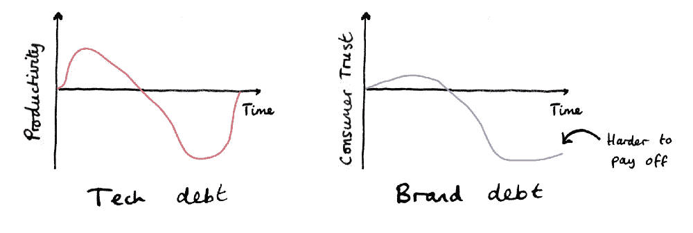

# 品牌管理:品牌债务的危险

> 原文：<https://medium.com/swlh/brand-management-the-dangers-of-brand-debt-f55a55660403>

## 科技债务会让你的发展停滞不前。品牌债务会让你的生意陷入停顿。品牌管理软件可以提供帮助。

Bad [brand management](https://en.wikipedia.org/wiki/Brand_management) leads to brand debt

在敏捷技术项目中，当

1.  走捷径，
2.  代码不是按照规范编写的，
3.  变化没有被记录，
4.  完工时不签票，
5.  测试代码不是写出来的，

然后项目招**【科技债】**。

# **科技债**

有时候，在“快速发展”的方法论中，初创公司会有意承担科技债务。

当一个特定的项目需要快速实施时，大公司也会这样做。

但是团队越大，项目越大，技术债务就越多。关于债务有一件事是肯定的……法警迟早会来敲门。

# **品牌债务**

最近，我偶然看到一篇关于营销等价物的文章。

软件招致技术债务，营销招致“品牌债务”——斯科特·布林克尔

对于小型创业公司来说，品牌在很大程度上取决于创始人的个性。

这确保了对每一个营销输出的控制水平。所有的支出都可以用同样的语调来写。颜色和字体可以一致使用。可以连贯地选择图像和照片。简而言之，营销内容永远是关于品牌的*，因此品牌管理不是一个太大的问题。*

*对于较大的公司来说，保持品牌可能有点棘手。创始人可能不再能够回顾他们公司的每一项产出。因此，某种“品牌冠军”或品牌经理必须监督公司品牌在营销材料中的实施。*

*品牌冠军的作用非常重要。如果有足够多的材料被制作和分发，而这些材料在外观、感觉和声音上都与品牌不符，那么营销团队可能会招致**品牌债务**。*

# ***品牌债务的危害***

*科技债务会让你的发展**停滞**。**品牌债务**会把你的**生意**磨到停顿。*

*因为，如果积累了太多的品牌债务，它会摧毁消费者的信任，而这种信任要严重得多，也难以偿还！*

**

*Tech debt vs. Brand debt*

# ***什么原因导致品牌负债？***

## ***原因 1:个性***

*品牌债务的第一个原因来自一个营销团队的构成。*

*营销团队是由个人组成的。如果没有公司希望营销材料的外观和感觉的指导方针，每个人的个性都可能会渗透到营销输出中。*

*少量的话这还不错。如果一家公司重视其品牌的古怪和个性，并且他们雇佣了合适的人，这甚至可能是件好事。但如果不加以监控和管理，随着时间的推移，它会像滚雪球一样，导致不连贯的品牌信息。*

## ***原因二:营销接触点多样***

*品牌债务的第二个原因是当今存在的营销接触点的数量和种类。*

*在复杂的数字营销世界中，营销团队不断在许多不同的平台上测试牵引力。每个平台都有自己的外观和感觉，因此营销人员希望为他们的目标平台量身定制内容。*

*同样，只要受到监控，这是一件好事。但是，当营销内容与他们正在测试的市场/平台比与他们所代表的品牌更合拍时，这可能会导致品牌不一致和品牌债务。*

# ***避免品牌债务***

*品牌债务是由创建品牌内容时缺乏流程和结构造成的。可以通过采取以下措施来改善你的品牌管理。*

1.  *在设计和营销团队之间建立强有力的联系。*
2.  *为你的公司起草一些详细的品牌指南。*
3.  *在品牌指南中设置检查和措施，以确保任何营销材料都符合其目的地(即接触点)和贵公司的品牌形象。*
4.  *使用品牌管理软件。这有助于将您的品牌身份带入生活，以便整个营销团队在创建营销内容时可以立即访问他们的品牌指南、元素和资产。*

*【www.pilcro.com】最初发表于**。***

****

## **这篇文章发表在 [The Startup](https://medium.com/swlh) 上，这是 Medium 最大的创业刊物，拥有+427，678 名读者。**

## **在此订阅接收[我们的头条新闻](https://growthsupply.com/the-startup-newsletter/)。**

****