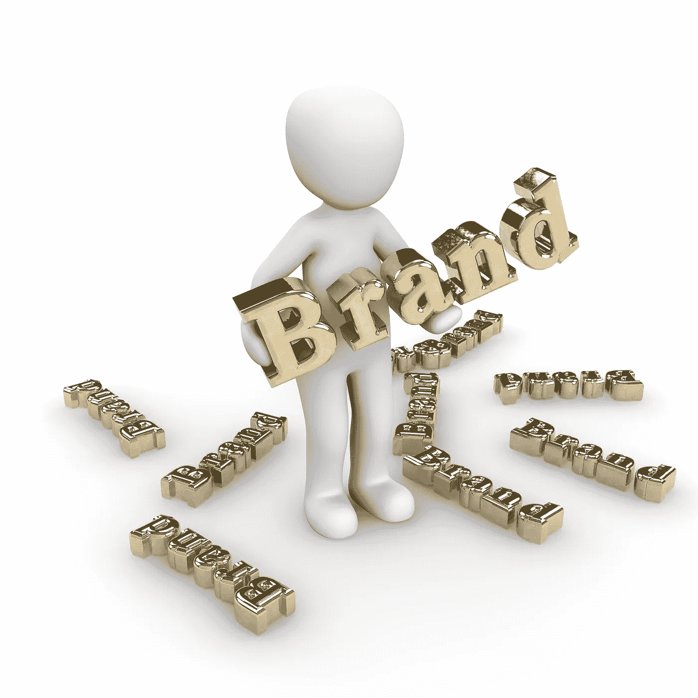

# 商业中的品牌

> 原文：<https://medium.com/swlh/branding-in-business-2e957ac13266>

## **未来是什么？**

Image by [Peggy und Marco Lachmann-Anke](https://pixabay.com/users/3dman_eu-1553824/?utm_source=link-attribution&utm_medium=referral&utm_campaign=image&utm_content=1027862) from [Pixabay](https://pixabay.com/?utm_source=link-attribution&utm_medium=referral&utm_campaign=image&utm_content=1027862)

不管喜欢不喜欢，每个人都有一个品牌。我正在和品牌专家 [Floortje Lopes](https://www.linkedin.com/in/floortje-lopes-ing-a0481247/) 合作一个项目，她总是提醒她的客户和观众“一个标志和一个网站不是一个品牌。”

一个品牌更大。这是关于我们是谁。它是关于人们与我们之间的联系。这是我们拥有的身份。