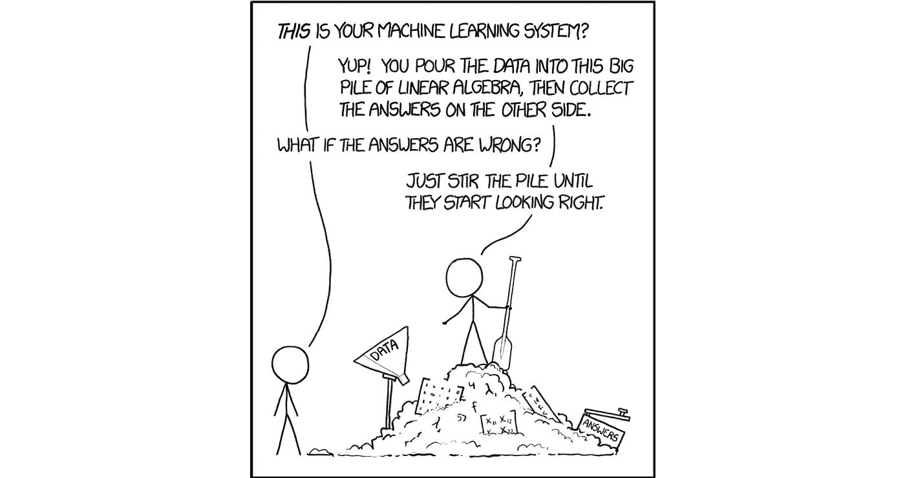

# 破解黑盒

> 原文：<https://medium.com/swlh/breaking-down-the-black-box-39403b0f64a3>

## 换句话说，如何让机器学习对人类来说是可理解的

# 如果成功了，就成功了，对吧？

Source: [XKCD](https://xkcd.com/1838/)

我记得在完成我的第一次关于机器学习的 Kaggle 竞赛后，我坐了下来，惊叹于从本质上归结为难以理解的线性代数的大块内容和一些描述输出有多好的统计数据…