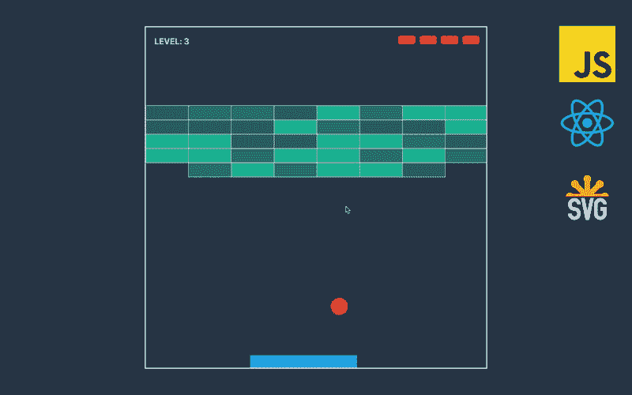

# 与 JavaScript，React 和 SVG 的突破游戏。第一部分

> 原文：<https://medium.com/swlh/breakout-game-with-javascript-react-and-svg-part-1-d7e244a30c3e>

这是课程“[使用 JavaScript、React 和 SVG](/@geekrodion/breakout-game-with-javascript-react-and-svg-c8c62a3d30c6) 的突破游戏”的一部分。

[GitHub Repository](https://github.com/RodionChachura/breakout-game) and [Deployed Game](https://rodionchachura.github.io/breakout-game/)

在本课程中，我们将使用 JavaScript、React 和 SVG 构建一个突破游戏。我们将用 create-react-app 引导游戏，不会使用任何额外的库，只是普通的现代 JS 和 react。我们将利用函数式的、不可变的编程，在这个过程中，我们将学习 React 钩子、SVG…