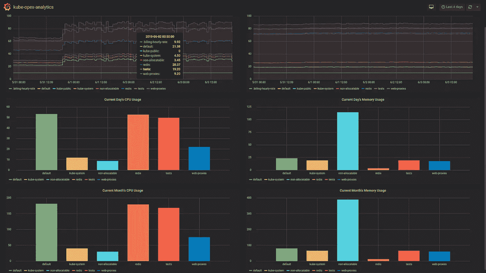
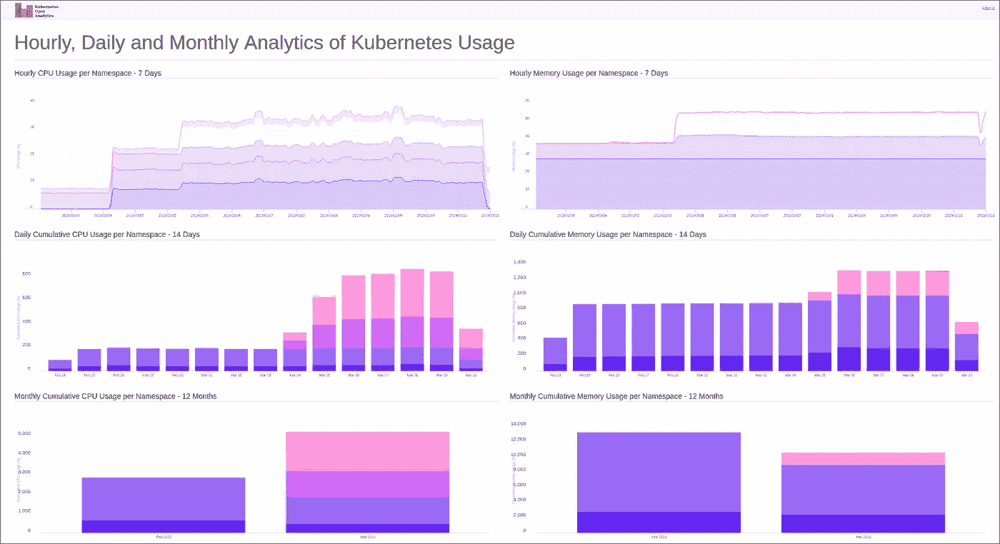
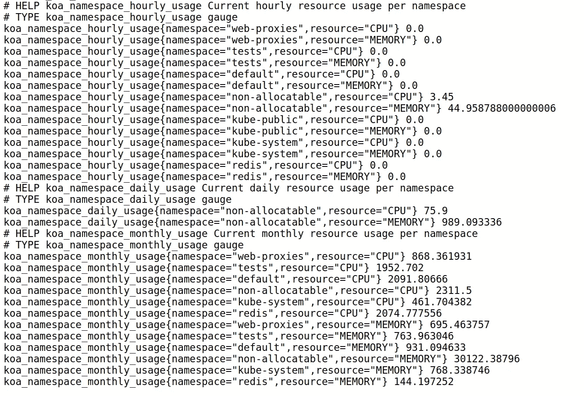
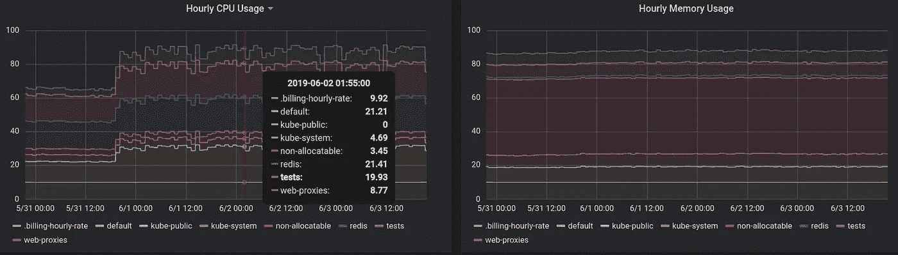
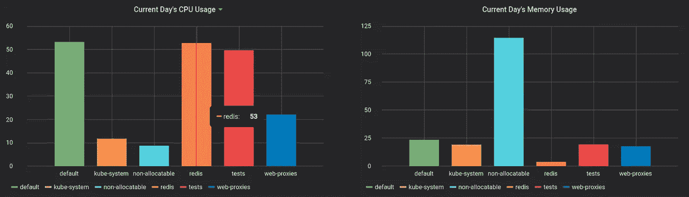
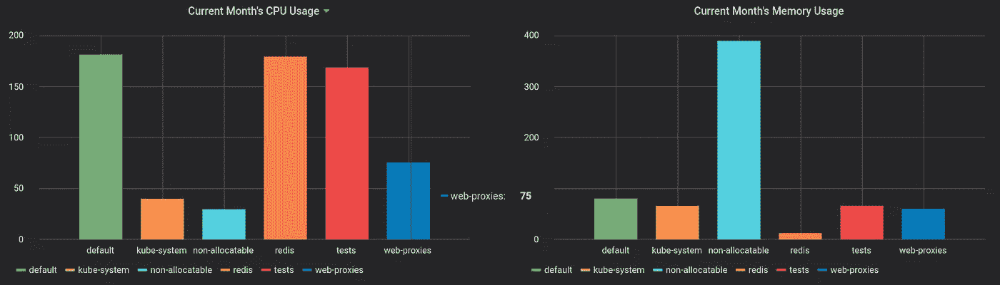

# 在 Kubernetes 集群上引入 Prometheus Metrics 和 Grafana Dashboard 进行成本分配

> 原文：<https://medium.com/swlh/bringing-prometheus-metrics-and-grafana-dashboard-for-cost-allocation-on-kubernetes-clusters-1ee7f68cd677>

这个故事介绍了一个 Prometheus Exporter 和一个 Grafana 仪表板，旨在为 Kubernetes 集群提供面向成本的整合资源使用分析。这些分析实际上旨在强调事实指标，以帮助组织轻松做出短期、中期和长期的成本分配和容量规划决策。

> **旁注:**读者可能也会对另一个[的故事](/@rodrigue.chakode/kubernetes-resource-usage-analytics-for-cost-allocation-and-capacity-planning-416800e85d16)感兴趣，它与当前的故事相关，但又独立。



A Grafana Screenshot of the Hereafter-described Analytics Dashboard for Kubernetes Cost Allocation and Capacity Planning

# 介绍

几个月前 [Kubernetes Opex Analytics](https://github.com/rchakode/kube-opex-analytics) 作为一款原创的开源资源使用分析工具推出，使 Kubernetes 集群的成本分摊和容量规划决策变得更加容易。根据 Apache 2.0 许可条款发布，该工具带有内置的分析图表，涵盖各种用例。它收到了很多用户反馈，有些人要求能够将其指标暴露给现有的 Prometheus 环境。

在 0.3.0 版本中已经引入了一个普罗米修斯出口器，所以在这个故事中，我很乐意介绍和描述它。这伴随着一个集成的 Grafana 仪表板，让用户很容易开始。所有这些都是对原生 Kubernetes Opex 分析功能和仪表板的补充。

## 接下来将涵盖哪些内容

该故事将详细介绍暴露的指标，并提供步骤来设置出口商和所提供的 Grafana 仪表板。在此之前，我们将为不熟悉 Kubernetes Opex Analytics 的读者回顾其核心功能。

> 如果您已经熟悉 Kubernetes Opex Analytics 的概念，您可以跳过下一部分继续。

# Kubernetes 运营支出分析概述

Kubernetes Opex Analytics 基于以下核心概念设计:

*   **以名称空间为中心的**:意味着整合的资源使用指标将单个名称空间视为资源共享的基本单元。还特别注意考虑和突出显示`non-allocatable resources`。
*   **每小时使用量&趋势**:像在公共云上一样，每个名称空间的资源使用以每小时为基础进行整合。这实际上对应于每小时每个名称空间使用的资源比率(`%`)。它是成本计算的基础，还允许获得每个名称空间和 Kubernetes 集群规模的资源消耗的时间趋势。
*   **每日和每月使用成本:**提供每个周期(每日/每月)、名称空间和资源类型(CPU/内存)，*综合成本*以下列方式之一计算: *(i)* 该周期内累计的每小时使用量； *(ii)* 基于资源使用和给定的每小时计费率计算的实际成本； *(iii)* 每个名称空间的使用情况与全局集群使用情况的标准化比率。
*   **高效可视化:**对于其生成的指标，Kubernetes Opex Analytics 提供了仪表板，其中包含相关图表，以及过去 12 个月(即一年)的最后几个小时，如下所示。



Kubernetes Opex Analytics — Screenshot of the Built-in Dashboard

# 安装 Kubernetes 运营支出分析

接下来，我们假设安装将在 Kubernetes 集群上完成，因为您也可以在 Docker 上安装它，如这里的[所述](https://github.com/rchakode/kube-opex-analytics#start-koa-on-docker)。

有一个[头盔图](https://github.com/rchakode/kube-opex-analytics/tree/master/helm/kube-opex-analytics)可以通过使用头盔`Tiller`或`kubectl`来简化 Kubernetes 上的部署。

在这两种情况下，检查`values.yaml`文件，根据您的需要修改配置选项(例如，为数据存储提供永久卷)。

使用`Helm Tiller`:

```
helm upgrade \
  --install kube-opex-analytics \
  helm/kube-opex-analytics/
```

使用`kubectl`:

```
helm template \
  --name kube-opex-analytics \
  helm/kube-opex-analytics/ | kubectl apply -f -
```

> 这将通过端口`80`上名为`kube-opex-analytics`的 HTTP 服务启用内置的仪表板。

# 普罗米修斯出口商

通过`/metrics`端点公开 Prometheus 的指标。

## 公开的指标

如下图示例所示，公开的指标如下:

*   `koa_namespace_hourly_usage`:显示每个名称空间当前每小时的 CPU 和内存资源使用情况。
*   `koa_namespace_daily_usage`:显示每个名称空间在当天的 CPU 和内存的当前资源使用情况。
*   `koa_namespace_monthly_usage`:显示每个名称空间和当月的当前 CPU 和内存资源使用情况。



Kubernetes Opex Analytics — Sample of Metrics Exposed for Prometheus

## 普罗米修斯**刮掉**的工作

该作业可以配置如下。小于 5 分钟的时间间隔(即`300s`)是无用的，因为在此期间不会生成新的指标。

```
scrape_configs:
  - job_name: 'kube-opex-analytics'
    scrape_interval: 300s
    static_configs:
      - targets: ['kube-opex-analytics:80']
```

> 回想一下，Kubernetes Opex Analytics 使用每小时整合的指标，因此您可能需要至少等待一个小时才能获得所有指标。

# Grafana 仪表板

一旦 Prometheus 中的指标可用，获取[这个 Grafana 仪表板](https://grafana.com/dashboards/10282)，并将其导入 Grafana。仪表板依赖于一个变量`KOA_DS_PROMETHEUS`，该变量将指向您的普罗米修斯数据源。

正确配置后，仪表板将立即显示图表，如下所述。

## 每小时使用量

有两个面板分别显示所选时间间隔(默认为 7 天)内 CPU(左)和内存(右)的使用情况图表。不同命名空间的系列是堆叠的。这使得比较使用情况变得容易，也有助于显示集群的负载情况。在下面的示例中，我们可以看到在过去 5 天中，全局 CPU 和内存使用率达到了 90%以上。



Kubernetes Opex Analytics — Hourly Resource Usage

## 当天的使用情况

这两个面板分别显示当天 CPU(左)和内存(右)的成本图表。使用本故事前面描述的成本算法来计算价值。



Kubernetes Opex Analytics — Current’s Day Resource Usage

## 本月的使用情况

下方的两个面板分别显示当月 CPU(左)和内存(右)的成本图表。使用本故事前面描述的成本算法计算的值。



Kubernetes Opex Analytics — Current’s Month Resource Usage

# 前进

简而言之，我们在这个故事中介绍了一个 Prometheus 出口商以及一个用于 Kubernetes Opex Analytics 的 Grafana 仪表盘。

您可能已经注意到，所描述的 Grafana 仪表盘的图表不如 Kubernetes Opex Analytics 的内置仪表盘丰富。例如，每日和每月的使用分别限于当天和当月。这使得很难将当前的使用情况与以前的进行比较。[这些是 Grafana 处理基于系列名称的条形图的固有限制](https://community.grafana.com/t/display-stacked-series/3402/15)。因此，当前的实现还有进一步改进的空间，非常感谢大家的贡献。

我想提醒一下，Kubernetes Opex Analytics 是开源的，它是一个开放贡献的项目。我们总是很高兴在 [Github](https://github.com/rchakode/kube-opex-analytics) 上收到反馈和贡献:如果您遇到问题或有一些改进的想法，请提交问题；提出拉取请求；或者给个星。

尽情享受吧！