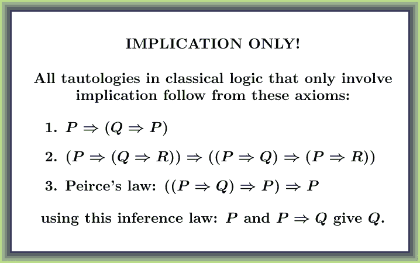
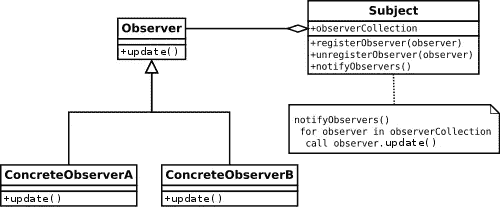
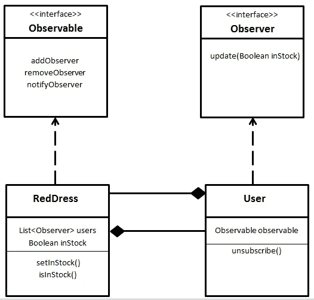
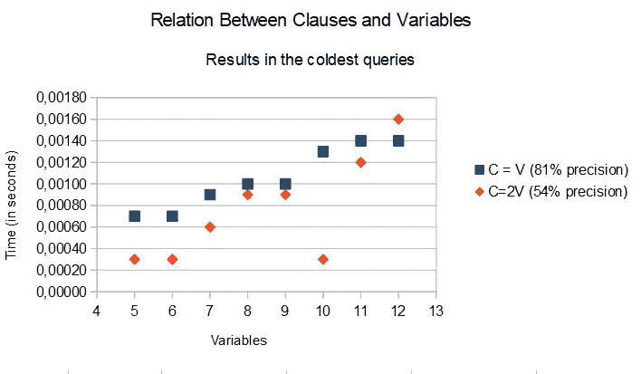

# 观察者背后的蛮力

> 原文：<https://medium.com/swlh/brute-force-behind-the-observer-c150aedb9210>


Photo by [Deva Darshan](https://unsplash.com/@darshan394?utm_source=unsplash&utm_medium=referral&utm_content=creditCopyText) on [Unsplash](https://unsplash.com/search/photos/cars-theme-park?utm_source=unsplash&utm_medium=referral&utm_content=creditCopyText)

## 如何构建具有观察者模式的微型机器，能够解决最复杂的问题。

搜索时轻视蛮力的力量是相当普遍的。它给人的印象是，解决问题的最好方法是通过一些合适的和谨慎的方法。然而，代码越复杂，交互性越差，效率就越受限制。另一方面，如果我们担心实现更动态的东西，那么公式对每种情况的适用性就会提高。

因此，对于非常复杂的问题和不是非常大的条目，使用迭代器为我们提供最快的解决方案可能是明智的。

# 时间表上的蛮力

假设我们想要实现一个简单的学校时间表。为此，我们必须将教师、课程、教室结合起来……但课程表至少能识别出一种对应关系，这种对应关系指定了哪节课、哪一天、哪一天的什么时间、教师、科目和课程。所以我们可以准备这个初始化:

```
def test1(days, hours, clrooms, courses, teachs, subjs):
    D = ['d' + str(X) for X in range(days)]
    H = ['h' + str(X) for X in range(hours)]
    R = ['r' + str(X) for X in range(clrooms)]
    C = ['c' + str(X) for X in range(courses)]
    T = ['t' + str(X) for X in range(teachs)]
    S = ['s' + str(X) for X in range(subjs)]
    return ((R, H, D), (S, T, C))
```

如果我们想要迭代列表的组合(天、小时和教室；或者课程，老师，科目)，首先要把列表组合起来，这样才能很好的编码，所以我可以提出这个类:

```
class Combine:
    def __init__(self, domains):
        self.D = domains
        self.len = self._calculateLen()def _calculateLen(self):
        R = 1
        for X in self.D:
            R*= len(X)
        return Rdef __getitem__(self, item):
        R = []
        for dom in self.D:
            R.append(dom[item % len(dom)])
            item //= len(dom)
        return tuple(R)
```

您可以用这种方式测试上面的代码:

```
>>> c = Combine([('a', 'b'), ('1', '2', '3')])
>>> for i in range(125, 136):
 print(''.join(c[i]), end=' ')b3 a1 b1 a2 b2 a3 b3 a1 b1 a2 b2
```

Combine 类的目的是提供一种技术，允许我们在没有任何误差的情况下遍历每一种可能性(暴力)。另一方面，我们能够用一个大数字来索引任何可能性。因此我们可以使用的迭代器如下。

```
def corresp (dom, im, ini = 0):
    'Returns the iterator'
    'For every item in dom there is no more than one item in im'
    X = Combine(dom)
    Y = Combine(im)
    while True:
        C = {}
        index = ini
        for j in range(X.len):
            C[X[ini + j]] = Y[index]
            index //= Y.len
        yield C
        ini += 1
```

这个迭代器最初是专门为考虑所有匹配而准备的。因此，如果只有一个对应关系作为约束，就很容易建立一个时间表。

```
>>> for X in corresp(*test1(3, 4, 2, 2, 5, 5)):
 print(X)
 break{('r0', 'h0', 'd0'): ('s0', 't0', 'c0'), ('r1', 'h0', 'd0'): ('s0', 't0', 'c0'), ('r0', 'h1', 'd0'): ('s0', 't0', 'c0'), ('r1', 'h1', 'd0'): ('s0', 't0', 'c0'), ('r0', 'h2', 'd0'): ('s0', 't0', 'c0'), ('r1', 'h2', 'd0'): ('s0', 't0', 'c0'), ('r0', 'h3', 'd0'): ('s0', 't0', 'c0'), ('r1', 'h3', 'd0'): ('s0', 't0', 'c0'), ('r0', 'h0', 'd1'): ('s0', 't0', 'c0'), ('r1', 'h0', 'd1'): ('s0', 't0', 'c0'), ('r0', 'h1', 'd1'): ('s0', 't0', 'c0'), ('r1', 'h1', 'd1'): ('s0', 't0', 'c0'), ('r0', 'h2', 'd1'): ('s0', 't0', 'c0'), ('r1', 'h2', 'd1'): ('s0', 't0', 'c0'), ('r0', 'h3', 'd1'): ('s0', 't0', 'c0'), ('r1', 'h3', 'd1'): ('s0', 't0', 'c0'), ('r0', 'h0', 'd2'): ('s0', 't0', 'c0'), ('r1', 'h0', 'd2'): ('s0', 't0', 'c0'), ('r0', 'h1', 'd2'): ('s0', 't0', 'c0'), ('r1', 'h1', 'd2'): ('s0', 't0', 'c0'), ('r0', 'h2', 'd2'): ('s0', 't0', 'c0'), ('r1', 'h2', 'd2'): ('s0', 't0', 'c0'), ('r0', 'h3', 'd2'): ('s0', 't0', 'c0'), ('r1', 'h3', 'd2'): ('s0', 't0', 'c0')}
```

但我们不能忘记，在时间表中，它很重要:

*   受试者一周内出现的次数，
*   受试者每天有多少不连续的小时，以及
*   一个老师每天有多少不连续的小时。

所以这段代码很可能是第一近似值。虽然这篇文章的目的不是讨论如何生成时间表。

# 逻辑上的暴力

当一个小孩子在逻辑上有问题时，他似乎不会应用克莱尼的公理来解决它；或者是某个聪明人的正式系统产品。



Reducing our axioms to the expression minimum sometimes does not help the resolution of our problems.

他使用的机制似乎接近**观察者模式**。也就是说，尝试对表达式中的每个幻影应用简单的操作。



Observer Pattern

在非常有序的结构中测试所有可能的组合可能是快速找到解决方案的好方法。但是，首先，**观察者模式**是如何工作的？

## 观察者模式示例

想象一下，你对一件红色的衣服感兴趣，但你不是唯一感兴趣的人。随着时间的推移，这些类型的衣服可能会出现在商店里，所以，为了尽快去买它们，你给商店你的电话号码，以便他们可以打电话给你。



因此，要应用该模式，我们必须识别用户订阅和通知每个人发生任何变化的机制。

这怎么可能适用于逻辑呢？

## 微型机器的原因

当我提供一个能够满足循环中任何布尔公式的实现时，我要求一个多项式时间，它既不小于也不大于 *n* ⁵， *n* 是子句的数量。如下所述:

[](/swlh/the-boolean-satisfiability-problem-solved-48ceb5550115) [## 布尔可满足性问题，解决了吗？

### 在这里，我展示了一些终极技术来制作逻辑运算的强大工具。

medium.com](/swlh/the-boolean-satisfiability-problem-solved-48ceb5550115) 

然而，O(n⁵)和 o(n⁵)的意思是，如果对于大小为 10(10 个子句的布尔公式)的条目，我们需要 1 秒来求解[10⁵时间标记→ 1 秒]，那么对于大小为 20 的条目，我们将需要:20⁵ = 2⁵ 10⁵ → 2⁵ 1 秒= 32 秒。这就是为什么，即使代码在未来的机器上会运行得更快，我们也可能对更快的结果感兴趣。

# 准备结构

为了利用 observer 模式上的蛮力在记录时间内解决任何布尔公式，我们需要将所有变量放入一个数组中，包括时态变量。

想象一个数组，它只存储布尔值和 **None** 值，当该值不是 **None** 时，所有订阅该单元的微电机都将得到通知(**观察者模式**)。

事实上，如果我们可以在访问数组的元素时通过索引来计算它的倒数，那么使用这个数组会更容易。也就是做一些类似于:A[-X] = 1- A[X]的性质

```
class DiaconArray:
    def __init__(self, size):
        self.body=[None]*size def __setitem__(self, position, value):
        if value == None:
            self.body[position] = None
        elif position<0:
            self.body[-position] = 1 - value
        else:
            self.body[position] = value def __getitem__(self,position):
        if type(position) == slice:
            other = DiaconArray(1)
            other.body = self.body[position]
            return other
        elif self.body[abs(position)] == None:
            return None
        elif position < 0:
            return 1 - self.body[-position]
        else:
            return self.body[position]
```

你可以在这篇文章的末尾找到代码的链接。

观察器按照重复的逻辑运算符模式构造，即所有观察器执行相同的逻辑运算。在这种情况下，我们将使用来自[密码分析](https://en.wikipedia.org/wiki/Cryptanalysis)的所谓χ运算符。

假设我们将χ定义为:`chi = lambda x, y, z0: (x & (1^y)) ^ z0` 每个观察者将由 4 个时间变量组成，其中 3 必须是χ的入口，第四个是输出。也就是说，如果 *x* 、 *y* 和 *z0* 不是 **None** ，那么输出可以通过上面的公式求解。但是，如果输出不是 **None** 和 *x* 和 *y* 会发生什么……那么我们就有足够的信息知道 *z0* 的值。这就是为什么我们要用不同的方式定义我们的微电机。

```
class Chi:
    opChi=[ lambda x,y,z0,z1:z0^z1 if y==0 else None,
            lambda x,y,z0,z1: z0^z1^1 if x==1 else None,
            lambda x,y,z0,z1:(x&(1^y))^z1,
            lambda x,y,z0,z1:(x&(1^y))^z0]
```

在这种情况下，我们观察如果我们想要猜测χ( *x，y，z0，z1* )中的参数 0、1、2 或 3，我们必须做的四种操作。

但是，如果我们只有一些价值观，而不是所有必要的价值观，我们能做什么呢？下一段代码中的解决方案:

```
X=["323121323020313010212010",
                    #0000
       "212010",    #0001
       "313010",    #0010
       "10",        #0011
       "323020",    #0100
       "20",        #0101
       "30",        #0110
       "0",         #0111
       "323121",    #1000
       "21",        #1001
       "31",        #1010
       "1",         #1011
       "32",        #1100
       "2",         #1101
       "3",         #1110
       "",          #1111
       ]
```

如果我们知道χ( *x，y，z0，z1* )中除第四个`#1110`以外的所有自变量，我们只需找到 *opChi* 中的第四个`"3"`运算符，如果我们知道除第三个`#1101`以外的所有自变量，我们只需找到第三个`"2"`。所以从逻辑上来说，如果我们知道除了第四个和第三个`#1100`之外的所有论点，我们只需要找到后面的或者第三个或者第四个运算符`"32"`，这取决于我们之前推导的论点。

```
class Chi:
    def __init__(self, n, op=[]):
        'None means indeterminate'
        self.observers=DiaconArray(n)
        self.operators=op[:]
        self.methods=[]         #Invariant of the launchers
                                # [(function, X, Y, Z0, Z1),...]
        self.launchers={}      # observers no observed
                                # {pos:[(posMet, posArg),...],...}
                                # posArg respecting the string
        for K in range(n):
            self.launchers[K]=[]
        for o in op:
            self._generateInvariant(o)
```

在*方法*中我们把推导出来的字符串放到*池中。X* ，以及数组中作为操作参数的位置。在*发射器*中，我们为每一个**无**位置声明，什么是*方法*索引，以及那个**无**位置的字符串*函数*索引。我们将通知观察者 *_generateInvariant* 中的所有操作符。

```
def _generateInvariant(self, operator):
        for op in operator:
            if abs(op)>=len(self.observers):
                n=len(self.observers)
                self.observers+=DiaconArray(abs(op)-n+1)
                for K in range(n,len(self.observers)):
                    self.launchers[K]=[]

        px,py,pz0,pz1=operator
        function=Chi.X[Chi.apply(self.observers[px],
                                 self.observers[py],
                                 self.observers[pz0],
                                 self.observers[pz1])]
        if len(function)==0:
            return False
        elif len(function)==1:
            value= Chi.opChi[int(function)](
                            self.observers[px],
                            self.observers[py],
                            self.observers[pz0],
                            self.observers[pz1])
            self[(px,py,pz0,pz1)[int(function)]]=value
            return False
        elif function=="10":
            if not self.observers[pz0]==self.observers[pz1]:
                self[px]=1
                self[py]=0
                return False
        elif function=="20":
            if self.observers[py]==1:
                self[pz0]=self.observers[pz1]
                return False
        elif function=="30":
            if self.observers[py]==1:
                self[pz1]=self.observers[pz0]
                return False
        elif function=="21":
            if self.observers[px]==0:
                self[pz0]=self.observers[pz1]
                return False
        elif function=="31":
            if self.observers[px]==0:
                self[pz1]=self.observers[pz0]
                return False

        self.methods.append((function,px,py,pz0,pz1))
        for k in range(4):
            Key=(px,py,pz0,pz1)[k]
            if self.observers[Key]==None:
                self.launchers[abs(Key)].append(
                    (len(self.methods)-1,k))
        return True
```

要理解代码，您必须观察某些部分:

*   *apply* 方法从每个自变量的状态**None**/not-**None**中解码出 X 索引。
*   如果`len(function)==1`表示不需要新的*观测器*。因为有可能直接解决**无**论证。
*   有一些例外，不需要新的*观察器*。
*   最后，在*方法*中添加操作符，并配置其每个无参数启动器。

在我的上一个版本中，我实现了不同的方法来确保查询:温度参数*越高，给出一致响应的可能性就越大，但是会执行更多的操作。*

# 界面结构

构造完结构的内核后，你会注意到使用它很困难:你需要把每一个逻辑公式想象成χ运算符的组合。为了解决测试所有结果的问题，我在同一个文件中实现了 **DiaconChi** 类。

```
class DiaconChi:
    def __init__(self,n):
        self.C = Chi(2*n)
        self.n = n
        self.auxiliars = 1
        self.C[0] = 0
        self.C[1] = 1
```

在这种情况下，我们将在数组的奇数位置使用临时变量，在偶数位置使用用户变量。请注意，第一个时间变量是 1，第一个用户变量是 0。

但是我们感兴趣的代码是这个。

```
def _adjustN(self,*secuencia):
        for X in secuencia:
            if abs(X) >= self.n:
                self.n = abs(X) + 1def AND(self, result, *sec):
        self._adjustN(result)
        self._adjustN(*sec)
        R = 2 * sec[0]
        for op in sec[1:-1]:
            auxiliar = 2 * self.auxiliars + 1
            self.auxiliars += 1
            self.C.opera([R,-2*op,0,auxiliar])
            R = auxiliar
        self.C.opera([R,-2*sec[-1],0,2*result])def _ANDaux(self, rAux, *sec):
        'rAux is the output'
        self._adjustN(*sec)
        R = sec[0]
        for op in sec[1:-1]:
            auxiliar = 2 * self.auxiliars + 1
            self.auxiliars += 1
            self.C.opera([R, -op, 0, auxiliar])
            R = auxiliar
        self.C.opera([R, -sec[-1], 0, rAux])def OR(self, result, *sec):
        self.AND(-result, *tuple([-X for X in sec]))def SAT3(self, clauses):
        for c in clauses:
            self._ANDaux(0, -2*c[0], -2*c[1], -2*c[2])
```

考虑到，

*   *_adjustN* 是一种方法，如果变量需要，它可以使数组变长。
*   *opera* 是主张χ运算的原生方法。
*   SAT3 在数组中实现了三个布尔量之和的布尔积。

我们来查一下，(x+y+z)(x+y+z)(x+y+z)= 1；如果 *x* =1、 *z* =0，那么 *y* 会怎么样？

```
>>> C=DiaconChi(23)
>>> C[0]
0
>>> C[1]
>>> C.SAT([(1,2,3),(-1,-2,3),(1,-2,-3)])
>>> C[1]
>>> C[2]
>>> C[3]
>>> C[1]=1
>>> C[3]=0
>>> C[2]
0
>>> C
0100-------------------
```

# 关于效率和精度

在这一节中，我将提出一个代码来测试微型机器何时正确工作以及它们在几秒钟内有多快。

```
from profile import time
from random import randrange
def testGen(clauses, variables):
    cc = DiaconChi(variables)
    SAT3 = [[(randrange(variables)+1) * (2*randrange(2)-1) \
                  for Y in range(3)] \
                     for X in range(clauses)]

    cc.SAT(SAT3)
    before = time.time()
    try:
        for V in range(1, variables+1):
            if cc[V] is None:
                cc[V] = 0
    except BadAssignment:
        return round(time.time() - before), False
    elapsedTime = time.time() - before
    for (A, B, C) in SAT3:
        if (cc[A] or cc[B] or cc[C]) == 0:
            raise "Fatal error"return round(elapsedTime, 4), True
```

在前面的代码中，我们可以观察到三种可能的回报:

*   如果有一个坏的尝试，它将返回时间浪费和错误。
*   如果有一个解决方案，它将返回所需的时间和真实值。
*   如果代码中有一个错误(不是预期的)，它将引发一个“致命错误”

为了得到一个好的图形，我们需要这样的东西:

```
def precision(clauses, variables, lots):
    T = 0
    S = 0
    for i in range(lots):
        time, sucess = testGen(clauses, variables)
        T += time
        S += int(sucess)return round(T/lots, 4), round(S/lots, 4)
```

这将返回一对值(*时间*，*精度*)，进行批量平均。

你可以考虑*时间*依赖于子句(观察者)的数量，而*精度*依赖于变量和子句之间的比率(观察者之间的互联性)。



# 守则和他们的结论

考虑到其他操作符还有一些其他版本，理解创建一个提供意想不到的好结果的专用机器是多么容易是很有趣的。人们可以想象在一个网络中通过不同的机器来分配观察器是多么容易。

因此，这些应用程序是专为需要快速响应和高效分销网络的情况而设计的。

你可以测试所有的东西，并在我的书*的两个文件中找到代码，这两个文件就是* : [DiaconArray.py 和 diaconChi.py](https://archive.org/download/TheTwoExactPhilosophiesFiles)