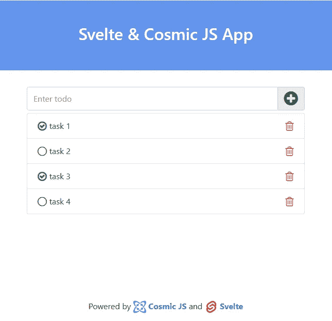

# 使用 Svelte 和 Cosmic JS 构建一个简单的 ToDo 应用程序

> 原文：<https://medium.com/swlh/build-a-simple-todo-app-using-svelte-and-cosmic-js-6999332b2bda>

在本教程中，我将向你展示如何使用 [Svelte](https://svelte.dev/) 和 [Cosmic JS](https://cosmicjs.com/) 创建一个简单的 Todo 应用程序。所以让我们喝杯咖啡，开始编码吧。

# TL；速度三角形定位法(dead reckoning)

[苗条待办事宜应用程序演示](https://cosmicjs.com/apps/svelte-todo-app)

[下载源代码](https://github.com/cosmicjs/svelte-todo)

# 先决条件