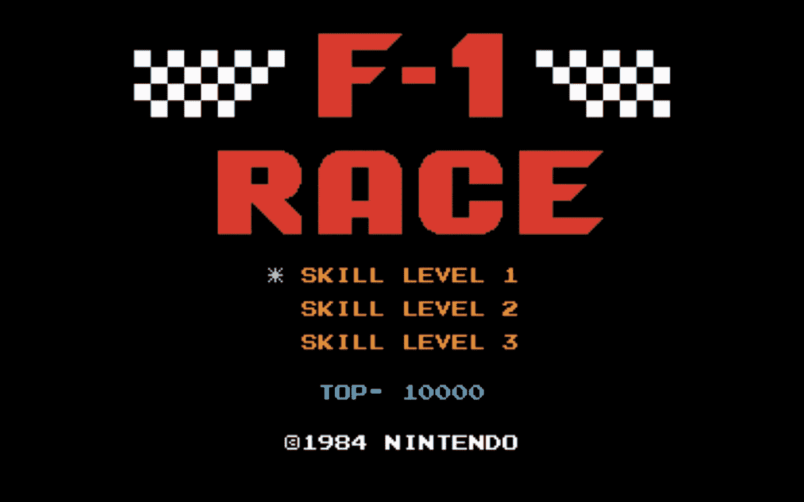
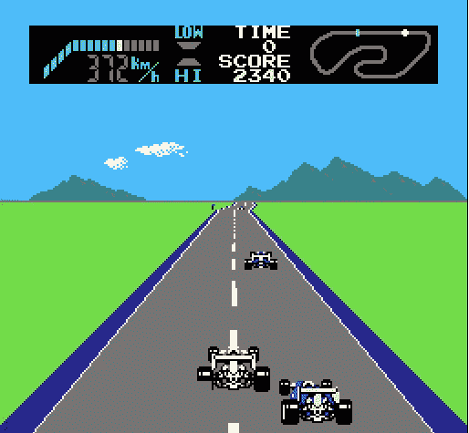
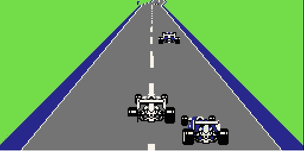

# 建立一个人工智能来玩 F1 比赛

> 原文：<https://medium.com/swlh/build-an-ai-to-play-f1-race-64f078a3fce2>

The F1-race classic

> 真的吗？一个 AI 玩 F1 赛车游戏？算是吧。这个故事更像是一个助手指南，而不是构建整个系统的教程。

我把它作为一个实验项目开始，并建立了一些基础，你可以通过贡献进一步改进。

[**链接到 Github 回购**](https://github.com/adesgautam/AI-race)

# **F1 赛车游戏**

所以，让我们先来谈谈这个游戏。

F1-race gameplay

F1 赛车游戏于 1984 年由任天堂 (NES)发行。

游戏包括一辆赛车，它可以在 3 条赛道上运行，按照难度级别 1、2 和 3 进行分类。

目标是在 40 秒的时间内完成赛道。赛道有一些急转弯，还有一些更多的车，让游戏变得有点有趣。

有 4 个控制:向前，向后，向左和向右。也允许两个控件的组合，如向前-左、向前-右。

# 这个计划

我们将把这个问题转化为一个监督学习任务(**图像- >标签**)。

我们将建立的管道如下:

1.  使用模拟器收集数据(游戏帧和键盘按压)。
2.  准备数据(裁剪图像和准备标签)。
3.  训练 **CNN 模型**。
4.  测试预测。
5.  制作模型在模拟器上玩游戏。

# **1。收集数据**

我将使用 **OpenEmu** 模拟器在 Mac 上运行 F1 赛车游戏。如果你在另一个操作系统上，你可以使用[这个网站](http://www.nintendoemulator.com/nes/4099)在浏览器中运行游戏。我们将使用[这个脚本](https://github.com/adesgautam/AI-race/blob/master/grabScreen.py)来抓取游戏截图，同时按下键盘。

在设置游戏抓取截图的窗口区域时要小心。

所有的图像都将保存在 **pics1** 目录中，并且会创建一个 **CSV** 文件，其中包含图像路径和按键。

尽量收集越来越多的数据。我只尝试了 10k 张图片。

# 2.准备数据

这里参考[剧本](https://github.com/adesgautam/AI-race/blob/master/prepare_data.py)。

这里，图像将被裁剪以仅获得图像的相关部分。

cropped image

之后，它们将被调整为 64x64 或 32x32 或你选择的尺寸。请记住，图像的大小将反映用于训练模型的计算能力。

标签将被转换成**一键编码**。

# 训练模型

现在，我们将根据我们准备的数据训练一个 **CNN 模型**。

[这个文件](https://github.com/adesgautam/AI-race/blob/master/models.py)包含了 4 个 CNN 模型来进行实验。

这个脚本训练模型并绘制出**损失**和**准确度**图。

我使用 **models.py** 文件中的 **CNN Model2** 对 **10k 图像**进行了训练，在使用尺寸为 **32x32** 的 **RGB** 图像的测试数据上获得了 **81%** 的准确率。

# 玩游戏

要玩这个游戏，请参考[这个脚本](https://github.com/adesgautam/AI-race/blob/master/play.py)。

记住 **OpenEmu** 不允许从脚本到窗口的直接键盘输入。因此，我们将在这里使用浏览器模拟器[和](http://www.nintendoemulator.com/nes/4099)。

小心地将浏览器窗口放在合适的位置以便截图。

尽管我得到了大约 81%的准确率，但这个模型的游戏性并不好。它需要许多改进。

但是，我试图建立一个**管道**来构建系统，这也可以用于其他游戏，其中游戏问题可以转换为**监督学习任务**。

随意叉 [**回购**](https://github.com/adesgautam/AI-race) 为项目做贡献。

在模型进一步改进之后，我将向您展示这个故事的下一部分。

请点击👏按钮，如果你喜欢这个帖子，拿着它给更多的爱。

如果您希望连接:

[**Github**](https://github.com/adesgautam)**[**LinkedIn**](https://www.linkedin.com/in/adesh-gautam-518810127/)**[**Twitter**](https://twitter.com/gautamades)**[**Instagram**](https://www.instagram.com/adeshgautam/)******

********

## ****这篇文章发表在 [The Startup](https://medium.com/swlh) 上，这是 Medium 最大的创业刊物，拥有+431，678 名读者。****

## ****在这里订阅接收[我们的头条新闻](https://growthsupply.com/the-startup-newsletter/)。****

********