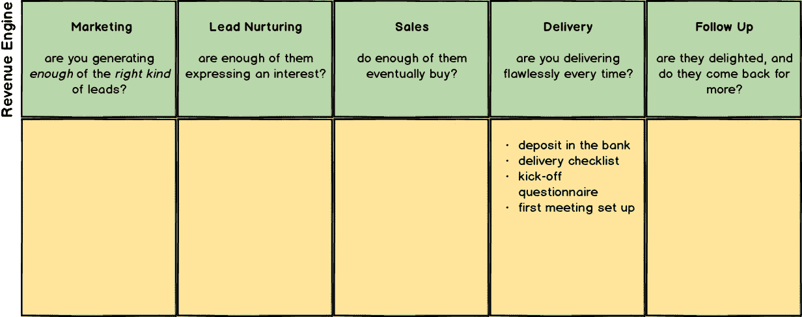
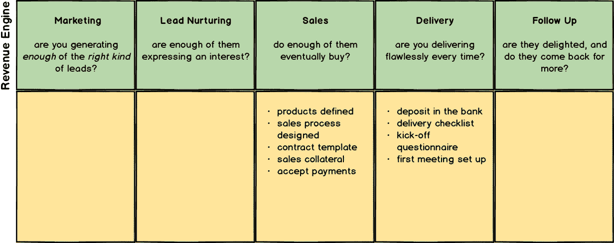
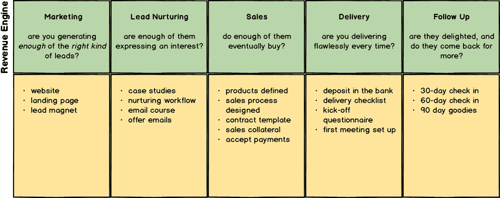
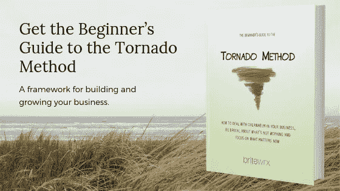

# 反向建立你的企业(以更快实现目标)

> 原文：<https://medium.com/swlh/build-your-business-backwards-to-get-there-faster-2487dfc73217>

Photo by [Clem Onojeghuo](https://unsplash.com/photos/OuxPfti70I0?utm_source=unsplash&utm_medium=referral&utm_content=creditCopyText) on [Unsplash](https://unsplash.com/search/photos/dress-shoes?utm_source=unsplash&utm_medium=referral&utm_content=creditCopyText)

你知道什么样的鞋油最适合你的鞋子吗？

原来有三种鞋油；基于液体的、基于乳脂的和基于糊状或蜡状的。大多数发烧友会告诉你扔掉液体抛光剂。他们还会告诉你，与蜡基抛光剂相比，奶油基抛光剂能更好地保护你鞋子的皮革，但蜡基抛光剂会给你更高的光泽。并且市场上不同种类的抛光剂之间存在巨大差异。我发现，我用来擦鞋的最常见的蜡基抛光剂是被嗤之以鼻的，因为它们远不如精英品牌的好。

当你真正进入任何一个主题，都会有惊人数量的细节被发现。上面的鞋油例子只是一个模糊有趣的话题；你几乎可以在任何主题中进入令人痛苦的细节。

但是鞋油，或者任何其他微观细节的主题，与建立一个企业有什么关系呢？答案在于细节——或者更确切地说，一旦你深入主题，就会发现难以置信的大量细节。

# 创业——大量的细节

创业是一件可怕的事情。有大量的活动部分，每个活动部分(如营销、销售或你的品牌)都有许多你必须处理的细节。

当我们开始创业时，我们不知道有多少细节。也许这是一件好事，因为如果我们知道有多少细节需要处理，我们可能永远不会开始。

但我们确实开始了，我们了解了细节，在准备启动之前，我们在一个巨大的任务清单上勾掉了每一项。我们希望在发布之前把一切都“做对”，所以我们沉迷于每一个细节，调整它，微调它，再做一遍，因为我们不确定什么会起作用。

如果你有任何程度的完美主义，你会对这种模式很熟悉。我们这些完美主义者(是的，我也是一个)希望在开展业务、推出新产品或服务之前，一切都绝对正确。

如果我们不小心，我们可以花所有的时间来微调细节。但在我们开展业务之前，不会有任何收入，所以走出去的压力越来越大。

那么，我们如何才能避免被所有的细节淹没呢？

# 倒着建

避免被所有细节淹没的一个方法是逆向建立你的业务。

要理解这是如何工作的，首先要了解一些背景知识:

如果你熟悉我的作品，你就会知道[龙卷风法](https://britewrx.com/tornado-method/)。龙卷风方法是一个设计、建立和经营企业的框架。在三个层次中有 11 个要素——把这 11 个要素都做对了，你不仅会有一个成功的企业，你也会有一个美好的生活。

龙卷风方法的顶层是收入引擎——市场营销、潜在客户培育、销售、交付和跟进的顺序，每个企业都需要这些来产生可靠的收入流。它看起来是这样的:

当我们开始建立一个企业时，我们倾向于从营销开始，这是收入引擎的第一阶段。一旦我们解决了这个问题，我们就可以决定如何培养我们的销售线索，然后决定如何销售(以及销售什么)。

但是这些元素中的每一个都有大量的细节，我们很容易迷失，超载，被我们必须做的事情淹没。

避免这种压倒性局面的一个方法是逆向建立业务。

与其从营销开始，不如从交付开始，即我们实际交付产品或服务的阶段。一旦你确定了如何提供产品或服务，你就知道如何销售，然后如何培养你的销售线索，等等。

# 基本原则

“逆向构建”方法的基本原则如下:

> 设计你的收入引擎的每一个阶段，以拥有一个可行的业务所需的绝对最小值。

在 Tornado 方法中，这被称为*最小可行收入引擎*，或 MVRE。

你可能已经熟悉了*最小可行产品*(或 MVP)的概念——你可以成功销售的最小产品或服务。不要在销售之前给你的产品添加所有的华而不实的东西，而是构建最少的可行产品，这样你就可以更快地进入市场，并开始获得人们真正想要什么的反馈。

MVRE 的概念也类似。不要构建业务的每个细节，只构建收入引擎每个阶段所需的最低限度，这样你就可以更快地启动并开始获得关于什么在起作用的反馈。

然而，弄清楚你的“最低可行”营销、潜在客户培育和销售应该是什么可能是困难的。通过逆向设计(和构建)你的收入引擎，你可以让事情变得简单得多。

# 它是如何工作的

要反向建立你的业务，在收入引擎的每个阶段下创建一个清单，从交付阶段开始反向工作。

想象一下，你刚刚找到了理想的客户，准备开始提供服务(收入引擎的交付阶段)。问自己以下问题:

> 我交付产品或服务的最低要求是什么？

记住，你已经完成了销售，所以你只需要专注于交货。您至少需要包括:

*   你客户的存款安全地存在你的银行账户里。
*   交付产品或服务的清单。
*   开始这项工作的调查问卷。
*   与客户安排的第一次会面。

这些项目属于收入引擎的交付阶段，因此您要将它们作为核对清单添加到此框中。它看起来是这样的:

有了这些，您现在可以向后移动一个阶段到收入引擎的销售阶段。你又要问一个关键问题:

> 销售我的产品或服务的绝对最低要求是什么？

您的清单可能包括以下一些内容:

*   你的产品或服务(你卖的东西)。
*   已定义的销售流程，可能包括 FAQ(常见问题)和如何处理异议。
*   合同模板(如果您需要合同)。
*   销售宣传材料，如宣传册或详细的产品或服务网页。
*   案例研究，参考或以前客户的证明。
*   接受支付的方式(支票、银行转账或其他电子支付方式)。

完成后，您可能会看到如下所示的内容:

现在，使用以下问题重复销售线索培育阶段的练习:

> 培育我的销售线索，我必须具备的绝对最低要求是什么？

最后，在营销阶段:

> 为了推销我的产品和服务，我必须具备的最低要求是什么？

您最终的 MVRE 可能看起来像这样:

这是你的主清单，列出了推出你的产品或服务——以及你的企业——至少需要做的事情。

# 这有什么帮助

现在，你有了一个清单，上面列有推销你的产品或服务、培养你的销售线索、进行销售和交付你的产品或服务的最低要求。这是你的最低可行收入引擎(MVRE)。

你的 MVRE 清单上的每一项可能仍然有很多工作要做，但你的清单应该比试图从一个随机的事情清单开始要小得多。

在建立这些项目的过程中，你可能会发现更多的项目需要添加到你的列表中，但是在你把它添加到你的列表中之前，问问你自己:

> 我一定要有这个才能让我的生意运作吗，或者它只是一个好东西？

如果可以的话，把额外的项目放在“待办事项”或“未来”清单中，而不是把它添加到你的 MVRE 清单中。你还有很多事情要做，所以如果没有必要，你希望避免添加更多的项目。

使用这种方法也能帮助你应对压力。通过将每个待办事项放入收入引擎的适当方框中，你减少了每次必须处理的事项数量，并且你知道清单上有一些事情，所以你不必一直担心。

# 最好的鞋油刷是由马毛制成的

我懒得去弄清楚为什么马鬃是最好的鞋刷；我怀疑它是刚性，耐用性和灵活性的结合。但我确实发现(根据专家的说法),昂贵的马鬃刷和便宜的替代品之间没有太大区别——只要它们使用马鬃。

在做这项研究时，迷失在互联网的兔子洞里是一个巨大的诱惑——目前我认为我知道如何保养我的鞋子，知道该买哪种鞋油，坚持用马毛制成的刷子，让鞋油保持 5 到 10 分钟，然后开始抛光。

建立你的企业，就像擦鞋一样，是一项管理你需要掌握多少细节的练习。你不需要成为所有方面的专家，但你需要掌握最基本的——之后你可以根据你的兴趣选择掌握更多。

# 行动呼吁

龙卷风方法是世界上最简单的设计、建造和经营企业的系统。你可以在这里下载免费的龙卷风方法初学者指南。如果您有任何问题，我很乐意为您效劳！

祝你生意兴隆！

*原载于 2019 年 1 月 14 日*[*【blog.britewrx.com*](https://blog.britewrx.com/build-your-business-backwards-to-get-there-faster/)*。*

## 这篇文章发表在 [The Startup](https://medium.com/swlh) 上，这是 Medium 最大的创业刊物，拥有+411，714 名读者。

## 在此订阅接收[我们的头条新闻](http://growthsupply.com/the-startup-newsletter/)。

