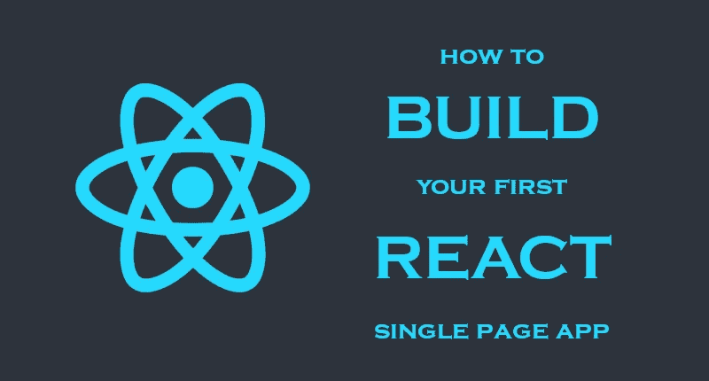

# 构建您的第一个 React 单页面应用程序

> 原文：<https://medium.com/swlh/build-your-first-react-single-page-app-ad341f86b920>

本指南面向那些对 React、Node 和 JavaScript 没有多少经验的人。这些说明假设读者使用的是 Windows 和 VS 代码，但是它们可以根据需要适用于其他环境和 ide。

您将学习如何设置您的开发环境，使用几个 Reactstrap 组件构建一个单页面应用程序，通过将代码分成两个模块来重构代码，然后…