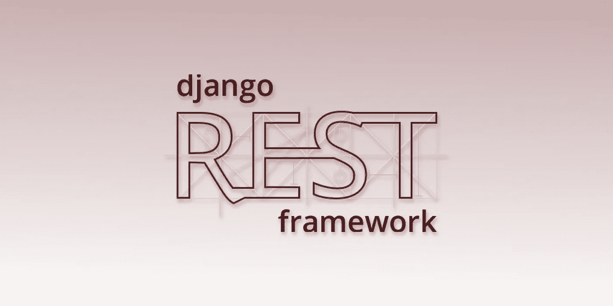

# 用 Django REST 框架在 30 分钟内构建一个 REST API

> 原文：<https://medium.com/swlh/build-your-first-rest-api-with-django-rest-framework-e394e39a482c>

在 Django 中构建 REST API 非常简单。在本教程中，我们将逐步完成安装和运行第一个 API 的步骤。

*(这篇文章是我教授如何在 Django 后端* *上部署* [*React 前端的系列文章的一部分。然而，这篇文章中没有具体的反应。无论您的 API 需要什么，请继续阅读！)*](/@BennettGarner/react-on-django-getting-started-f30de8d23504)