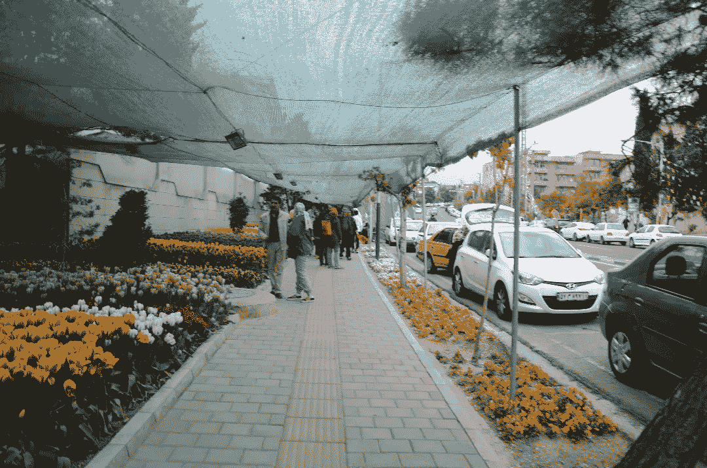

# 为商业的未来建立一个社区

> 原文：<https://medium.com/swlh/building-a-community-for-the-future-of-business-2c7f86363df2>

Tulip Passage, Zarafshan, Tehran

为了纪念他热爱郁金香的母亲，Human Bahmani 博士每年春天都会在德黑兰扎拉法山的一个社区种植数千株郁金香。所以每年春天，人们都聚集在这个地区欣赏这些美丽的花朵。该地区的市长通过提供场所和人力资源支持来支持他的行动。街头艺术家来那里娱乐人们，你可以看到一些咖啡车…