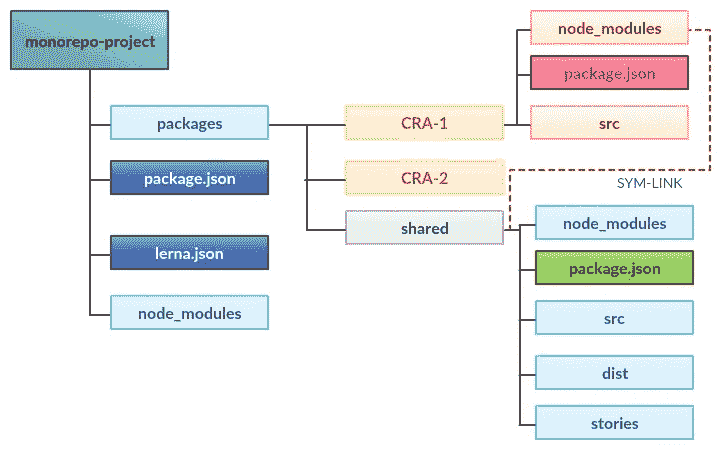

# 使用 Lerna 和 Monorepo 构建多 CRA

> 原文：<https://medium.com/swlh/building-a-multi-cra-using-lerna-and-monorepo-4628de405c6b>

嘿程序员们！

今天的帖子是关于如何使用 monorepo 的概念在一个 repo 中构建多个 web 应用。我们看到很多产品是为不同角色的用户设计的。想想优步。你可以报名当司机。或者你可以注册成为一名骑手，获得一套完全不同的功能。通常，像这样的产品在不同的平台下…