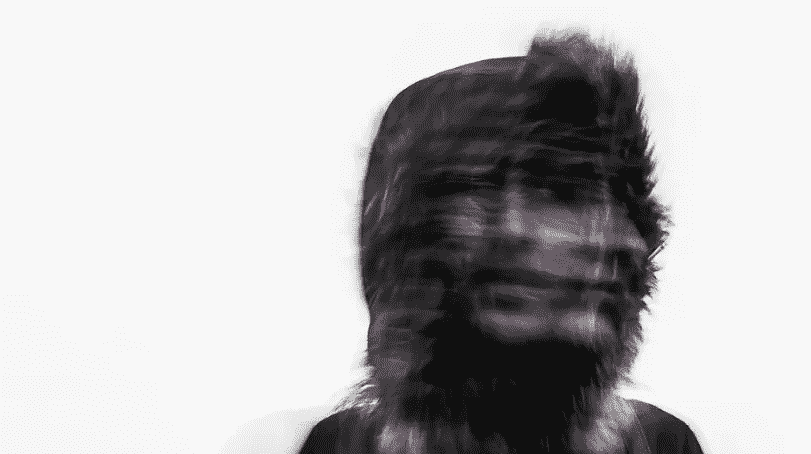

# 建立个人品牌并不总是让自己看起来很好

> 原文：<https://medium.com/swlh/building-a-personal-brand-isnt-always-about-making-yourself-look-good-727e1673ca71>

*本文原载于* [*快公司 2019 年 6 月 21 日*](https://www.fastcompany.com/90366736/building-a-personal-brand-isnt-always-about-making-yourself-look-good?partner=newscred&utm_source=newscred&utm_medium=feed&utm_campaign=newscred+fastcompany&utm_content=newscred)

十年前，一位当时领先的广告博主称我为“杜晨·诺兹尔女士”我仍然不确定这是什么意思，但我肯定这不是一种恭维。这是我 13 年来作为世界上第一个战略家经历的众多侮辱之一…