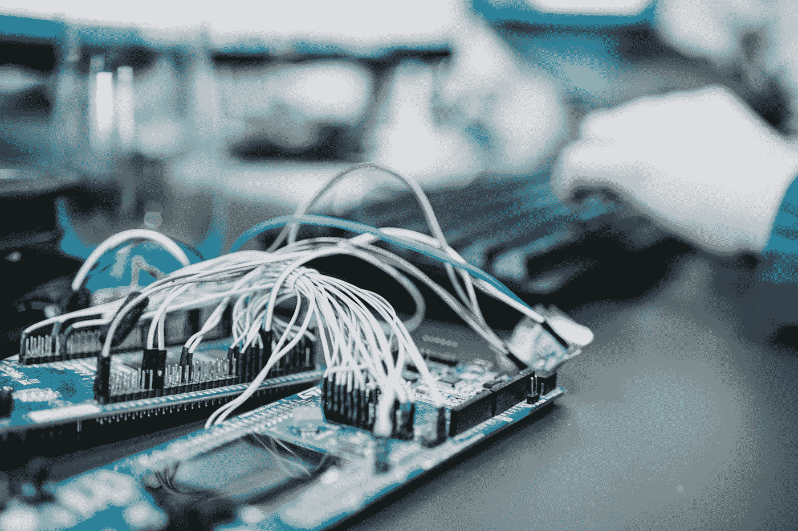

# 将人工智能融入创业公司的灵魂

> 原文：<https://medium.com/swlh/building-ai-into-your-startups-soul-24ca19b430f8>

Photo by [Hitesh Choudhary](https://unsplash.com/@hiteshchoudhary?utm_source=medium&utm_medium=referral) on [Unsplash](https://unsplash.com?utm_source=medium&utm_medium=referral)

人工智能正在改变我们工作、研究和看待世界的方式。实际上，人工智能技术的应用改变了我们生活的方方面面。这种影响在一定程度上是因为我们的客户期望直观地满足他们的需求。或许更重要的是，我们的客户实际上是如何因人工智能而改变的。

人类对认知任务、短期和长期记忆技术的依赖被描述为“分布式认知”(见我的文章“[奇点悄悄在我们身后](/swlh/the-singularity-sneaking-up-behind-us-66c7d8ae33a2)”)，研究人员正在观察人工智能如何改变我们大脑的连接方式。

这对创业公司意味着什么？已经有投资者不断询问深度学习和机器学习在你的业务中的作用。你将如何捕捉和货币化你的客户互动产生的数据是这些讨论的核心。

这些问题的背后是对数据收集实践、数据隐私和大量合规性问题的合理担忧。处理 GDPR 和其他要求的后勤工作令人生畏，失误的后果是严重的。

## 那么，我们如何让人工智能成为我们创业公司的灵魂呢？

对于科技含量高的初创公司来说，从设备和应用程序中收集遥测数据非常简单，但管理由此产生的数据就不那么简单了。技术密集度较低的企业在仪器和收集方面面临更多的挑战，但往往更容易通过与客户的密切接触实现合规。不管创业公司的类型如何，现在当务之急是让人工智能成为你创业公司的灵魂。

创业公司的灵魂是客户至上——因此，要将人工智能融入创业公司的灵魂，你需要让人工智能服务于客户至上。收集客户数据以改善客户体验会减少客户阻力和合规性开销。

很容易陷入这样一个陷阱:使用你当前的商业模式来收集未来的数据，也许是不确定的业务。另一个流行但糟糕的想法是收集这些数据，然后计划将这些数据货币化。不要这样做！

经验证的途径是:

1.  通过明确的权限和清晰的数据使用计划细节，合乎道德地收集客户数据
2.  装备您的企业，打造一个数字飞轮，改善当今的客户体验
3.  利用人工智能驱动的自动化优化未来客户体验

## 构建数字飞轮

你的企业是一个数字飞轮，有三个主要组成部分:客户参与、产品开发和业务运营，这一概念为你的企业产生的数据提供了一个可视化的结构。这种结构提供了一种清晰的方式来思考客户数据和改善产品或服务体验之间的关系。

Photo by [Austin Distel](https://unsplash.com/@austindistel?utm_source=medium&utm_medium=referral) on [Unsplash](https://unsplash.com?utm_source=medium&utm_medium=referral)

数字飞轮优势的一个例子可以是来自客户的产品使用数据，结合来自生产和客户服务的员工反馈，为产品开发决策提供信息，从而实现改进。

这个飞轮以中央数据存储为中心，它是安全的，符合您与客户和合作伙伴达成的隐私和数据使用政策。

## 数字飞轮策略

理解客户参与度是第一要务，也是从人工智能中获得最大收益的地方。利用你的产品或服务来提升客户体验将会为客户满意度带来巨大而直接的回报。

使用物联网连接平台(如[微软的物联网中心](https://azure.microsoft.com/en-us/services/iot-central/))来检测物理产品是一个良好的开端，可以让使用数据流向中央数据存储，并深入了解客户的使用模式。从非数字产品和服务中获得遥测可以通过社交媒体参与、信息丰富和引人入胜的内容策略来实现，或者间接通过一线员工的参与来实现。

Photo by [Zan Ilic](https://unsplash.com/@zanilic?utm_source=medium&utm_medium=referral) on [Unsplash](https://unsplash.com?utm_source=medium&utm_medium=referral)

最初的目标是建立一个关于客户使用、参与、满意度和反馈的资料库，这些资料可以直接用于下一代产品设计。这些下一代设计应该以 2 种重要方式使用 AI:

1.  创造直观或可预测的客户体验。这是通过将人工智能构建到下一代产品中来实现的，这些产品结合了来自当前一代数据的训练，以取悦客户的新方式表现。最常见的例子是内置于大多数在线购物和媒体体验中的推荐引擎体验
2.  使用自然语言输入、环境刺激和客户档案自动执行以前的手动客户操作。使用自然语言进行创新的一个例子是电视的自然语言遥控器的出现。另一个是特斯拉利用客户数据来优化悬架设置，因为其他司机的汽车经历了坑洼或崎岖的道路

## 后续步骤:为自动化做好准备

现在你在考虑自动化，直观的界面，直观的体验，下一步是什么？

1.  建立一个客户数据收集政策，这将有助于您的客户了解您计划如何使用他们的日期。明确的客户数据收集许可总是更好
2.  规划您的数据存储和管理计划，以确保符合当前和发展中的法规。
3.  利用数据科学专家尽可能减少数据偏差，以确保为所有用户提供最佳结果
4.  建立您的计划，用数字飞轮来装备您的业务。全面考虑如何获取数据。不要仅仅依赖物联网设备，要寻找广泛的输入和

有兴趣看看你造的！

# 关于作者:

Matt Vasey 是微软负责人工智能业务和企业发展的高级总监。他专注于扩大技术合作伙伴、标准机构和其他创新推动者的生态系统，这些都是服务于个人和企业的新一代人工智能应用、服务和系统所必需的。技术兴趣和专业知识包括认知工作场所自动化、机器人、混合现实、虚拟助理功能、视觉人工智能、内容智能和边缘/雾人工智能。

除了在微软的工作之外，他还担任 [OpenFog Consortium](https://www.openfogconsortium.org/about-us/#governance) 的主席、[工业互联网 Consortium](https://www.iiconsortium.org/) 的指导委员会成员、 [OPC Foundation](https://opcfoundation.org/) 的董事会成员，以及 [A3 Automation](https://www.a3automate.org/) 、 [Myplanet](https://medium.com/u/c11688ad85c0) 和人工智能和物联网领域初创公司的人工智能顾问委员会成员。

在[https://www.linkedin.com/in/mattvasey/](https://www.linkedin.com/in/mattvasey/)与马特联系