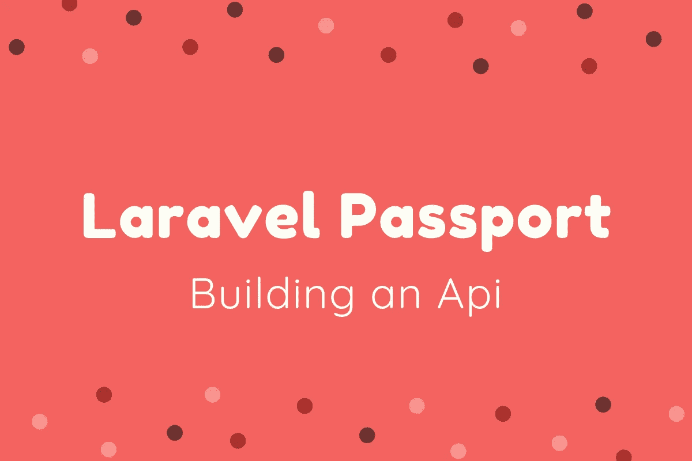

# 用 Passport 在 Laravel 中构建 API

> 原文：<https://medium.com/swlh/building-an-api-in-laravel-with-passport-bd17cf39109f>

在本文中，我将使用 Laravel Passport 创建一个 API。Laravel Passport 提供了一种执行 API 认证的简单方法。您将学习如何在 Laravel Passport 中构建 API，以及如何为用户生成令牌。此令牌用于对用户进行身份验证。

[Postman](https://www.getpostman.com/) 是我将用来向 API 发送请求的工具。

## 装置