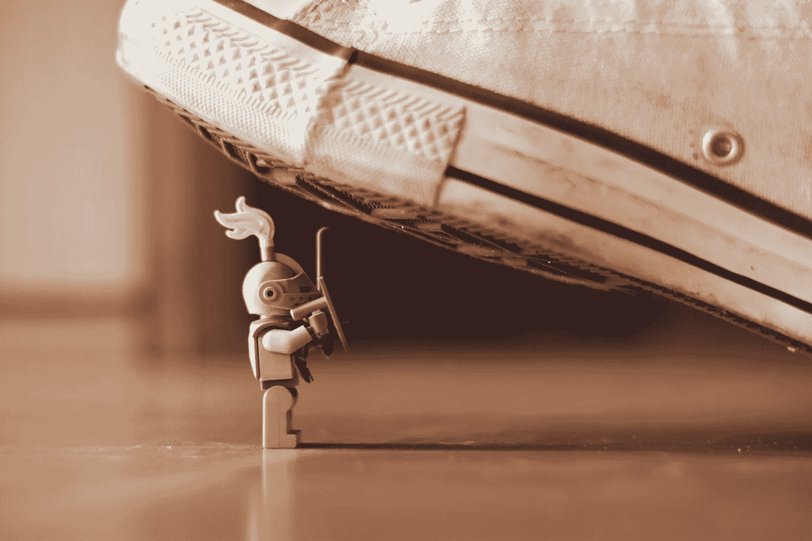

# 打造盔甲:写作与拒绝

> 原文：<https://medium.com/swlh/building-armor-writing-and-rejection-e8f7fce9dbdc>

我在农场长大。有许多工作要做。有些家务我不太喜欢，但它们都必须完成。回过头来看，它教会了我一种职业道德和一个简单的真理，即有时需要挖一条沟。不管我们对某些任务感觉如何，有些任务是工作的一部分。

对于一个作家来说，拒绝是这个职业不可避免的一个方面。那么，一个作家如何应对拒绝呢？简单。因为被拒绝了。

我做职业作家已经 25 年了。我已经被拒绝了数百次——可能是数千次。当我开始从事自由写作时，除了周日，我每天至少会收到一封拒绝信(对于年轻读者来说，“邮件”是一种古老的交流方式)。我知道会有拒绝信。我期待他们中的大多数。这并没有阻止我，对我职业生涯的影响最终是微乎其微的。我在许多媒体上取得了成功。拒绝从来都不重要。只有工作做到了。

拒绝是工作的一部分。每说一个“是”，你就会听到十次“不”如果你幸运的话。这些拒绝并不好玩，但是让它们影响你必须做的工作会适得其反。尤其是如果事先的预期是“不”是你最想听到的。

## 一个作家是如何经受住所有这些拒绝的？

简而言之，你不要再在乎它了。当然，你想要钱、事业和所有这些东西，但是你不必为了得到它们而重视它们。你不再执着于别人说的话和随之而来的期望，而只是做好工作。你不再把自己当回事了。你只要做好工作。写作并把你的东西拿出来。有时候，说起来容易做起来难，但这仍然是目标。

这需要的不仅仅是自我。这需要的不仅仅是自信。自欺欺人是有帮助的，但就像生活的大多数方面一样，答案更接近于一种接受的形式。要得到肯定，你需要听到很多否定。接受这只是交易的一部分。

如果你读过我的其他写作文章，你会知道我不可避免地主张耐心和经验是任何职业作家的关键工具。他们为你打造盔甲。我不相信捷径或快速解决办法。这些东西可能会向有抱负的作家兜售希望，但它们大多是谎言和谎言，以及只适合在枕头上针扎的感觉良好的格言。我相信工作。写作是一段旅程，沿途短暂停留，没有终点。

说到拒绝，我明白我不是你。众所周知，我是一个没有感情的反社会者(我希望。这会使拒绝变得更容易)。我知道我不能要求你打个响指就没有感觉(我已经要求我的妻子尝试过了，我可以明确地告诉你，这不仅不起作用，而且适得其反。)，但是把自己和工作分开是有根本的。

如果你想让所有人都喜欢你的作品，那你就是在庸人自扰。接受拒绝可能表明你走在正确的道路上。或者只是说这是不可避免的。

我一直是坚持多于天赋。我很早就认识到，坚强不是由你是否能击倒别人来定义的，而是由你在不断被击倒后站起来的频率来定义的。

## **不是你，是他们(但很可能也是你)**

随着时间的推移，你学会了认识到拒绝不是针对你的。与你无关，往往与你的写作关系不大。写故事的人容易在头脑中写出关于现实生活的不同故事。我完全有能力想象有人看了我的手稿，把它扔进垃圾桶，因为他们认为它很糟糕(显然不是这个原因。我才华横溢)。大多数拒绝的原因更加平凡。

最简单的说，这通常是两件不合适的事情。我写犯罪小说。如果我把其中一本给不喜欢暴力或脏话的人，他们会讨厌的。我是说，真的很讨厌。我的“他妈的”和“其他词”的比例高得惊人。那个讨厌我的书的人并没有告诉我任何关于我或者书的质量的事情。它只能告诉我，我给错了人。如果我给一个正在寻找小型独立电影的制片人一个大型科幻电影剧本，我当然会被拒绝。不太适合。

这并不是说给你工作反馈的人总是错的。或者从拒绝中学不到什么。我绝对不是说所有的作家都是被误解的天才。肯定不是。天哪，不。你们中的一些人可能真的很糟糕。这是基本概率。有可能你的书、电影剧本或诗歌(尤其是你的诗歌)非常糟糕。我不认识你。很难写出好的东西，所以是的，可能有一些狗屎。但让我们假设它至少相当不错。

## **针灸，不是酷刑**

把一个人的工作推向世界是一个人的自我和好奇心之间的平衡。听，学，用孩子的眼光去看。我不能太在意有人“喜欢”或者“不喜欢”我写的东西。我不了解那个人，也不了解他们的口味。但是，如果有人告诉我，这个故事令人费解，或者我对一个地方的描述不准确，这是真正的批评，可能会帮助我重新审视我在现实生活的幻想版本中可能令人费解的故事。找机会学习没有错。

我的作品对我来说非常私人。我写一些贴近我内心的地方和人。我表达了一种幽默感，我希望这种幽默感是原创的，是我自己的。我尽最大努力把它留在球场上。但是一旦完成了，它就是一个手稿，它就是一个东西。故事在书页上。我放下了。完成的草稿是我希望我感到自豪的东西，但仍然是一件东西。很有可能，我已经开始着手下一个项目了。

如果你能在把你的作品发送到这个世界时保持这种距离，那么你就能建造足够的盔甲来保护自己免受那些毒箭的伤害。他们没必要受伤。

这也适用于对你工作的负面评价。我的书《石膏城》在亚马逊上有超过 1000 条评论。我从来没有去亚马逊看过他们(作者，我不能强调这一点。不要读你的亚马逊评论。没有意义。不，该死的。点。)，但我读过许多 1 星评论，因为我的“朋友”会在我收到新评论时发短信给我。显然我说了太多脏话。我已经知道了(见上面提到的他妈的和其他词的比率)。我只能嘲笑他们。

这就是耐心和经验的好处。一个装满拒绝信的邮箱和一个装满作品的书架的好处。拒绝无非是又一条需要挖的沟。耐心点。打造你的盔甲。想办法不去管它，回去工作。因为总是和工作有关。